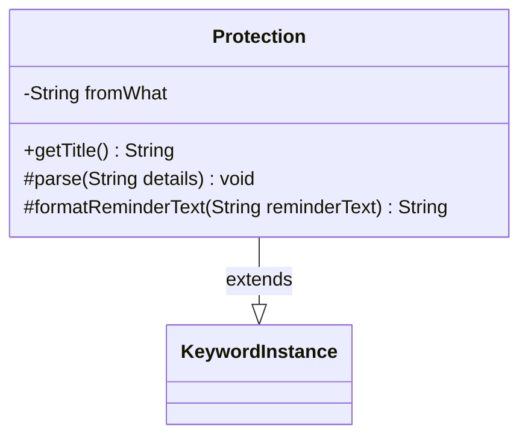

---
aliases:
  - Protection
tags:
  - java/class
  - module/forge-game
  - pkg/forge/game/keyword
fqn: forge.game.keyword.Protection
package: forge.game.keyword
module: forge-game
kind: Class
---

# Protection

**Package:** `forge.game.keyword` &nbsp; **Module:** `forge-game` &nbsp; **Kind:** Class



## Relationships
**Extends:**
- [[forge.game.keyword.KeywordInstance|KeywordInstance]]

## Source
`forge-game/src/main/java/forge/game/keyword/Protection.java`

```java
package forge.game.keyword;

public class Protection extends KeywordInstance<Protection> {
    private String fromWhat = "";

    @Override
    public String getTitle() {
        return "Protection from " + fromWhat;
    }

    @Override
    protected void parse(String details) {
    }

    @Override
    protected String formatReminderText(String reminderText) {
        return String.format(reminderText, fromWhat);
    }
}
```
