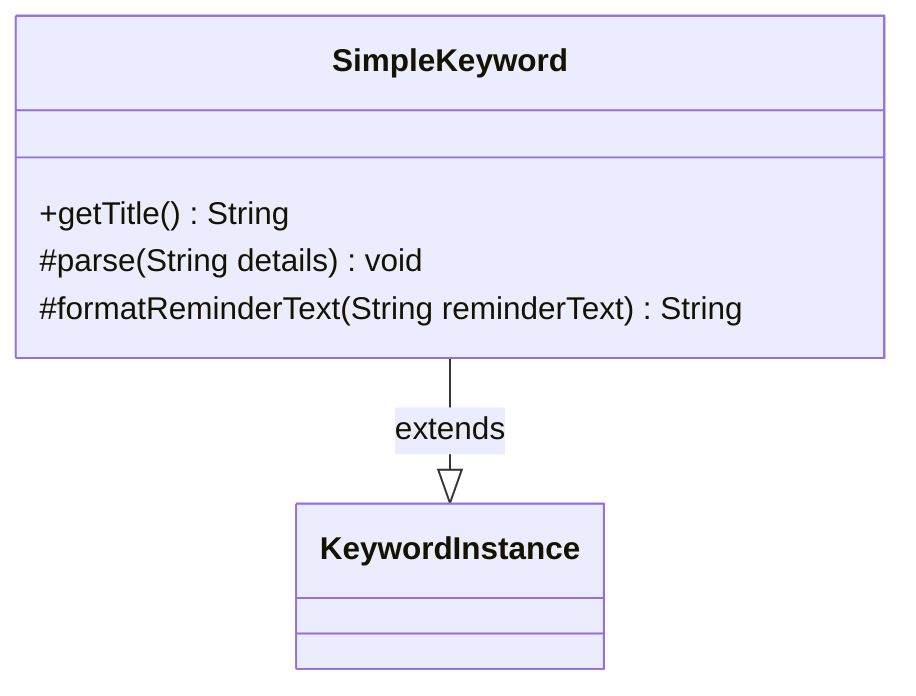

---
aliases:
  - SimpleKeyword
tags:
  - java/class
  - module/forge-game
  - pkg/forge/game/keyword
fqn: forge.game.keyword.SimpleKeyword
package: forge.game.keyword
module: forge-game
kind: Class
---

# SimpleKeyword

**Package:** `forge.game.keyword`   **Module:** `forge-game`   **Kind:** Class



## Relationships
**Extends:**
- [[forge.game.keyword.KeywordInstance|KeywordInstance]]

## Design Description

Static keyword abilities like flying or haste have no parameters or special data to track, and `SimpleKeyword` exists to model exactly that case. As a concrete subclass of the generic `KeywordInstance` (self-typed as `KeywordInstance<SimpleKeyword>`), it supplies the minimal behavior the abstract supertype requires: `getTitle()` simply returns the keyword's string form, while the overridden `parse(String)` is intentionally a no-op because simple keywords carry no detail string to interpret, and `formatReminderText(String)` returns the reminder text unchanged. The deliberately empty implementations document the design intent—this class is the trivial leaf of the keyword hierarchy, handling parameterless keywords so that more complex keyword types can specialize parsing and formatting behavior elsewhere.

## Source
`forge-game/src/main/java/forge/game/keyword/SimpleKeyword.java`

```java
package forge.game.keyword;

public class SimpleKeyword extends KeywordInstance<SimpleKeyword> {

    public String getTitle() {
        return getKeyword().toString();
    }

    @Override
    protected void parse(String details) {
        //don't need to merge details for simple keywords
    }

    @Override
    protected String formatReminderText(String reminderText) {
        return reminderText;
    }
}
```

## Python
`forge/game/keyword/SimpleKeyword.py`

```python
from forge.game.keyword.KeywordInstance import KeywordInstance


class SimpleKeyword(KeywordInstance):

    def getTitle(self) -> str:
        return str(self.getKeyword())

    def parse(self, details: str) -> None:
        #don't need to merge details for simple keywords
        pass

    def formatReminderText(self, reminderText: str) -> str:
        return reminderText
```
