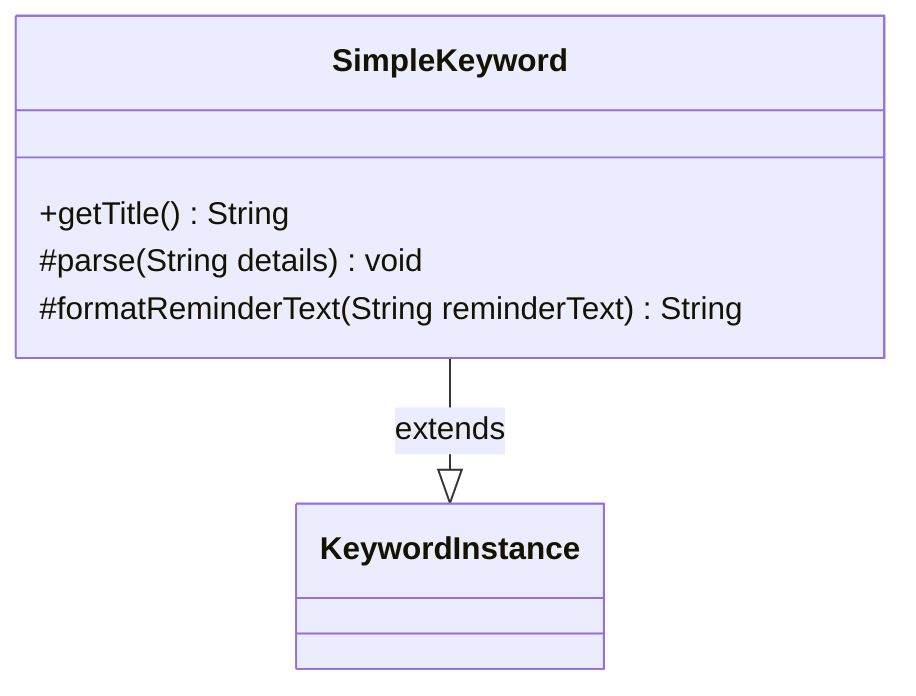

---
aliases:
  - SimpleKeyword
tags:
  - java/class
  - module/forge-game
  - pkg/forge/game/keyword
fqn: forge.game.keyword.SimpleKeyword
package: forge.game.keyword
module: forge-game
kind: Class
---

# SimpleKeyword

**Package:** `forge.game.keyword` &nbsp; **Module:** `forge-game` &nbsp; **Kind:** Class



## Relationships
**Extends:**
- [[forge.game.keyword.KeywordInstance|KeywordInstance]]

## Source
`forge-game/src/main/java/forge/game/keyword/SimpleKeyword.java`

```java
package forge.game.keyword;

public class SimpleKeyword extends KeywordInstance<SimpleKeyword> {

    public String getTitle() {
        return getKeyword().toString();
    }

    @Override
    protected void parse(String details) {
        //don't need to merge details for simple keywords
    }

    @Override
    protected String formatReminderText(String reminderText) {
        return reminderText;
    }
}
```
