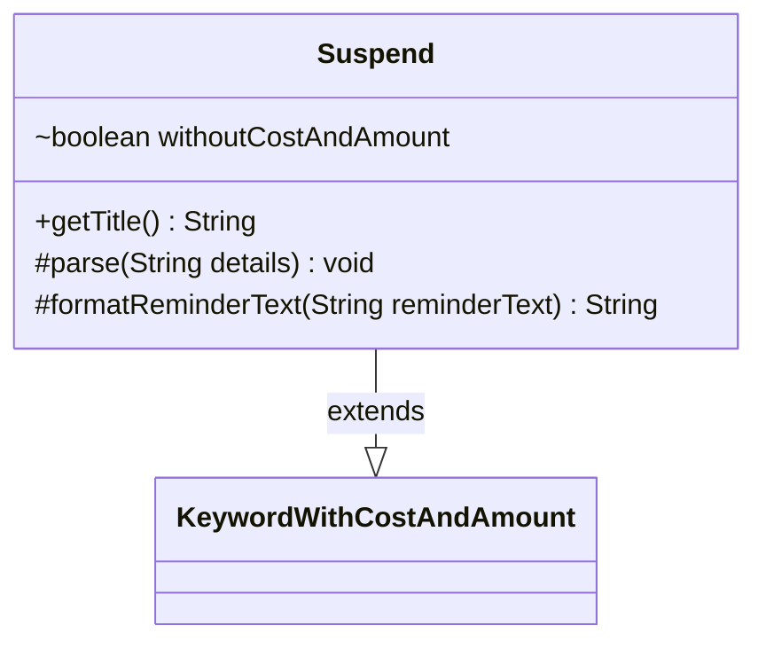

---
aliases:
  - Suspend
tags:
  - java/class
  - module/forge-game
  - pkg/forge/game/keyword
fqn: forge.game.keyword.Suspend
package: forge.game.keyword
module: forge-game
kind: Class
---

# Suspend

**Package:** `forge.game.keyword`   **Module:** `forge-game`   **Kind:** Class



## Relationships
**Extends:**
- [[forge.game.keyword.KeywordWithCostAndAmount|KeywordWithCostAndAmount]]

## Design Description

Suspend models the Magic keyword of the same name as a concrete subclass of KeywordWithCostAndAmount, inheriting the standard cost-and-amount parsing and presentation machinery for keywords that pair a mana cost with a numeric value. Its sole responsibility is to handle the variant case where Suspend appears without an explicit cost and amount, tracked by the `withoutCostAndAmount` flag set during parsing when no details are supplied. It overrides three inherited hooks—`parse`, `getTitle`, and `formatReminderText`—delegating to the superclass in the normal case but substituting a bare keyword title and a fixed, fully-spelled-out reminder text describing the time-counter mechanic in the costless variant. The design keeps the special case isolated behind these targeted overrides, reusing all base behavior otherwise.

## Source
`forge-game/src/main/java/forge/game/keyword/Suspend.java`

```java
package forge.game.keyword;

public class Suspend extends KeywordWithCostAndAmount {

    boolean withoutCostAndAmount = false;

    @Override
    public String getTitle() {
        if (withoutCostAndAmount) {
            return getKeyword().toString();
        }
        return super.getTitle();
    }

    @Override
    protected void parse(String details) {
        if ("".equals(details)) {
            withoutCostAndAmount = true;
        } else {
            super.parse(details);
        }
    }

    @Override
    protected String formatReminderText(String reminderText) {
        if (withoutCostAndAmount) {
            return "At the beginning of its owner's upkeep, remove a time counter from that card. When the last is removed, the player plays it without paying its mana cost. If it's a creature, it has haste.";
        } else {
            return super.formatReminderText(reminderText);
        }
    }
}
```

## Python
`forge/game/keyword/Suspend.py`

```python
from forge.game.keyword.KeywordWithCostAndAmount import KeywordWithCostAndAmount


class Suspend(KeywordWithCostAndAmount):

    def __init__(self):
        super().__init__()
        self.withoutCostAndAmount = False

    def getTitle(self) -> str:
        if self.withoutCostAndAmount:
            return str(self.getKeyword())
        return super().getTitle()

    def parse(self, details: str) -> None:
        if details == "":
            self.withoutCostAndAmount = True
        else:
            super().parse(details)

    def formatReminderText(self, reminderText: str) -> str:
        if self.withoutCostAndAmount:
            return "At the beginning of its owner's upkeep, remove a time counter from that card. When the last is removed, the player plays it without paying its mana cost. If it's a creature, it has haste."
        else:
            return super().formatReminderText(reminderText)
```
