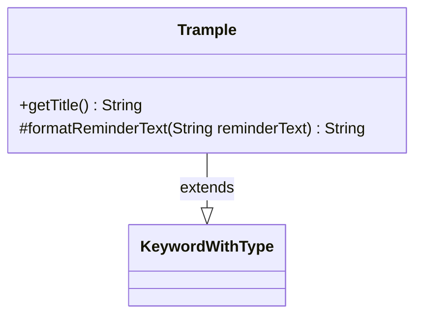

---
aliases:
  - Trample
tags:
  - java/class
  - module/forge-game
  - pkg/forge/game/keyword
fqn: forge.game.keyword.Trample
package: forge.game.keyword
module: forge-game
kind: Class
---

# Trample

**Package:** `forge.game.keyword` &nbsp; **Module:** `forge-game` &nbsp; **Kind:** Class



## Relationships
**Extends:**
- [[forge.game.keyword.KeywordWithType|KeywordWithType]]

## Design Description

Trample is a concrete keyword implementation that models Magic: The Gathering's trample ability within Forge's keyword system. Extending `KeywordWithType`, it specializes the inherited type-aware behavior to support both ordinary trample and the planeswalker-specific "Trample Over Planeswalkers" variant. It overrides `getTitle()` to return the appropriate display name and `formatReminderText()` to supply variant-specific reminder text, branching on the inherited `type` field: when a type is present, it produces the planeswalker-targeting wording; otherwise it defers to the default title and reminder text. This design keeps parsing and type-handling logic in the superclass while delegating only the presentation differences to the subclass, reflecting Forge's pattern of one lightweight class per keyword.

## Source
`forge-game/src/main/java/forge/game/keyword/Trample.java`

```java
package forge.game.keyword;

public class Trample extends KeywordWithType {
    @Override
    public String getTitle() {
        if (!type.isEmpty()) {
            return "Trample Over Planeswalkers";
        }
        return "Trample";
    }
    @Override
    protected String formatReminderText(String reminderText) {
        if (!type.isEmpty()) {
            return "This creature can deal excess combat damage to the controller of the planeswalker it's attacking.";
        }
        return reminderText;
    }
}
```

## Python
`forge/game/keyword/Trample.py`

```python
package forge.game.keyword

from forge.game.keyword.KeywordWithType import KeywordWithType


class Trample(KeywordWithType):
    def getTitle(self) -> str:
        if not self.type:
            pass
        if self.type:
            return "Trample Over Planeswalkers"
        return "Trample"

    def formatReminderText(self, reminderText: str) -> str:
        if self.type:
            return "This creature can deal excess combat damage to the controller of the planeswalker it's attacking."
        return reminderText
```
