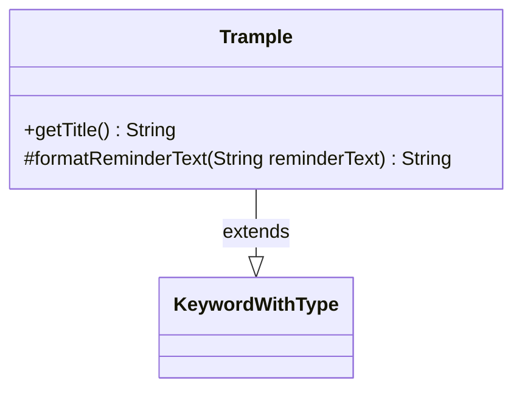

---
aliases:
  - Trample
tags:
  - java/class
  - module/forge-game
  - pkg/forge/game/keyword
fqn: forge.game.keyword.Trample
package: forge.game.keyword
module: forge-game
kind: Class
---

# Trample

**Package:** `forge.game.keyword` &nbsp; **Module:** `forge-game` &nbsp; **Kind:** Class



## Relationships
**Extends:**
- [[forge.game.keyword.KeywordWithType|KeywordWithType]]

## Source
`forge-game/src/main/java/forge/game/keyword/Trample.java`

```java
package forge.game.keyword;

public class Trample extends KeywordWithType {
    @Override
    public String getTitle() {
        if (!type.isEmpty()) {
            return "Trample Over Planeswalkers";
        }
        return "Trample";
    }
    @Override
    protected String formatReminderText(String reminderText) {
        if (!type.isEmpty()) {
            return "This creature can deal excess combat damage to the controller of the planeswalker it's attacking.";
        }
        return reminderText;
    }
}
```
