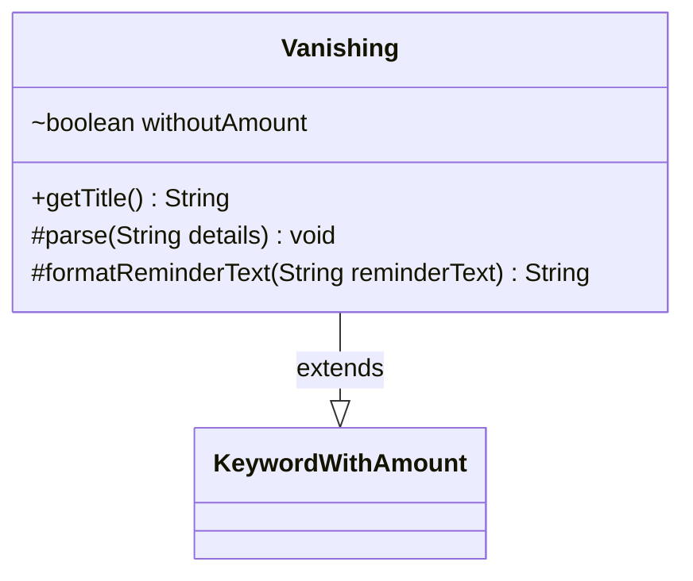

---
aliases:
  - Vanishing
tags:
  - java/class
  - module/forge-game
  - pkg/forge/game/keyword
fqn: forge.game.keyword.Vanishing
package: forge.game.keyword
module: forge-game
kind: Class
---

# Vanishing

**Package:** `forge.game.keyword` &nbsp; **Module:** `forge-game` &nbsp; **Kind:** Class



## Relationships
**Extends:**
- [[forge.game.keyword.KeywordWithAmount|KeywordWithAmount]]

## Design Description

Vanishing models Magic: The Gathering's Vanishing keyword as a concrete keyword ability, extending KeywordWithAmount to inherit standard handling of a numeric counter value. Its core design intent is to support the keyword's two forms: the normal version carrying a time-counter amount, and the amountless variant (signaled by empty details during parse), tracked via the withoutAmount flag. It overrides getTitle and formatReminderText to branch on that flag, supplying fixed reminder text and a bare keyword title for the amountless case while delegating to the superclass otherwise. By overriding only the parse and formatting hooks exposed by KeywordWithAmount, it cleanly specializes the inherited amount-based behavior without duplicating the counter-management logic shared across keyword classes.

## Source
`forge-game/src/main/java/forge/game/keyword/Vanishing.java`

```java
package forge.game.keyword;

public class Vanishing extends KeywordWithAmount {

    boolean withoutAmount = false;

    public String getTitle() {
        if (withoutAmount) {
            return getKeyword().toString();
        }
        return super.getTitle();
    }

    @Override
    protected void parse(String details) {
        if ("".equals(details)) {
            withoutAmount = true;
        } else {
            super.parse(details);
        }
    }

    @Override
    protected String formatReminderText(String reminderText) {
        if (withoutAmount) {
            return "At the beginning of your upkeep, remove a time counter from this enchantment. When the last is removed, sacrifice it.";
        } else {
            return super.formatReminderText(reminderText);
        }
    }
}
```

## Python
`forge/game/keyword/Vanishing.py`

```python
from forge.game.keyword.KeywordWithAmount import KeywordWithAmount


class Vanishing(KeywordWithAmount):

    def __init__(self):
        super().__init__()
        self.withoutAmount = False

    def getTitle(self) -> str:
        if self.withoutAmount:
            return str(self.getKeyword())
        return super().getTitle()

    def parse(self, details: str) -> None:
        if "" == details:
            self.withoutAmount = True
        else:
            super().parse(details)

    def formatReminderText(self, reminderText: str) -> str:
        if self.withoutAmount:
            return "At the beginning of your upkeep, remove a time counter from this enchantment. When the last is removed, sacrifice it."
        else:
            return super().formatReminderText(reminderText)
```
