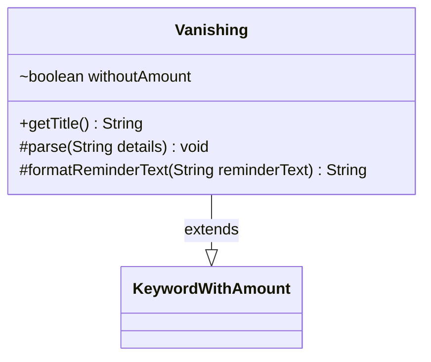

---
aliases:
  - Vanishing
tags:
  - java/class
  - module/forge-game
  - pkg/forge/game/keyword
fqn: forge.game.keyword.Vanishing
package: forge.game.keyword
module: forge-game
kind: Class
---

# Vanishing

**Package:** `forge.game.keyword` &nbsp; **Module:** `forge-game` &nbsp; **Kind:** Class



## Relationships
**Extends:**
- [[forge.game.keyword.KeywordWithAmount|KeywordWithAmount]]

## Source
`forge-game/src/main/java/forge/game/keyword/Vanishing.java`

```java
package forge.game.keyword;

public class Vanishing extends KeywordWithAmount {

    boolean withoutAmount = false;

    public String getTitle() {
        if (withoutAmount) {
            return getKeyword().toString();
        }
        return super.getTitle();
    }

    @Override
    protected void parse(String details) {
        if ("".equals(details)) {
            withoutAmount = true;
        } else {
            super.parse(details);
        }
    }

    @Override
    protected String formatReminderText(String reminderText) {
        if (withoutAmount) {
            return "At the beginning of your upkeep, remove a time counter from this enchantment. When the last is removed, sacrifice it.";
        } else {
            return super.formatReminderText(reminderText);
        }
    }
}
```
