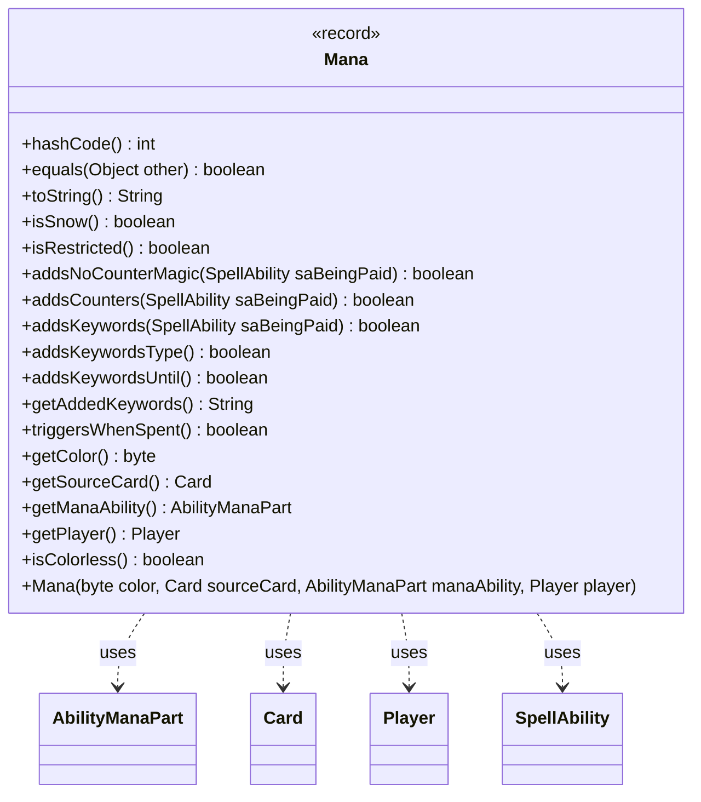

---
aliases:
  - Mana
tags:
  - java/record
  - module/forge-game
  - pkg/forge/game/mana
fqn: forge.game.mana.Mana
package: forge.game.mana
module: forge-game
kind: Record
---

# Mana

**Package:** `forge.game.mana`   **Module:** `forge-game`   **Kind:** Record



## Relationships
**Uses:**
- [[forge.game.card.Card|Card]]
- [[forge.game.player.Player|Player]]
- [[forge.game.spellability.AbilityManaPart|AbilityManaPart]]
- [[forge.game.spellability.SpellAbility|SpellAbility]]

## Design Description

Mana is an immutable record modeling a single mana "globe" in a player's pool, capturing its color, originating source card, the mana ability that produced it, and the owning player. Beyond holding state, it delegates rules-relevant queries—whether the mana is snow, restricted, colorless, adds counters or keywords, suppresses counterspells, or triggers when spent—to its collaborating `AbilityManaPart`, which it treats as the authority on the mana's special behaviors. It consults `SpellAbility` to evaluate context-dependent effects against the ability being paid for.

Notable design intent: the canonical constructor snapshots the source card via `CardCopyService` last-known-information copies, decoupling the mana from later changes to that card. Its hand-written `equals`/`hashCode` deliberately ignore the player and treat mana as fungible unless distinguishing restrictions, keywords, or counter effects require otherwise.

## Source
`forge-game/src/main/java/forge/game/mana/Mana.java`

```java
/*
 * Forge: Play Magic: the Gathering.
 * Copyright (C) 2011  Forge Team
 *
 * This program is free software: you can redistribute it and/or modify
 * it under the terms of the GNU General Public License as published by
 * the Free Software Foundation, either version 3 of the License, or
 * (at your option) any later version.
 * 
 * This program is distributed in the hope that it will be useful,
 * but WITHOUT ANY WARRANTY; without even the implied warranty of
 * MERCHANTABILITY or FITNESS FOR A PARTICULAR PURPOSE.  See the
 * GNU General Public License for more details.
 * 
 * You should have received a copy of the GNU General Public License
 * along with this program.  If not, see <http://www.gnu.org/licenses/>.
 */
package forge.game.mana;

import forge.card.MagicColor;
import forge.card.mana.ManaAtom;
import forge.game.card.Card;
import forge.game.card.CardCopyService;
import forge.game.player.Player;
import forge.game.spellability.AbilityManaPart;
import forge.game.spellability.SpellAbility;

/**
 * <p>
 * Mana class.
 * This represents a single mana 'globe' floating in a player's pool.
 * </p>
 */
public record Mana(byte color, Card sourceCard, AbilityManaPart manaAbility, Player player) {

    @Override
    public int hashCode() {
        final int prime = 31;
        int result = 1;
        result = prime * result + color;
        result = prime * result + ((manaAbility == null) ? 0 : manaAbility.hashCode());
        result = prime * result + ((sourceCard == null) ? 0 : sourceCard.hashCode());
        return result;
    }

    @Override
    public boolean equals(Object other) {
        if (!(other instanceof Mana)) {
            return false;
        }
        Mana m2 = (Mana) other;

        if (color != m2.color) {
            return false;
        }

        AbilityManaPart mp = this.getManaAbility();
        AbilityManaPart mp2 = m2.getManaAbility();
        if ((mp == null) != (mp2 == null)) {
            return false;
        }

        if (!sourceCard.equals(m2.sourceCard) && mp != null) {
            if (addsKeywords(null) != m2.addsKeywords(null)) {
                return false;
            }
            if (addsCounters(null) != m2.addsCounters(null)) {
                return false;
            }
            if (mp.isCannotCounterPaidWith() != mp2.isCannotCounterPaidWith()) {
                return false;
            }
            if (mp.getTriggersWhenSpent() != mp2.getTriggersWhenSpent()) {
                return false;
            }
            if (mp.isPersistentMana() != mp2.isPersistentMana()) {
                return false;
            }
        }

        return mp == mp2 || (mp.getManaRestrictions().equals(mp2.getManaRestrictions()) && mp.getExtraManaRestriction().equals(mp2.getExtraManaRestriction()));
    }

    public Mana(final byte color, final Card sourceCard, final AbilityManaPart manaAbility, final Player player) {
        this.color = color;
        this.manaAbility = manaAbility;
        this.sourceCard = sourceCard.isInPlay() ? CardCopyService.getLKICopy(sourceCard) : sourceCard.getGame().getChangeZoneLKIInfo(sourceCard);
        this.player = player;
    }

    @Override
    public String toString() {
        return MagicColor.toShortString(color);
    }

    public boolean isSnow() {
        return this.sourceCard.isSnow();
    }

    public boolean isRestricted() {
        return this.manaAbility != null && (!manaAbility.getManaRestrictions().isEmpty() || !manaAbility.getExtraManaRestriction().isEmpty());
    }

    public boolean addsNoCounterMagic(SpellAbility saBeingPaid) {
        return this.manaAbility != null && manaAbility.cannotCounterPaidWith(saBeingPaid);
    }

    public boolean addsCounters(SpellAbility saBeingPaid) {
        return this.manaAbility != null && manaAbility.addsCounters(saBeingPaid);
    }

    public boolean addsKeywords(SpellAbility saBeingPaid) {
        return this.manaAbility != null && manaAbility.addKeywords(saBeingPaid);
    }

    public boolean addsKeywordsType() {
        return this.manaAbility != null && manaAbility.getAddsKeywordsType() != null;
    }

    public boolean addsKeywordsUntil() {
        return this.manaAbility != null && manaAbility.getAddsKeywordsUntil() != null;
    }

    public String getAddedKeywords() {
        return this.manaAbility.getKeywords();
    }

    public boolean triggersWhenSpent() {
        return this.manaAbility != null && manaAbility.getTriggersWhenSpent();
    }

    public byte getColor() {
        return this.color;
    }

    public Card getSourceCard() {
        return this.sourceCard;
    }

    public AbilityManaPart getManaAbility() {
        return this.manaAbility;
    }

    public Player getPlayer() {
        return this.player;
    }

    public boolean isColorless() {
        return color == (byte)ManaAtom.COLORLESS;
    }

}
```

## Python
`forge/game/mana/Mana.py`

```python
from forge.card.MagicColor import MagicColor
from forge.card.mana.ManaAtom import ManaAtom
from forge.game.card.Card import Card
from forge.game.card.CardCopyService import CardCopyService
from forge.game.player.Player import Player
from forge.game.spellability.AbilityManaPart import AbilityManaPart
from forge.game.spellability.SpellAbility import SpellAbility


class Mana:
    """
    Mana class.
    This represents a single mana 'globe' floating in a player's pool.
    """

    def __init__(self, color: int, sourceCard: Card, manaAbility: AbilityManaPart, player: Player):
        self.color = color
        self.manaAbility = manaAbility
        self.sourceCard = CardCopyService.getLKICopy(sourceCard) if sourceCard.isInPlay() else sourceCard.getGame().getChangeZoneLKIInfo(sourceCard)
        self.player = player

    def hashCode(self) -> int:
        prime = 31
        result = 1
        result = prime * result + self.color
        result = prime * result + (0 if self.manaAbility is None else self.manaAbility.hashCode())
        result = prime * result + (0 if self.sourceCard is None else self.sourceCard.hashCode())
        return result

    def __hash__(self) -> int:
        return self.hashCode()

    def equals(self, other) -> bool:
        if not isinstance(other, Mana):
            return False
        m2 = other

        if self.color != m2.color:
            return False

        mp = self.getManaAbility()
        mp2 = m2.getManaAbility()
        if (mp is None) != (mp2 is None):
            return False

        if not self.sourceCard.equals(m2.sourceCard) and mp is not None:
            if self.addsKeywords(None) != m2.addsKeywords(None):
                return False
            if self.addsCounters(None) != m2.addsCounters(None):
                return False
            if mp.isCannotCounterPaidWith() != mp2.isCannotCounterPaidWith():
                return False
            if mp.getTriggersWhenSpent() != mp2.getTriggersWhenSpent():
                return False
            if mp.isPersistentMana() != mp2.isPersistentMana():
                return False

        return mp is mp2 or (mp.getManaRestrictions().equals(mp2.getManaRestrictions()) and mp.getExtraManaRestriction().equals(mp2.getExtraManaRestriction()))

    def __eq__(self, other) -> bool:
        return self.equals(other)

    def toString(self) -> str:
        return MagicColor.toShortString(self.color)

    def __str__(self) -> str:
        return self.toString()

    def isSnow(self) -> bool:
        return self.sourceCard.isSnow()

    def isRestricted(self) -> bool:
        return self.manaAbility is not None and (not self.manaAbility.getManaRestrictions().isEmpty() or not self.manaAbility.getExtraManaRestriction().isEmpty())

    def addsNoCounterMagic(self, saBeingPaid: SpellAbility) -> bool:
        return self.manaAbility is not None and self.manaAbility.cannotCounterPaidWith(saBeingPaid)

    def addsCounters(self, saBeingPaid: SpellAbility) -> bool:
        return self.manaAbility is not None and self.manaAbility.addsCounters(saBeingPaid)

    def addsKeywords(self, saBeingPaid: SpellAbility) -> bool:
        return self.manaAbility is not None and self.manaAbility.addKeywords(saBeingPaid)

    def addsKeywordsType(self) -> bool:
        return self.manaAbility is not None and self.manaAbility.getAddsKeywordsType() is not None

    def addsKeywordsUntil(self) -> bool:
        return self.manaAbility is not None and self.manaAbility.getAddsKeywordsUntil() is not None

    def getAddedKeywords(self) -> str:
        return self.manaAbility.getKeywords()

    def triggersWhenSpent(self) -> bool:
        return self.manaAbility is not None and self.manaAbility.getTriggersWhenSpent()

    def getColor(self) -> int:
        return self.color

    def getSourceCard(self) -> Card:
        return self.sourceCard

    def getManaAbility(self) -> AbilityManaPart:
        return self.manaAbility

    def getPlayer(self) -> Player:
        return self.player

    def isColorless(self) -> bool:
        return self.color == ManaAtom.COLORLESS
```
