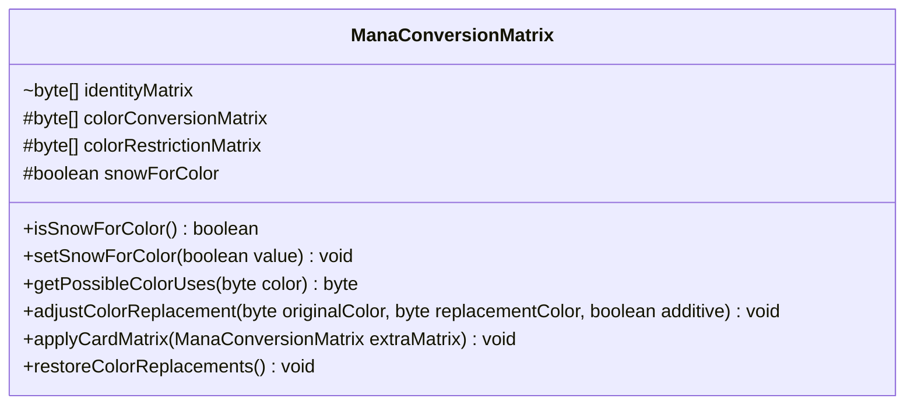

---
aliases:
  - ManaConversionMatrix
tags:
  - java/class
  - module/forge-game
  - pkg/forge/game/mana
fqn: forge.game.mana.ManaConversionMatrix
package: forge.game.mana
module: forge-game
kind: Class
---

# ManaConversionMatrix

**Package:** `forge.game.mana` &nbsp; **Module:** `forge-game` &nbsp; **Kind:** Class



## Design Description

ManaConversionMatrix models the rules engine's mana-payment substitution system, tracking how one color of mana may be spent to pay costs of another. It maintains two parallel byte-array matrices indexed by mana type: a conversion matrix whose bits are OR'd together to broaden what a color can pay for, and a restriction matrix whose bits are AND'd to narrow it; `getPossibleColorUses` combines both to yield the legal payment options for a color. As a plain mutable state holder (not implementing any interface), it collaborates with `ManaAtom` for color-bit constants and type indexing, deliberately avoiding hardcoded indices via `getIndexOfFirstManaType`. Notable design intent includes the symmetric additive/restrictive logic in `adjustColorReplacement`, `applyCardMatrix` for layering a card's temporary effects onto the base matrix, and `restoreColorReplacements` resetting to an identity state where each color pays only for itself.

## Source
`forge-game/src/main/java/forge/game/mana/ManaConversionMatrix.java`

```java
package forge.game.mana;

import forge.card.mana.ManaAtom;

import java.util.Arrays;

public class ManaConversionMatrix {
    static byte[] identityMatrix = { ManaAtom.WHITE, ManaAtom.BLUE, ManaAtom.BLACK, ManaAtom.RED, ManaAtom.GREEN, ManaAtom.COLORLESS };

    // Conversion matrix ORs byte values to make mana more payable
    // Restrictive matrix ANDs byte values to make mana less payable
    protected byte[] colorConversionMatrix = new byte[ManaAtom.MANATYPES.length];
    protected byte[] colorRestrictionMatrix = new byte[ManaAtom.MANATYPES.length];

    protected boolean snowForColor = false;

    public boolean isSnowForColor() {
        return snowForColor;
    }

    public void setSnowForColor(boolean value) {
        snowForColor = value;
    }

    public byte getPossibleColorUses(byte color) {
        // Take the current conversion value, AND with restrictions to get mana usage
        int rowIdx = ManaAtom.getIndexOfFirstManaType(color);
        int matrixIdx = rowIdx < 0 ? identityMatrix.length - 1 : rowIdx;

        byte colorUse = colorConversionMatrix[matrixIdx];
        colorUse &= colorRestrictionMatrix[matrixIdx];
        return colorUse;
    }

    public void adjustColorReplacement(byte originalColor, byte replacementColor, boolean additive) {
        // Fix the index without hardcodes
        int rowIdx = ManaAtom.getIndexOfFirstManaType(originalColor);
        rowIdx = rowIdx < 0 ? identityMatrix.length - 1 : rowIdx;
        if (additive) {
            colorConversionMatrix[rowIdx] |= replacementColor;
        } else {
            colorRestrictionMatrix[rowIdx] &= replacementColor;
        }
    }

    public void applyCardMatrix(ManaConversionMatrix extraMatrix) {
        for (int i = 0; i < colorConversionMatrix.length; i++) {
            colorConversionMatrix[i] |= extraMatrix.colorConversionMatrix[i];
        }

        for (int i = 0; i < colorRestrictionMatrix.length; i++) {
            colorRestrictionMatrix[i] &= extraMatrix.colorRestrictionMatrix[i];
        }
        setSnowForColor(extraMatrix.isSnowForColor());
    }

    public void restoreColorReplacements() {
        // By default each color can only be paid by itself ( {G} -> {G}, {C} -> {C}
        System.arraycopy(identityMatrix, 0, colorConversionMatrix, 0, colorConversionMatrix.length);
        // By default all mana types are unrestricted
        Arrays.fill(colorRestrictionMatrix, ManaAtom.ALL_MANA_TYPES);
        snowForColor = false;
    }
}
```

## Python
`forge/game/mana/ManaConversionMatrix.py`

```python
from forge.card.mana.ManaAtom import ManaAtom


class ManaConversionMatrix:
    identityMatrix = [ManaAtom.WHITE, ManaAtom.BLUE, ManaAtom.BLACK, ManaAtom.RED, ManaAtom.GREEN, ManaAtom.COLORLESS]

    def __init__(self):
        # Conversion matrix ORs byte values to make mana more payable
        # Restrictive matrix ANDs byte values to make mana less payable
        self.colorConversionMatrix = [0] * len(ManaAtom.MANATYPES)
        self.colorRestrictionMatrix = [0] * len(ManaAtom.MANATYPES)

        self.snowForColor = False

    def isSnowForColor(self) -> bool:
        return self.snowForColor

    def setSnowForColor(self, value: bool) -> None:
        self.snowForColor = value

    def getPossibleColorUses(self, color: int) -> int:
        # Take the current conversion value, AND with restrictions to get mana usage
        rowIdx = ManaAtom.getIndexOfFirstManaType(color)
        matrixIdx = len(ManaConversionMatrix.identityMatrix) - 1 if rowIdx < 0 else rowIdx

        colorUse = self.colorConversionMatrix[matrixIdx]
        colorUse &= self.colorRestrictionMatrix[matrixIdx]
        return colorUse

    def adjustColorReplacement(self, originalColor: int, replacementColor: int, additive: bool) -> None:
        # Fix the index without hardcodes
        rowIdx = ManaAtom.getIndexOfFirstManaType(originalColor)
        rowIdx = len(ManaConversionMatrix.identityMatrix) - 1 if rowIdx < 0 else rowIdx
        if additive:
            self.colorConversionMatrix[rowIdx] |= replacementColor
        else:
            self.colorRestrictionMatrix[rowIdx] &= replacementColor

    def applyCardMatrix(self, extraMatrix: "ManaConversionMatrix") -> None:
        for i in range(len(self.colorConversionMatrix)):
            self.colorConversionMatrix[i] |= extraMatrix.colorConversionMatrix[i]

        for i in range(len(self.colorRestrictionMatrix)):
            self.colorRestrictionMatrix[i] &= extraMatrix.colorRestrictionMatrix[i]
        self.setSnowForColor(extraMatrix.isSnowForColor())

    def restoreColorReplacements(self) -> None:
        # By default each color can only be paid by itself ( {G} -> {G}, {C} -> {C}
        for i in range(len(self.colorConversionMatrix)):
            self.colorConversionMatrix[i] = ManaConversionMatrix.identityMatrix[i]
        # By default all mana types are unrestricted
        for i in range(len(self.colorRestrictionMatrix)):
            self.colorRestrictionMatrix[i] = ManaAtom.ALL_MANA_TYPES
        self.snowForColor = False
```
