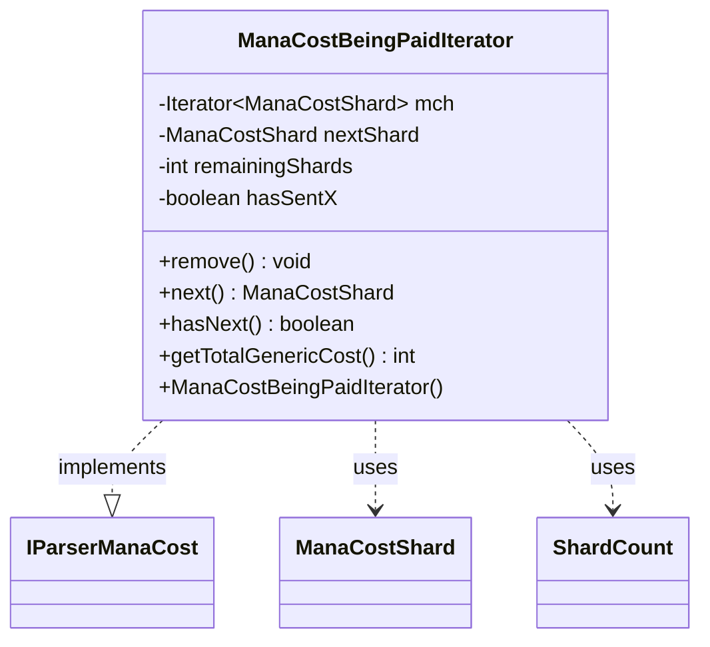

---
aliases:
  - ManaCostBeingPaidIterator
tags:
  - java/class
  - module/forge-game
  - pkg/forge/game/mana
fqn: forge.game.mana.ManaCostBeingPaid.ManaCostBeingPaidIterator
package: forge.game.mana
module: forge-game
kind: Class
---

# ManaCostBeingPaidIterator

**Package:** `forge.game.mana`   **Module:** `forge-game`   **Kind:** Class



## Relationships
**Implements:**
- [[forge.card.mana.IParserManaCost|IParserManaCost]]
**Uses:**
- [[forge.card.mana.ManaCostShard|ManaCostShard]]
- [[forge.game.mana.ManaCostBeingPaid.ShardCount|ShardCount]]

## Design Description

ManaCostBeingPaidIterator is a private inner iterator of ManaCostBeingPaid that exposes the cost's outstanding shards as a sequential stream, implementing the IParserManaCost contract. Walking the enclosing instance's `unpaidShards` map, it yields each ManaCostShard repeated by its ShardCount.totalCount, emits any generic-X requirement first (driven by `cntX`), and deliberately skips the GENERIC shard so generic mana is handled separately rather than enumerated.

Notable design intent: hasNext() carries the real work — advancing the underlying key iterator, priming `nextShard`, and recursing to bypass GENERIC — while next() merely decrements a counter and assumes hasNext() was called, throwing otherwise. The iterator is read-only (remove() throws UnsupportedOperationException), and getTotalGenericCost() reports the generic requirement, using -1 to signal an entirely empty cost versus 0 for none outstanding.

## Source
`forge-game/src/main/java/forge/game/mana/ManaCostBeingPaid.java` — declaration excerpt

```java
    private class ManaCostBeingPaidIterator implements IParserManaCost {
        private Iterator<ManaCostShard> mch;
        private ManaCostShard nextShard = null;
        private int remainingShards = 0;
        private boolean hasSentX = false;

        public ManaCostBeingPaidIterator() {
            mch = unpaidShards.keySet().iterator();
        }

        @Override
        public void remove() {
            throw new UnsupportedOperationException();
        }

        @Override
        public ManaCostShard next() {
            if (remainingShards == 0) {
                throw new UnsupportedOperationException("All shards were depleted, call hasNext()");
            }
            remainingShards--;
            return nextShard;
        }

        @Override
        public boolean hasNext() {
            if (remainingShards > 0) { return true; }
            if (!hasSentX) {
                if (nextShard != ManaCostShard.X && cntX > 0) {
                    nextShard = ManaCostShard.X;
                    remainingShards = cntX;
                    return true;
                }
                else {
                    hasSentX = true;
                }
            }
            if (!mch.hasNext()) { return false; }

            nextShard = mch.next();
            if (nextShard == ManaCostShard.GENERIC) {
                return this.hasNext(); // skip generic
            }
            remainingShards = unpaidShards.get(nextShard).totalCount;
            return true;
        }

        @Override
        public int getTotalGenericCost() {
            ShardCount c = unpaidShards.get(ManaCostShard.GENERIC);
            if (c == null) {
                return unpaidShards.isEmpty() && cntX == 0 ? -1 : 0;
            }
            return c.totalCount;
        }
    }
```

## Python
`forge/game/mana/ManaCostBeingPaid/ManaCostBeingPaidIterator.py`

```python
from forge.card.mana.IParserManaCost import IParserManaCost
from forge.card.mana.ManaCostShard import ManaCostShard
from forge.game.mana.ManaCostBeingPaid.ShardCount import ShardCount


class ManaCostBeingPaidIterator(IParserManaCost):
    def __init__(self, outer):
        self.outer = outer
        self.nextShard = None
        self.remainingShards = 0
        self.hasSentX = False
        self.mch = iter(self.outer.unpaidShards.keys())

    def remove(self):
        raise NotImplementedError()

    def next(self):
        if self.remainingShards == 0:
            raise NotImplementedError("All shards were depleted, call hasNext()")
        self.remainingShards -= 1
        return self.nextShard

    def hasNext(self):
        if self.remainingShards > 0:
            return True
        if not self.hasSentX:
            if self.nextShard != ManaCostShard.X and self.outer.cntX > 0:
                self.nextShard = ManaCostShard.X
                self.remainingShards = self.outer.cntX
                return True
            else:
                self.hasSentX = True

        nextShard = next(self.mch, None)
        if nextShard is None:
            return False

        self.nextShard = nextShard
        if self.nextShard == ManaCostShard.GENERIC:
            return self.hasNext()  # skip generic
        self.remainingShards = self.outer.unpaidShards[self.nextShard].totalCount
        return True

    def getTotalGenericCost(self):
        c = self.outer.unpaidShards.get(ManaCostShard.GENERIC)
        if c is None:
            return -1 if (len(self.outer.unpaidShards) == 0 and self.outer.cntX == 0) else 0
        return c.totalCount
```
