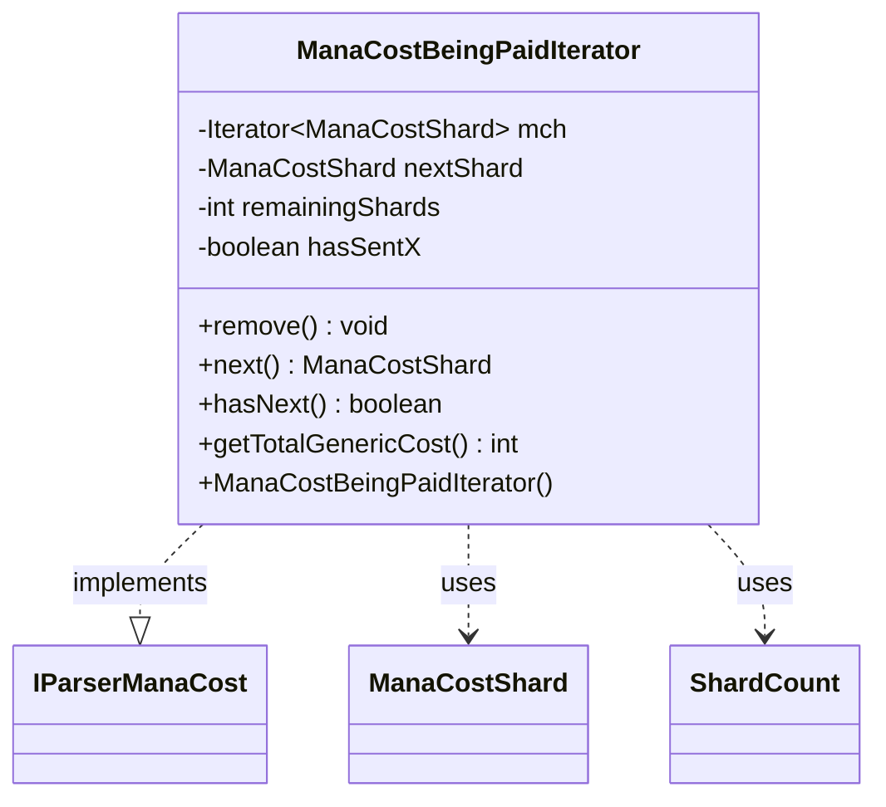

---
aliases:
  - ManaCostBeingPaidIterator
tags:
  - java/class
  - module/forge-game
  - pkg/forge/game/mana
fqn: forge.game.mana.ManaCostBeingPaid.ManaCostBeingPaidIterator
package: forge.game.mana
module: forge-game
kind: Class
---

# ManaCostBeingPaidIterator

**Package:** `forge.game.mana` &nbsp; **Module:** `forge-game` &nbsp; **Kind:** Class



## Relationships
**Implements:**
- [[forge.card.mana.IParserManaCost|IParserManaCost]]
**Uses:**
- [[forge.card.mana.ManaCostShard|ManaCostShard]]
- [[forge.game.mana.ManaCostBeingPaid.ShardCount|ShardCount]]

## Source
`forge-game/src/main/java/forge/game/mana/ManaCostBeingPaid.java` — declaration excerpt

```java
    private class ManaCostBeingPaidIterator implements IParserManaCost {
        private Iterator<ManaCostShard> mch;
        private ManaCostShard nextShard = null;
        private int remainingShards = 0;
        private boolean hasSentX = false;

        public ManaCostBeingPaidIterator() {
            mch = unpaidShards.keySet().iterator();
        }

        @Override
        public void remove() {
            throw new UnsupportedOperationException();
        }

        @Override
        public ManaCostShard next() {
            if (remainingShards == 0) {
                throw new UnsupportedOperationException("All shards were depleted, call hasNext()");
            }
            remainingShards--;
            return nextShard;
        }

        @Override
        public boolean hasNext() {
            if (remainingShards > 0) { return true; }
            if (!hasSentX) {
                if (nextShard != ManaCostShard.X && cntX > 0) {
                    nextShard = ManaCostShard.X;
                    remainingShards = cntX;
                    return true;
                }
                else {
                    hasSentX = true;
                }
            }
            if (!mch.hasNext()) { return false; }

            nextShard = mch.next();
            if (nextShard == ManaCostShard.GENERIC) {
                return this.hasNext(); // skip generic
            }
            remainingShards = unpaidShards.get(nextShard).totalCount;
            return true;
        }

        @Override
        public int getTotalGenericCost() {
            ShardCount c = unpaidShards.get(ManaCostShard.GENERIC);
            if (c == null) {
                return unpaidShards.isEmpty() && cntX == 0 ? -1 : 0;
            }
            return c.totalCount;
        }
    }
```
