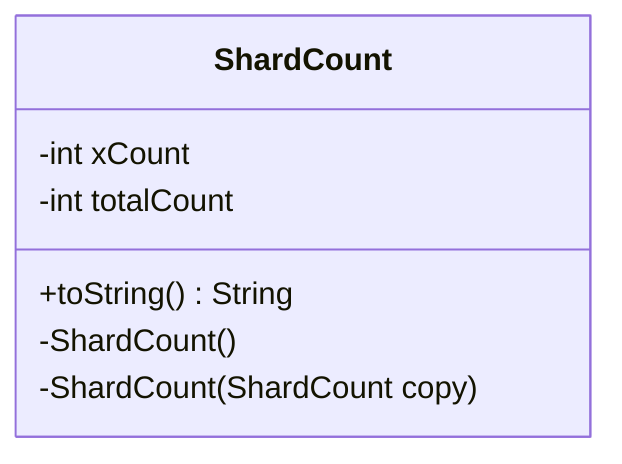

---
aliases:
  - ShardCount
tags:
  - java/class
  - module/forge-game
  - pkg/forge/game/mana
fqn: forge.game.mana.ManaCostBeingPaid.ShardCount
package: forge.game.mana
module: forge-game
kind: Class
---

# ShardCount

**Package:** `forge.game.mana` &nbsp; **Module:** `forge-game` &nbsp; **Kind:** Class



## Source
`forge-game/src/main/java/forge/game/mana/ManaCostBeingPaid.java` — declaration excerpt

```java
    private class ShardCount {
        private int xCount;
        private int totalCount;

        private ShardCount() {
        }
        private ShardCount(ShardCount copy) {
            xCount = copy.xCount;
            totalCount = copy.totalCount;
        }

        @Override
        public String toString() {
            return "{x=" + xCount + " total=" + totalCount + "}";
        }
    }
```
