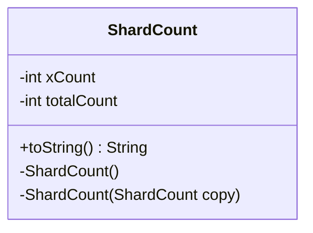

---
aliases:
  - ShardCount
tags:
  - java/class
  - module/forge-game
  - pkg/forge/game/mana
fqn: forge.game.mana.ManaCostBeingPaid.ShardCount
package: forge.game.mana
module: forge-game
kind: Class
---

# ShardCount

**Package:** `forge.game.mana`   **Module:** `forge-game`   **Kind:** Class



## Design Description

The ShardCount class is a private inner helper of `ManaCostBeingPaid` that tracks how many mana shards are being paid for a given color or cost component, distinguishing the variable portion (`xCount`) from the overall tally (`totalCount`). It exists purely as a lightweight mutable record scoped to its enclosing class, holding no behavior beyond state.

As a private nested class, it has no supertype beyond `Object` and collaborates only with `ManaCostBeingPaid`, which instantiates and mutates it during mana payment bookkeeping. The copy constructor signals deliberate support for cloning payment state, letting the outer class snapshot counts when duplicating a `ManaCostBeingPaid`, while the diagnostic `toString()` exposes both fields for debugging.

## Source
`forge-game/src/main/java/forge/game/mana/ManaCostBeingPaid.java` — declaration excerpt

```java
    private class ShardCount {
        private int xCount;
        private int totalCount;

        private ShardCount() {
        }
        private ShardCount(ShardCount copy) {
            xCount = copy.xCount;
            totalCount = copy.totalCount;
        }

        @Override
        public String toString() {
            return "{x=" + xCount + " total=" + totalCount + "}";
        }
    }
```

## Python
`forge/game/mana/ManaCostBeingPaid/ShardCount.py`

```python
from forge.game.mana.ManaCostBeingPaid import ManaCostBeingPaid


class ShardCount:
    def __init__(self, copy: "ShardCount" = None):
        if copy is None:
            self.xCount: int = 0
            self.totalCount: int = 0
        else:
            self.xCount = copy.xCount
            self.totalCount = copy.totalCount

    def toString(self) -> str:
        return "{x=" + str(self.xCount) + " total=" + str(self.totalCount) + "}"

    def __str__(self) -> str:
        return self.toString()
```
