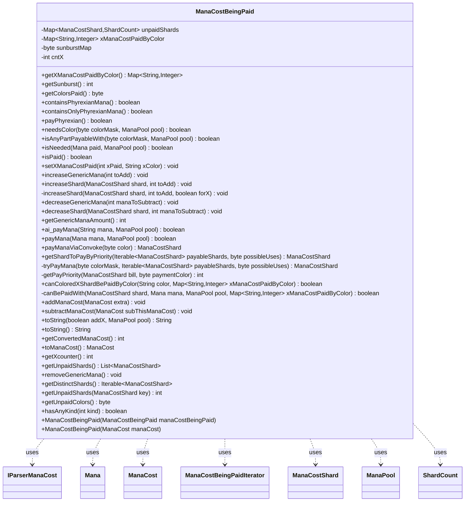

---
aliases:
  - ManaCostBeingPaid
tags:
  - java/class
  - module/forge-game
  - pkg/forge/game/mana
fqn: forge.game.mana.ManaCostBeingPaid
package: forge.game.mana
module: forge-game
kind: Class
---

# ManaCostBeingPaid

**Package:** `forge.game.mana` &nbsp; **Module:** `forge-game` &nbsp; **Kind:** Class



## Relationships
**Uses:**
- [[forge.card.mana.IParserManaCost|IParserManaCost]]
- [[forge.card.mana.ManaCost|ManaCost]]
- [[forge.card.mana.ManaCostShard|ManaCostShard]]
- [[forge.game.mana.Mana|Mana]]
- [[forge.game.mana.ManaCostBeingPaid.ManaCostBeingPaidIterator|ManaCostBeingPaidIterator]]
- [[forge.game.mana.ManaCostBeingPaid.ShardCount|ShardCount]]
- [[forge.game.mana.ManaPool|ManaPool]]

## Design Description

ManaCostBeingPaid models the mutable, in-progress state of a mana cost as it is being settled during payment, tracking the still-unpaid shards (grouped by ManaCostShard with per-shard total and X counts via the inner ShardCount), the count of pending {X} symbols, a sunburst bitmask of colors spent, and which colors paid for colored-X portions. Constructed from an immutable ManaCost (or copied), it exposes the payment lifecycle: querying what colors or Mana a cost still needs, applying payments through payMana/ai_payMana/payManaViaConvoke, and reporting completion via isPaid.

It delegates color-matching rules to the collaborating ManaPool and Mana, and uses ManaCostShard to classify hybrid, Phyrexian, snow, and 2-generic shards. Notable design intent includes a priority-based shard selection (getPayPriority/tryPayMana) that picks the most economical shard to pay, careful X-cost accounting, and complex fallback logic in decreaseShard for substituting hybrid shards. The inner ManaCostBeingPaidIterator implements IParserManaCost to convert the remaining cost back into an immutable ManaCost via toManaCost.

## Source
`forge-game/src/main/java/forge/game/mana/ManaCostBeingPaid.java`

```java
/*
 * Forge: Play Magic: the Gathering.
 * Copyright (C) 2011  Forge Team
 *
 * This program is free software: you can redistribute it and/or modify
 * it under the terms of the GNU General Public License as published by
 * the Free Software Foundation, either version 3 of the License, or
 * (at your option) any later version.
 * 
 * This program is distributed in the hope that it will be useful,
 * but WITHOUT ANY WARRANTY; without even the implied warranty of
 * MERCHANTABILITY or FITNESS FOR A PARTICULAR PURPOSE.  See the
 * GNU General Public License for more details.
 * 
 * You should have received a copy of the GNU General Public License
 * along with this program.  If not, see <http://www.gnu.org/licenses/>.
 */
package forge.game.mana;

import com.google.common.collect.Iterables;
import com.google.common.collect.Lists;
import com.google.common.collect.Maps;
import forge.card.ColorSet;
import forge.card.MagicColor;
import forge.card.mana.IParserManaCost;
import forge.card.mana.ManaAtom;
import forge.card.mana.ManaCost;
import forge.card.mana.ManaCostShard;
import forge.util.IterableUtil;
import org.apache.commons.lang3.StringUtils;

import java.util.*;
import java.util.Map.Entry;
import java.util.function.Predicate;

/**
 * <p>
 * ManaCostBeingPaid class.
 * </p>
 * 
 * @author Forge
 * @version $Id$
 */
public class ManaCostBeingPaid {
    private class ManaCostBeingPaidIterator implements IParserManaCost {
        private Iterator<ManaCostShard> mch;
        private ManaCostShard nextShard = null;
        private int remainingShards = 0;
        private boolean hasSentX = false;

        public ManaCostBeingPaidIterator() {
            mch = unpaidShards.keySet().iterator();
        }

        @Override
        public void remove() {
            throw new UnsupportedOperationException();
        }

        @Override
        public ManaCostShard next() {
            if (remainingShards == 0) {
                throw new UnsupportedOperationException("All shards were depleted, call hasNext()");
            }
            remainingShards--;
            return nextShard;
        }

        @Override
        public boolean hasNext() {
            if (remainingShards > 0) { return true; }
            if (!hasSentX) {
                if (nextShard != ManaCostShard.X && cntX > 0) {
                    nextShard = ManaCostShard.X;
                    remainingShards = cntX;
                    return true;
                }
                else {
                    hasSentX = true;
                }
            }
            if (!mch.hasNext()) { return false; }

            nextShard = mch.next();
            if (nextShard == ManaCostShard.GENERIC) {
                return this.hasNext(); // skip generic
            }
            remainingShards = unpaidShards.get(nextShard).totalCount;
            return true;
        }

        @Override
        public int getTotalGenericCost() {
            ShardCount c = unpaidShards.get(ManaCostShard.GENERIC);
            if (c == null) {
                return unpaidShards.isEmpty() && cntX == 0 ? -1 : 0;
            }
            return c.totalCount;
        }
    }

    private class ShardCount {
        private int xCount;
        private int totalCount;

        private ShardCount() {
        }
        private ShardCount(ShardCount copy) {
            xCount = copy.xCount;
            totalCount = copy.totalCount;
        }

        @Override
        public String toString() {
            return "{x=" + xCount + " total=" + totalCount + "}";
        }
    }

    // holds Mana_Part objects
    // ManaPartColor is stored before ManaPartGeneric
    private final Map<ManaCostShard, ShardCount> unpaidShards = Maps.newHashMap();
    private Map<String, Integer> xManaCostPaidByColor;
    private byte sunburstMap = 0;
    private int cntX = 0;

    /**
     * Copy constructor
     * @param manaCostBeingPaid
     */
    public ManaCostBeingPaid(ManaCostBeingPaid manaCostBeingPaid) {
        for (Entry<ManaCostShard, ShardCount> m : manaCostBeingPaid.unpaidShards.entrySet()) {
            unpaidShards.put(m.getKey(), new ShardCount(m.getValue()));
        }
        if (manaCostBeingPaid.xManaCostPaidByColor != null) {
            xManaCostPaidByColor = Maps.newHashMap(manaCostBeingPaid.xManaCostPaidByColor);
        }
        sunburstMap = manaCostBeingPaid.sunburstMap;
        cntX = manaCostBeingPaid.cntX;
    }

    public ManaCostBeingPaid(ManaCost manaCost) {
        if (manaCost == null) { return; }
        for (ManaCostShard shard : manaCost) {
            if (shard == ManaCostShard.X) {
                cntX++;
            } else {
                increaseShard(shard, 1, false);
            }
        }
        increaseGenericMana(manaCost.getGenericCost());
    }

    public Map<String, Integer> getXManaCostPaidByColor() {
        return xManaCostPaidByColor;
    }

    public final int getSunburst() {
        return ColorSet.fromMask(sunburstMap).countColors();
    }

    public final byte getColorsPaid() {
        return sunburstMap;
    }

    public final boolean containsPhyrexianMana() {
        for (ManaCostShard shard : unpaidShards.keySet()) {
            if (shard.isPhyrexian()) {
                return true;
            }
        }
        return false;
    }

    public final boolean containsOnlyPhyrexianMana() {
        for (ManaCostShard shard : unpaidShards.keySet()) {
            if (!shard.isPhyrexian()) {
                return false;
            }
        }
        return true;
    }

    public final boolean payPhyrexian() {
        ManaCostShard phy = null;
        for (ManaCostShard mcs : unpaidShards.keySet()) {
            if (mcs.isPhyrexian()) {
                phy = mcs;
                break;
            }
        }

        if (phy == null) {
            return false;
        }

        decreaseShard(phy, 1);
        return true;
    }

    // takes a Short Color and returns true if it exists in the mana cost.
    // Easier for split costs
    public final boolean needsColor(final byte colorMask, final ManaPool pool) {
        for (ManaCostShard shard : unpaidShards.keySet()) {
            if (shard == ManaCostShard.GENERIC) {
                continue;
            }
            if (shard.isOr2Generic()) {
                if ((shard.getColorMask() & colorMask) != 0) {
                    return true;
                }
            }
            else if (pool.canPayForShardWithColor(shard, colorMask)) {
                return true;
            }
        }
        return false;
    }

    // isNeeded(String) still used by the Computer, might have problems activating Snow abilities
    public final boolean isAnyPartPayableWith(byte colorMask, final ManaPool pool) {
        for (ManaCostShard shard : unpaidShards.keySet()) {
            if (pool.canPayForShardWithColor(shard, colorMask)) {
                return true;
            }
        }
        return false;
    }

    public final boolean isNeeded(final Mana paid, final ManaPool pool) {
        for (ManaCostShard shard : unpaidShards.keySet()) {
            if (canBePaidWith(shard, paid, pool, xManaCostPaidByColor)) {
                return true;
            }
        }
        return false;
    }

    public final boolean isPaid() {
        return unpaidShards.isEmpty();
    }

    public final void setXManaCostPaid(final int xPaid, final String xColor) {
        int xCost = xPaid * cntX;
        cntX = 0;

        ManaCostShard shard;
        if (StringUtils.isEmpty(xColor)) {
            shard = ManaCostShard.GENERIC;
        } else {
            shard = ManaCostShard.parseNonGeneric(xColor);
        }
        increaseShard(shard, xCost, true);
    }

    public final void increaseGenericMana(final int toAdd) {
        increaseShard(ManaCostShard.GENERIC, toAdd, false);
    }
    public final void increaseShard(final ManaCostShard shard, final int toAdd) {
        increaseShard(shard, toAdd, false);
    }
    private void increaseShard(final ManaCostShard shard, final int toAdd, final boolean forX) {
        if (toAdd <= 0) { return; }

        ShardCount sc = unpaidShards.computeIfAbsent(shard, k -> new ShardCount());
        if (forX) {
            sc.xCount += toAdd;
        }
        sc.totalCount += toAdd;
    }

    public final void decreaseGenericMana(final int manaToSubtract) {
        decreaseShard(ManaCostShard.GENERIC, manaToSubtract);
    }

    public final void decreaseShard(final ManaCostShard shard, final int manaToSubtract) {
        if (manaToSubtract <= 0) {
            return;
        }

        ShardCount sc = unpaidShards.get(shard);
        if (sc == null) {
            // only special rules for Mono Color Shards and for Generic
            if (!shard.isMonoColor() && shard != ManaCostShard.GENERIC) {
                return;
            }
            int otherSubtract = manaToSubtract;
            List<ManaCostShard> toRemove = Lists.newArrayList();

            //TODO move that for parts into extra function if able

            // try to remove multicolored hybrid shards
            // for that, this shard need to be mono colored
            if (shard.isMonoColor()) {
                for (Entry<ManaCostShard, ShardCount> e : unpaidShards.entrySet()) {
                    final ManaCostShard eShard = e.getKey();
                    sc = e.getValue();
                    if (eShard != ManaCostShard.COLORED_X && eShard.isOfKind(shard.getShard()) && eShard.isMultiColor()) {
                        if (otherSubtract >= sc.totalCount) {
                            otherSubtract -= sc.totalCount;
                            sc.xCount = sc.totalCount = 0;
                            toRemove.add(eShard);
                        } else {
                            sc.totalCount -= otherSubtract;
                            if (sc.xCount > sc.totalCount) {
                                sc.xCount = sc.totalCount;
                            }
                            // nothing more left in otherSubtract
                            break;
                        }
                    }
                }

                // try to remove 2 generic hybrid shards with colored shard
                for (Entry<ManaCostShard, ShardCount> e : unpaidShards.entrySet()) {
                    final ManaCostShard eShard = e.getKey();
                    sc = e.getValue();
                    if (eShard.isOfKind(shard.getShard()) && eShard.isOr2Generic()) {
                        if (otherSubtract >= sc.totalCount) {
                            otherSubtract -= sc.totalCount;
                            sc.xCount = sc.totalCount = 0;
                            toRemove.add(eShard);
                        } else {
                            sc.totalCount -= otherSubtract;
                            if (sc.xCount > sc.totalCount) {
                                sc.xCount = sc.totalCount;
                            }
                            // nothing more left in otherSubtract
                            break;
                        }
                    }
                }

                // try to remove colorless hybrid shards with colored shard
                for (Entry<ManaCostShard, ShardCount> e : unpaidShards.entrySet()) {
                    final ManaCostShard eShard = e.getKey();
                    sc = e.getValue();
                    if (eShard.isOfKind(shard.getShard()) && eShard.isColorless()) {
                        if (otherSubtract >= sc.totalCount) {
                            otherSubtract -= sc.totalCount;
                            sc.xCount = sc.totalCount = 0;
                            toRemove.add(eShard);
                        } else {
                            sc.totalCount -= otherSubtract;
                            if (sc.xCount > sc.totalCount) {
                                sc.xCount = sc.totalCount;
                            }
                            // nothing more left in otherSubtract
                            break;
                        }
                    }
                }

                // try to remove phyrexian shards with colored shard
                for (Entry<ManaCostShard, ShardCount> e : unpaidShards.entrySet()) {
                    final ManaCostShard eShard = e.getKey();
                    sc = e.getValue();
                    if (eShard.isOfKind(shard.getShard()) && eShard.isPhyrexian()) {
                        if (otherSubtract >= sc.totalCount) {
                            otherSubtract -= sc.totalCount;
                            sc.xCount = sc.totalCount = 0;
                            toRemove.add(eShard);
                        } else {
                            sc.totalCount -= otherSubtract;
                            if (sc.xCount > sc.totalCount) {
                                sc.xCount = sc.totalCount;
                            }
                            // nothing more left in otherSubtract
                            break;
                        }
                    }
                }
            } else if (shard == ManaCostShard.GENERIC) {
                // try to remove 2 generic hybrid shards WITH generic shard
                int shardAmount = otherSubtract / 2;
                for (Entry<ManaCostShard, ShardCount> e : unpaidShards.entrySet()) {
                    final ManaCostShard eShard = e.getKey();
                    sc = e.getValue();
                    if (eShard.isOr2Generic()) {
                        if (shardAmount >= sc.totalCount) {
                            shardAmount -= sc.totalCount;
                            otherSubtract -= sc.totalCount * 2;
                            sc.xCount = sc.totalCount = 0;
                            toRemove.add(eShard);
                        } else {
                            sc.totalCount -= shardAmount;
                            if (sc.xCount > sc.totalCount) {
                                sc.xCount = sc.totalCount;
                            }
                            // nothing more left in otherSubtract
                            break;
                        }
                    } else if (sc.xCount > 0) { // X part that can only be paid by specific color
                        if (otherSubtract >= sc.xCount) {
                            otherSubtract -= sc.xCount;
                            sc.totalCount -= sc.xCount;
                            sc.xCount = 0;
                            if (sc.totalCount == 0) {
                                toRemove.add(eShard);
                            }
                        } else {
                            sc.totalCount -= otherSubtract;
                            sc.xCount -= otherSubtract;
                            // nothing more left in otherSubtract
                            break;
                        }
                    }
                }
            }

            unpaidShards.keySet().removeAll(toRemove);
            //System.out.println("Tried to subtract a " + shard.toString() + " shard that is not present in this ManaCostBeingPaid");
            return;
        }

        int difference = manaToSubtract - sc.totalCount;

        if (manaToSubtract >= sc.totalCount) {
            sc.xCount = 0;
            sc.totalCount = 0;
            unpaidShards.remove(shard);
            // try to remove difference from the rest
            this.decreaseShard(shard, difference);
            return;
        }

        sc.totalCount -= manaToSubtract;
        if (sc.xCount > sc.totalCount) {
            sc.xCount = sc.totalCount; //only decrease xCount if it would otherwise be greater than totalCount
        }
    }

    public final int getGenericManaAmount() {
        ShardCount sc = unpaidShards.get(ManaCostShard.GENERIC);
        if (sc != null) {
            return sc.totalCount;
        }
        return 0;
    }

    /**
     * <p>
     * addMana.
     * </p>
     * 
     * @param mana
     *            a {@link java.lang.String} object.
     * @return a boolean.
     */
    public final boolean ai_payMana(final String mana, final ManaPool pool) {
        final byte colorMask = ManaAtom.fromName(mana);
        if (!this.isAnyPartPayableWith(colorMask, pool)) {
            //System.out.println("ManaCost : addMana() error, mana not needed - " + mana);
            return false;
            //throw new RuntimeException("ManaCost : addMana() error, mana not needed - " + mana);
        }

        Predicate<ManaCostShard> predCanBePaid = ms -> {
            // Check Colored X and see if the color is already used
            if (ms == ManaCostShard.COLORED_X && !canColoredXShardBePaidByColor(MagicColor.toShortString(colorMask), xManaCostPaidByColor)) {
                return false;
            }
            return pool.canPayForShardWithColor(ms, colorMask);
        };

        return tryPayMana(colorMask, IterableUtil.filter(unpaidShards.keySet(), predCanBePaid), pool.getPossibleColorUses(colorMask)) != null;
    }

    /**
     * <p>
     * addMana.
     * </p>
     * 
     * @param mana
     *            a {@link forge.game.mana.Mana} object.
     * @return a boolean.
     */
    public final boolean payMana(final Mana mana, final ManaPool pool) {
        if (!this.isNeeded(mana, pool)) {
            throw new RuntimeException("ManaCost : addMana() error, mana not needed - " + mana);
        }

        Predicate<ManaCostShard> predCanBePaid = ms -> canBePaidWith(ms, mana, pool, xManaCostPaidByColor);

        byte inColor = mana.getColor();
        byte outColor = pool.getPossibleColorUses(inColor);
        return tryPayMana(inColor, IterableUtil.filter(unpaidShards.keySet(), predCanBePaid), outColor) != null;
    }
    
    public final ManaCostShard payManaViaConvoke(final byte color) {
        Predicate<ManaCostShard> predCanBePaid = ms -> !ms.isSnow() && !ms.isColorless() && ms.canBePaidWithManaOfColor(color);
        return tryPayMana(color, IterableUtil.filter(unpaidShards.keySet(), predCanBePaid), (byte)0xFF);
    }

    public ManaCostShard getShardToPayByPriority(Iterable<ManaCostShard> payableShards, byte possibleUses) {
        List<ManaCostShard> choice = Lists.newArrayList();
        int priority = Integer.MIN_VALUE;
        for (ManaCostShard toPay : payableShards) {
            // if m is a better to pay than choice
            int toPayPriority = getPayPriority(toPay, possibleUses);
            if (toPayPriority > priority) {
                priority = toPayPriority;
                choice.clear();
            }
            if (toPayPriority == priority) {
                choice.add(toPay);
            }
        }
        if (choice.isEmpty()) {
            return null;
        }

        return Iterables.getFirst(choice, null);
    }

    private ManaCostShard tryPayMana(final byte colorMask, Iterable<ManaCostShard> payableShards, byte possibleUses) {
        ManaCostShard chosenShard = getShardToPayByPriority(payableShards, possibleUses);
        if (chosenShard == null) {
            return null;
        }
        ShardCount sc = unpaidShards.get(chosenShard);
        if (sc != null && sc.xCount > 0) {
            //if there's any X part of the cost for the chosen shard, pay it off first and track what color was spent to pay X
            sc.xCount--;
            String color = MagicColor.toShortString(colorMask);
            if (xManaCostPaidByColor == null) {
                xManaCostPaidByColor = Maps.newHashMap();
            }
            xManaCostPaidByColor.merge(color, 1, Integer::sum);
        }

        decreaseShard(chosenShard, 1);
        if (chosenShard.isOr2Generic() && ( 0 == (chosenShard.getColorMask() & possibleUses) )) {
            this.increaseGenericMana(1);
        }

        this.sunburstMap |= colorMask;
        return chosenShard;
    }

    private static int getPayPriority(final ManaCostShard bill, final byte paymentColor) {
        if (bill == ManaCostShard.GENERIC) {
            return 2;
        }

        if (bill.isMonoColor()) {
            if (bill.isOr2Generic()) {
                // The generic portion of a 2/Colored mana, should be lower priority than generic mana
                return !ColorSet.fromMask(bill.getColorMask() & paymentColor).isColorless() ? 9 : 1;
            }
            if (bill.isPhyrexian()) {
                return 8;
            }
            return 10;
        }
        return 5;
    }

    public static boolean canColoredXShardBePaidByColor(String color, Map<String, Integer> xManaCostPaidByColor) {
        if (xManaCostPaidByColor != null && xManaCostPaidByColor.get(color) != null) {
            return false;
        }
        return true;
    }

    private static boolean canBePaidWith(final ManaCostShard shard, final Mana mana, final ManaPool pool, Map<String, Integer> xManaCostPaidByColor) {
        if (shard.isSnow() && !mana.isSnow()) {
            return false;
        }
        if (mana.isRestricted() && !mana.getManaAbility().meetsManaShardRestrictions(shard, mana.getColor())) {
        	return false;
        }

        // snow can be paid for any color
        if (shard.getColorMask() != 0 && mana.isSnow() && pool.isSnowForColor()) {
            return true;
        }

        // Check Colored X and see if the color is already used
        if (shard == ManaCostShard.COLORED_X && !canColoredXShardBePaidByColor(MagicColor.toShortString(mana.getColor()), xManaCostPaidByColor)) {
            return false;
        }

        byte color = mana.getColor();
        return pool.canPayForShardWithColor(shard, color);
    }

    public final void addManaCost(final ManaCost extra) {
        for (ManaCostShard shard : extra) {
            if (shard == ManaCostShard.X) {
                cntX++;
            } else {
                increaseShard(shard, 1, false);
            }
        }
        increaseGenericMana(extra.getGenericCost());
    }

    public final void subtractManaCost(final ManaCost subThisManaCost) {
        for (ManaCostShard shard : subThisManaCost) {
            if (shard == ManaCostShard.X) {
                cntX--;
            }
            else if (unpaidShards.containsKey(shard)) {
                decreaseShard(shard, 1);
            }
            else {
                decreaseGenericMana(shard.getCmc());
            }
        }
        decreaseGenericMana(subThisManaCost.getGenericCost());
    }

    /**
     * To string.
     * 
     * @param addX
     *            the add x
     * @return the string
     */
    public final String toString(final boolean addX, final ManaPool pool) {
        // Boolean addX used to add Xs into the returned value
        final StringBuilder sb = new StringBuilder();

        // TODO Prepend a line about paying with any type/color if available
        if (addX) {
            for (int i = 0; i < this.getXcounter(); i++) {
                sb.append("{X}");
            }
        }

        int nGeneric = getGenericManaAmount();
        List<ManaCostShard> shards = Lists.newArrayList(unpaidShards.keySet());

        if (nGeneric > 0) {
            if (nGeneric <= 20) {
                sb.append("{").append(nGeneric).append("}");
            }
            else { //if no mana symbol exists for generic amount, use combination of symbols for each digit
                String genericStr = String.valueOf(nGeneric);
                for (int i = 0; i < genericStr.length(); i++) {
                    sb.append("{").append(genericStr.charAt(i)).append("}");
                }
            }
        }

        // Sort the keys to get a deterministic ordering.
        Collections.sort(shards);
        for (ManaCostShard shard : shards) {
            if (shard == ManaCostShard.GENERIC) {
                continue;
            }
            
            final String str = shard.toString();
            final int count = unpaidShards.get(shard).totalCount;
            for (int i = 0; i < count; i++) {
                sb.append(str);
            }
        }

        return sb.length() == 0 ? "0" : sb.toString();
    }

    /** {@inheritDoc} */
    @Override
    public final String toString() {
        return this.toString(true, null);
    }

    /**
     * <p>
     * getConvertedManaCost.
     * </p>
     * 
     * @return a int.
     */
    public final int getConvertedManaCost() {
        int cmc = 0;

        for (final Entry<ManaCostShard, ShardCount> s : this.unpaidShards.entrySet()) {
            cmc += s.getKey().getCmc() * s.getValue().totalCount;
        }
        return cmc;
    }

    public ManaCost toManaCost() {
        return new ManaCost(new ManaCostBeingPaidIterator());
    }

    public final int getXcounter() {
        return cntX;
    }

    public final List<ManaCostShard> getUnpaidShards() {
        List<ManaCostShard> result = new ArrayList<>();
        for (Entry<ManaCostShard, ShardCount> kv : unpaidShards.entrySet()) {
           for (int i = kv.getValue().totalCount; i > 0; i--) {
               result.add(kv.getKey());
           }
        }
        for (int i = cntX; i > 0; i--) {
            result.add(ManaCostShard.X);
        }
        return result;
    }

    public final void removeGenericMana() {
        unpaidShards.remove(ManaCostShard.GENERIC);
    }

    public Iterable<ManaCostShard> getDistinctShards() {
        return unpaidShards.keySet();
    }

    public int getUnpaidShards(ManaCostShard key) {
        ShardCount sc = unpaidShards.get(key);
        if (sc != null) {
            return sc.totalCount;
        }
        return 0;
    }

    public final byte getUnpaidColors() {
        byte result = 0;
        for (ManaCostShard s : unpaidShards.keySet()) {
            result |= s.getColorMask();
        }
        return result;
    }

    public boolean hasAnyKind(int kind) {
        for (Map.Entry<ManaCostShard, ShardCount> e : unpaidShards.entrySet()) {
            if (e.getKey().isOfKind(kind) && e.getValue().totalCount > e.getValue().xCount) {
                return true;
            }
        }
        return false;
    }
}
```

## Python
`forge/game/mana/ManaCostBeingPaid.py`

```python
from forge.card.ColorSet import ColorSet
from forge.card.MagicColor import MagicColor
from forge.card.mana.IParserManaCost import IParserManaCost
from forge.card.mana.ManaAtom import ManaAtom
from forge.card.mana.ManaCost import ManaCost
from forge.card.mana.ManaCostShard import ManaCostShard
from forge.game.mana.Mana import Mana
from forge.game.mana.ManaPool import ManaPool


class ManaCostBeingPaid:
    class ManaCostBeingPaidIterator(IParserManaCost):
        def __init__(self, outer):
            self.outer = outer
            self.mch = iter(list(outer.unpaidShards.keys()))
            self.nextShard = None
            self.remainingShards = 0
            self.hasSentX = False

        def remove(self):
            raise NotImplementedError()

        def next(self):
            if self.remainingShards == 0:
                raise Exception("All shards were depleted, call hasNext()")
            self.remainingShards -= 1
            return self.nextShard

        def hasNext(self):
            if self.remainingShards > 0:
                return True
            if not self.hasSentX:
                if self.nextShard != ManaCostShard.X and self.outer.cntX > 0:
                    self.nextShard = ManaCostShard.X
                    self.remainingShards = self.outer.cntX
                    return True
                else:
                    self.hasSentX = True
            try:
                self.nextShard = next(self.mch)
            except StopIteration:
                return False
            if self.nextShard == ManaCostShard.GENERIC:
                return self.hasNext()  # skip generic
            self.remainingShards = self.outer.unpaidShards.get(self.nextShard).totalCount
            return True

        def getTotalGenericCost(self):
            c = self.outer.unpaidShards.get(ManaCostShard.GENERIC)
            if c is None:
                return -1 if (len(self.outer.unpaidShards) == 0 and self.outer.cntX == 0) else 0
            return c.totalCount

    class ShardCount:
        def __init__(self, copy=None):
            if copy is not None:
                self.xCount = copy.xCount
                self.totalCount = copy.totalCount
            else:
                self.xCount = 0
                self.totalCount = 0

        def __str__(self):
            return "{x=" + str(self.xCount) + " total=" + str(self.totalCount) + "}"

    def __init__(self, source):
        # holds Mana_Part objects
        # ManaPartColor is stored before ManaPartGeneric
        self.unpaidShards = {}
        self.xManaCostPaidByColor = None
        self.sunburstMap = 0
        self.cntX = 0

        if isinstance(source, ManaCostBeingPaid):
            manaCostBeingPaid = source
            for k, v in manaCostBeingPaid.unpaidShards.items():
                self.unpaidShards[k] = ManaCostBeingPaid.ShardCount(v)
            if manaCostBeingPaid.xManaCostPaidByColor is not None:
                self.xManaCostPaidByColor = dict(manaCostBeingPaid.xManaCostPaidByColor)
            self.sunburstMap = manaCostBeingPaid.sunburstMap
            self.cntX = manaCostBeingPaid.cntX
        else:
            manaCost = source
            if manaCost is None:
                return
            for shard in manaCost:
                if shard == ManaCostShard.X:
                    self.cntX += 1
                else:
                    self.increaseShard(shard, 1, False)
            self.increaseGenericMana(manaCost.getGenericCost())

    def getXManaCostPaidByColor(self):
        return self.xManaCostPaidByColor

    def getSunburst(self):
        return ColorSet.fromMask(self.sunburstMap).countColors()

    def getColorsPaid(self):
        return self.sunburstMap

    def containsPhyrexianMana(self):
        for shard in self.unpaidShards.keys():
            if shard.isPhyrexian():
                return True
        return False

    def containsOnlyPhyrexianMana(self):
        for shard in self.unpaidShards.keys():
            if not shard.isPhyrexian():
                return False
        return True

    def payPhyrexian(self):
        phy = None
        for mcs in self.unpaidShards.keys():
            if mcs.isPhyrexian():
                phy = mcs
                break

        if phy is None:
            return False

        self.decreaseShard(phy, 1)
        return True

    # takes a Short Color and returns true if it exists in the mana cost.
    # Easier for split costs
    def needsColor(self, colorMask, pool):
        for shard in self.unpaidShards.keys():
            if shard == ManaCostShard.GENERIC:
                continue
            if shard.isOr2Generic():
                if (shard.getColorMask() & colorMask) != 0:
                    return True
            elif pool.canPayForShardWithColor(shard, colorMask):
                return True
        return False

    # isNeeded(String) still used by the Computer, might have problems activating Snow abilities
    def isAnyPartPayableWith(self, colorMask, pool):
        for shard in self.unpaidShards.keys():
            if pool.canPayForShardWithColor(shard, colorMask):
                return True
        return False

    def isNeeded(self, paid, pool):
        for shard in self.unpaidShards.keys():
            if ManaCostBeingPaid.canBePaidWith(shard, paid, pool, self.xManaCostPaidByColor):
                return True
        return False

    def isPaid(self):
        return len(self.unpaidShards) == 0

    def setXManaCostPaid(self, xPaid, xColor):
        xCost = xPaid * self.cntX
        self.cntX = 0

        if xColor is None or xColor == "":
            shard = ManaCostShard.GENERIC
        else:
            shard = ManaCostShard.parseNonGeneric(xColor)
        self.increaseShard(shard, xCost, True)

    def increaseGenericMana(self, toAdd):
        self.increaseShard(ManaCostShard.GENERIC, toAdd, False)

    def increaseShard(self, shard, toAdd, forX=False):
        if toAdd <= 0:
            return

        sc = self.unpaidShards.get(shard)
        if sc is None:
            sc = ManaCostBeingPaid.ShardCount()
            self.unpaidShards[shard] = sc
        if forX:
            sc.xCount += toAdd
        sc.totalCount += toAdd

    def decreaseGenericMana(self, manaToSubtract):
        self.decreaseShard(ManaCostShard.GENERIC, manaToSubtract)

    def decreaseShard(self, shard, manaToSubtract):
        if manaToSubtract <= 0:
            return

        sc = self.unpaidShards.get(shard)
        if sc is None:
            # only special rules for Mono Color Shards and for Generic
            if not shard.isMonoColor() and shard != ManaCostShard.GENERIC:
                return
            otherSubtract = manaToSubtract
            toRemove = []

            # TODO move that for parts into extra function if able

            # try to remove multicolored hybrid shards
            # for that, this shard need to be mono colored
            if shard.isMonoColor():
                for eShard, sc in self.unpaidShards.items():
                    if eShard != ManaCostShard.COLORED_X and eShard.isOfKind(shard.getShard()) and eShard.isMultiColor():
                        if otherSubtract >= sc.totalCount:
                            otherSubtract -= sc.totalCount
                            sc.xCount = sc.totalCount = 0
                            toRemove.append(eShard)
                        else:
                            sc.totalCount -= otherSubtract
                            if sc.xCount > sc.totalCount:
                                sc.xCount = sc.totalCount
                            # nothing more left in otherSubtract
                            break

                # try to remove 2 generic hybrid shards with colored shard
                for eShard, sc in self.unpaidShards.items():
                    if eShard.isOfKind(shard.getShard()) and eShard.isOr2Generic():
                        if otherSubtract >= sc.totalCount:
                            otherSubtract -= sc.totalCount
                            sc.xCount = sc.totalCount = 0
                            toRemove.append(eShard)
                        else:
                            sc.totalCount -= otherSubtract
                            if sc.xCount > sc.totalCount:
                                sc.xCount = sc.totalCount
                            # nothing more left in otherSubtract
                            break

                # try to remove colorless hybrid shards with colored shard
                for eShard, sc in self.unpaidShards.items():
                    if eShard.isOfKind(shard.getShard()) and eShard.isColorless():
                        if otherSubtract >= sc.totalCount:
                            otherSubtract -= sc.totalCount
                            sc.xCount = sc.totalCount = 0
                            toRemove.append(eShard)
                        else:
                            sc.totalCount -= otherSubtract
                            if sc.xCount > sc.totalCount:
                                sc.xCount = sc.totalCount
                            # nothing more left in otherSubtract
                            break

                # try to remove phyrexian shards with colored shard
                for eShard, sc in self.unpaidShards.items():
                    if eShard.isOfKind(shard.getShard()) and eShard.isPhyrexian():
                        if otherSubtract >= sc.totalCount:
                            otherSubtract -= sc.totalCount
                            sc.xCount = sc.totalCount = 0
                            toRemove.append(eShard)
                        else:
                            sc.totalCount -= otherSubtract
                            if sc.xCount > sc.totalCount:
                                sc.xCount = sc.totalCount
                            # nothing more left in otherSubtract
                            break
            elif shard == ManaCostShard.GENERIC:
                # try to remove 2 generic hybrid shards WITH generic shard
                shardAmount = otherSubtract // 2
                for eShard, sc in self.unpaidShards.items():
                    if eShard.isOr2Generic():
                        if shardAmount >= sc.totalCount:
                            shardAmount -= sc.totalCount
                            otherSubtract -= sc.totalCount * 2
                            sc.xCount = sc.totalCount = 0
                            toRemove.append(eShard)
                        else:
                            sc.totalCount -= shardAmount
                            if sc.xCount > sc.totalCount:
                                sc.xCount = sc.totalCount
                            # nothing more left in otherSubtract
                            break
                    elif sc.xCount > 0:  # X part that can only be paid by specific color
                        if otherSubtract >= sc.xCount:
                            otherSubtract -= sc.xCount
                            sc.totalCount -= sc.xCount
                            sc.xCount = 0
                            if sc.totalCount == 0:
                                toRemove.append(eShard)
                        else:
                            sc.totalCount -= otherSubtract
                            sc.xCount -= otherSubtract
                            # nothing more left in otherSubtract
                            break

            for k in toRemove:
                if k in self.unpaidShards:
                    del self.unpaidShards[k]
            # System.out.println("Tried to subtract a " + shard.toString() + " shard that is not present in this ManaCostBeingPaid");
            return

        difference = manaToSubtract - sc.totalCount

        if manaToSubtract >= sc.totalCount:
            sc.xCount = 0
            sc.totalCount = 0
            del self.unpaidShards[shard]
            # try to remove difference from the rest
            self.decreaseShard(shard, difference)
            return

        sc.totalCount -= manaToSubtract
        if sc.xCount > sc.totalCount:
            sc.xCount = sc.totalCount  # only decrease xCount if it would otherwise be greater than totalCount

    def getGenericManaAmount(self):
        sc = self.unpaidShards.get(ManaCostShard.GENERIC)
        if sc is not None:
            return sc.totalCount
        return 0

    def ai_payMana(self, mana, pool):
        colorMask = ManaAtom.fromName(mana)
        if not self.isAnyPartPayableWith(colorMask, pool):
            # System.out.println("ManaCost : addMana() error, mana not needed - " + mana);
            return False

        def predCanBePaid(ms):
            # Check Colored X and see if the color is already used
            if ms == ManaCostShard.COLORED_X and not ManaCostBeingPaid.canColoredXShardBePaidByColor(MagicColor.toShortString(colorMask), self.xManaCostPaidByColor):
                return False
            return pool.canPayForShardWithColor(ms, colorMask)

        payable = [ms for ms in self.unpaidShards.keys() if predCanBePaid(ms)]
        return self.tryPayMana(colorMask, payable, pool.getPossibleColorUses(colorMask)) is not None

    def payMana(self, mana, pool):
        if not self.isNeeded(mana, pool):
            raise Exception("ManaCost : addMana() error, mana not needed - " + str(mana))

        def predCanBePaid(ms):
            return ManaCostBeingPaid.canBePaidWith(ms, mana, pool, self.xManaCostPaidByColor)

        inColor = mana.getColor()
        outColor = pool.getPossibleColorUses(inColor)
        payable = [ms for ms in self.unpaidShards.keys() if predCanBePaid(ms)]
        return self.tryPayMana(inColor, payable, outColor) is not None

    def payManaViaConvoke(self, color):
        def predCanBePaid(ms):
            return not ms.isSnow() and not ms.isColorless() and ms.canBePaidWithManaOfColor(color)

        payable = [ms for ms in self.unpaidShards.keys() if predCanBePaid(ms)]
        return self.tryPayMana(color, payable, 0xFF)

    def getShardToPayByPriority(self, payableShards, possibleUses):
        choice = []
        priority = -2147483648
        for toPay in payableShards:
            # if m is a better to pay than choice
            toPayPriority = ManaCostBeingPaid.getPayPriority(toPay, possibleUses)
            if toPayPriority > priority:
                priority = toPayPriority
                choice.clear()
            if toPayPriority == priority:
                choice.append(toPay)
        if len(choice) == 0:
            return None

        return choice[0] if choice else None

    def tryPayMana(self, colorMask, payableShards, possibleUses):
        chosenShard = self.getShardToPayByPriority(payableShards, possibleUses)
        if chosenShard is None:
            return None
        sc = self.unpaidShards.get(chosenShard)
        if sc is not None and sc.xCount > 0:
            # if there's any X part of the cost for the chosen shard, pay it off first and track what color was spent to pay X
            sc.xCount -= 1
            color = MagicColor.toShortString(colorMask)
            if self.xManaCostPaidByColor is None:
                self.xManaCostPaidByColor = {}
            self.xManaCostPaidByColor[color] = self.xManaCostPaidByColor.get(color, 0) + 1

        self.decreaseShard(chosenShard, 1)
        if chosenShard.isOr2Generic() and (0 == (chosenShard.getColorMask() & possibleUses)):
            self.increaseGenericMana(1)

        self.sunburstMap |= colorMask
        return chosenShard

    @staticmethod
    def getPayPriority(bill, paymentColor):
        if bill == ManaCostShard.GENERIC:
            return 2

        if bill.isMonoColor():
            if bill.isOr2Generic():
                # The generic portion of a 2/Colored mana, should be lower priority than generic mana
                return 9 if not ColorSet.fromMask(bill.getColorMask() & paymentColor).isColorless() else 1
            if bill.isPhyrexian():
                return 8
            return 10
        return 5

    @staticmethod
    def canColoredXShardBePaidByColor(color, xManaCostPaidByColor):
        if xManaCostPaidByColor is not None and xManaCostPaidByColor.get(color) is not None:
            return False
        return True

    @staticmethod
    def canBePaidWith(shard, mana, pool, xManaCostPaidByColor):
        if shard.isSnow() and not mana.isSnow():
            return False
        if mana.isRestricted() and not mana.getManaAbility().meetsManaShardRestrictions(shard, mana.getColor()):
            return False

        # snow can be paid for any color
        if shard.getColorMask() != 0 and mana.isSnow() and pool.isSnowForColor():
            return True

        # Check Colored X and see if the color is already used
        if shard == ManaCostShard.COLORED_X and not ManaCostBeingPaid.canColoredXShardBePaidByColor(MagicColor.toShortString(mana.getColor()), xManaCostPaidByColor):
            return False

        color = mana.getColor()
        return pool.canPayForShardWithColor(shard, color)

    def addManaCost(self, extra):
        for shard in extra:
            if shard == ManaCostShard.X:
                self.cntX += 1
            else:
                self.increaseShard(shard, 1, False)
        self.increaseGenericMana(extra.getGenericCost())

    def subtractManaCost(self, subThisManaCost):
        for shard in subThisManaCost:
            if shard == ManaCostShard.X:
                self.cntX -= 1
            elif shard in self.unpaidShards:
                self.decreaseShard(shard, 1)
            else:
                self.decreaseGenericMana(shard.getCmc())
        self.decreaseGenericMana(subThisManaCost.getGenericCost())

    def toString(self, addX=True, pool=None):
        # Boolean addX used to add Xs into the returned value
        sb = []

        # TODO Prepend a line about paying with any type/color if available
        if addX:
            for i in range(self.getXcounter()):
                sb.append("{X}")

        nGeneric = self.getGenericManaAmount()
        shards = list(self.unpaidShards.keys())

        if nGeneric > 0:
            if nGeneric <= 20:
                sb.append("{" + str(nGeneric) + "}")
            else:  # if no mana symbol exists for generic amount, use combination of symbols for each digit
                genericStr = str(nGeneric)
                for i in range(len(genericStr)):
                    sb.append("{" + genericStr[i] + "}")

        # Sort the keys to get a deterministic ordering.
        shards.sort()
        for shard in shards:
            if shard == ManaCostShard.GENERIC:
                continue

            s = str(shard)
            count = self.unpaidShards.get(shard).totalCount
            for i in range(count):
                sb.append(s)

        result = "".join(sb)
        return "0" if len(result) == 0 else result

    def __str__(self):
        return self.toString(True, None)

    def getConvertedManaCost(self):
        cmc = 0

        for key, value in self.unpaidShards.items():
            cmc += key.getCmc() * value.totalCount
        return cmc

    def toManaCost(self):
        return ManaCost(ManaCostBeingPaid.ManaCostBeingPaidIterator(self))

    def getXcounter(self):
        return self.cntX

    def removeGenericMana(self):
        if ManaCostShard.GENERIC in self.unpaidShards:
            del self.unpaidShards[ManaCostShard.GENERIC]

    def getDistinctShards(self):
        return self.unpaidShards.keys()

    def getUnpaidShards(self, key=None):
        if key is not None:
            sc = self.unpaidShards.get(key)
            if sc is not None:
                return sc.totalCount
            return 0

        result = []
        for k, v in self.unpaidShards.items():
            for i in range(v.totalCount, 0, -1):
                result.append(k)
        for i in range(self.cntX, 0, -1):
            result.append(ManaCostShard.X)
        return result

    def getUnpaidColors(self):
        result = 0
        for s in self.unpaidShards.keys():
            result |= s.getColorMask()
        return result

    def hasAnyKind(self, kind):
        for e_key, e_value in self.unpaidShards.items():
            if e_key.isOfKind(kind) and e_value.totalCount > e_value.xCount:
                return True
        return False
```
