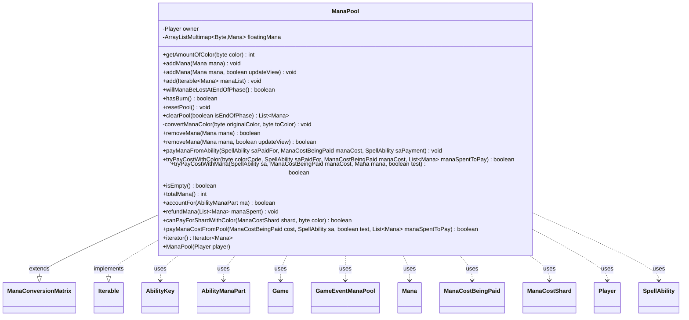

---
aliases:
  - ManaPool
tags:
  - java/class
  - module/forge-game
  - pkg/forge/game/mana
fqn: forge.game.mana.ManaPool
package: forge.game.mana
module: forge-game
kind: Class
---

# ManaPool

**Package:** `forge.game.mana`   **Module:** `forge-game`   **Kind:** Class



## Relationships
**Extends:**
- [[forge.game.mana.ManaConversionMatrix|ManaConversionMatrix]]
**Uses:**
- [[forge.card.mana.ManaCostShard|ManaCostShard]]
- [[forge.game.Game|Game]]
- [[forge.game.ability.AbilityKey|AbilityKey]]
- [[forge.game.event.GameEventManaPool|GameEventManaPool]]
- [[forge.game.mana.Mana|Mana]]
- [[forge.game.mana.ManaCostBeingPaid|ManaCostBeingPaid]]
- [[forge.game.player.Player|Player]]
- [[forge.game.spellability.AbilityManaPart|AbilityManaPart]]
- [[forge.game.spellability.SpellAbility|SpellAbility]]

## Design Description

The ManaPool class models a player's pool of floating (unspent) mana during a turn, backed by an `ArrayListMultimap` keyed on color byte so multiple Mana of the same color can coexist. It owns the lifecycle of that mana: adding and removing units, reporting amounts and totals, paying mana costs from the pool, refunding mana, and clearing the pool at end of phase—honoring rules for persistent, combat, and kept mana as well as mana-burn and LoseMana replacement effects.

By extending ManaConversionMatrix it inherits color-substitution logic, which it uses in `canPayForShardWithColor` and `convertManaColor` to determine and apply alternate color payments. It implements `Iterable<Mana>` for convenient traversal of floating mana. It collaborates closely with Player (its owner), Mana, SpellAbility, AbilityManaPart, and ManaCostBeingPaid to resolve payments, and fires GameEventManaPool events through the Game to keep the view synchronized—reflecting a clear separation between mana state and UI notification.

## Source
`forge-game/src/main/java/forge/game/mana/ManaPool.java`

```java
/*
 * Forge: Play Magic: the Gathering.
 * Copyright (C) 2011  Forge Team
 *
 * This program is free software: you can redistribute it and/or modify
 * it under the terms of the GNU General Public License as published by
 * the Free Software Foundation, either version 3 of the License, or
 * (at your option) any later version.
 *
 * This program is distributed in the hope that it will be useful,
 * but WITHOUT ANY WARRANTY; without even the implied warranty of
 * MERCHANTABILITY or FITNESS FOR A PARTICULAR PURPOSE.  See the
 * GNU General Public License for more details.
 *
 * You should have received a copy of the GNU General Public License
 * along with this program.  If not, see <http://www.gnu.org/licenses/>.
 */
package forge.game.mana;

import com.google.common.collect.ArrayListMultimap;
import com.google.common.collect.Lists;
import forge.card.mana.ManaAtom;
import forge.card.mana.ManaCostShard;
import forge.game.Game;
import forge.game.ability.AbilityKey;
import forge.game.cost.CostPayment;
import forge.game.event.EventValueChangeType;
import forge.game.event.GameEventManaPool;
import forge.game.phase.PhaseType;
import forge.game.player.Player;
import forge.game.replacement.ReplacementLayer;
import forge.game.replacement.ReplacementType;
import forge.game.spellability.AbilityManaPart;
import forge.game.spellability.SpellAbility;
import forge.game.staticability.StaticAbilityUnspentMana;

import java.util.*;

/**
 * <p>
 * ManaPool class.
 * </p>
 *
 * @author Forge
 * @version $Id$
 */
public class ManaPool extends ManaConversionMatrix implements Iterable<Mana> {
    private final Player owner;
    private final ArrayListMultimap<Byte, Mana> floatingMana = ArrayListMultimap.create();

    public ManaPool(final Player player) {
        owner = player;
        restoreColorReplacements();
    }

    public final int getAmountOfColor(final byte color) {
        Collection<Mana> ofColor = floatingMana.get(color);
        return ofColor == null ? 0 : ofColor.size();
    }

    public void addMana(final Mana mana) {
        addMana(mana, true);
    }
    public void addMana(final Mana mana, boolean updateView) {
        floatingMana.put(mana.getColor(), mana);
        if (updateView) {
            owner.updateManaForView();
            owner.getGame().fireEvent(new GameEventManaPool(owner, EventValueChangeType.Added, mana));
        }
    }

    public final void add(final Iterable<Mana> manaList) {
        for (final Mana m : manaList) {
            addMana(m);
        }
    }

    /**
     * <p>
     * willManaBeLostAtEndOfPhase.
     *
     * @return - whether floating mana will be lost if the current phase ended right now
     * </p>
     */
    public final boolean willManaBeLostAtEndOfPhase() {
        if (floatingMana.isEmpty()) {
            return false;
        }

        final Map<AbilityKey, Object> runParams = AbilityKey.mapFromAffected(owner);
        if (!owner.getGame().getReplacementHandler().getReplacementList(ReplacementType.LoseMana, runParams, ReplacementLayer.Other).isEmpty()) {
            return false;
        }

        int safeMana = 0;
        for (final byte c : StaticAbilityUnspentMana.getManaToKeep(owner)) {
            safeMana += getAmountOfColor(c);
        }

        // TODO isPersistentMana

        return totalMana() != safeMana; //won't lose floating mana if all mana is of colors that aren't going to be emptied
    }

    public final boolean hasBurn() {
        final Game game = owner.getGame();
        return game.getRules().hasManaBurn() || StaticAbilityUnspentMana.hasManaBurn(owner);
    }

    public final void resetPool() {
        // This should only be used to reset the pool to empty by things like restores.
        floatingMana.clear();
    }

    public final List<Mana> clearPool(boolean isEndOfPhase) {
        // isEndOfPhase parameter: true = end of phase, false = mana drain effect
        List<Mana> cleared = Lists.newArrayList();
        if (floatingMana.isEmpty()) { return cleared; }

        Byte convertTo = null;

        // TODO move this lower in case all mana would be persistent
        final Map<AbilityKey, Object> runParams = AbilityKey.mapFromAffected(owner);
        runParams.put(AbilityKey.Mana, "C");
        switch (owner.getGame().getReplacementHandler().run(ReplacementType.LoseMana, runParams)) {
        case NotReplaced:
            break;
        case Skipped:
            return cleared;
        default:
            convertTo = ManaAtom.fromName((String) runParams.get(AbilityKey.Mana));
            break;

        }

        final List<Byte> keys = Lists.newArrayList(floatingMana.keySet());
        if (isEndOfPhase) {
            keys.removeAll(StaticAbilityUnspentMana.getManaToKeep(owner));
        }
        if (convertTo != null) {
            keys.remove(convertTo);
        }

        for (Byte b : keys) {
            Collection<Mana> cm = floatingMana.get(b);
            final List<Mana> pMana = Lists.newArrayList();
            if (isEndOfPhase && !owner.getGame().getPhaseHandler().is(PhaseType.CLEANUP)) {
                for (final Mana mana : cm) {
                    if (mana.getManaAbility() != null && mana.getManaAbility().isPersistentMana()) {
                        pMana.add(mana);
                    }
                    if (mana.getManaAbility() != null && mana.getManaAbility().isCombatMana() &&
                            !owner.getGame().getPhaseHandler().is(PhaseType.COMBAT_END)) {
                        pMana.add(mana);
                    }
                }
            }
            cm.removeAll(pMana);
            if (convertTo != null) {
                convertManaColor(b, convertTo);
                cm.addAll(pMana);
            } else {
                cleared.addAll(cm);
                cm.clear();
                floatingMana.putAll(b, pMana);
            }
        }

        owner.updateManaForView();
        owner.getGame().fireEvent(new GameEventManaPool(owner, EventValueChangeType.Cleared, null));
        return cleared;
    }

    private void convertManaColor(final byte originalColor, final byte toColor) {
        List<Mana> convert = Lists.newArrayList();
        Collection<Mana> cm = floatingMana.get(originalColor);
        for (Mana m : cm) {
            convert.add(new Mana(toColor, m.getSourceCard(), m.getManaAbility(), m.getPlayer()));
        }
        cm.clear();
        floatingMana.putAll(toColor, convert);
        owner.updateManaForView();
    }

    public boolean removeMana(final Mana mana) {
        return removeMana(mana, true);
    }
    public boolean removeMana(final Mana mana, boolean updateView) {
        boolean result = floatingMana.remove(mana.getColor(), mana);
        if (result && updateView) {
            owner.updateManaForView();
            owner.getGame().fireEvent(new GameEventManaPool(owner, EventValueChangeType.Removed, mana));
        }
        return result;
    }

    public final void payManaFromAbility(final SpellAbility saPaidFor, ManaCostBeingPaid manaCost, final SpellAbility saPayment) {
        // Mana restriction must be checked before this method is called
        final List<SpellAbility> paidAbs = saPaidFor.getPayingManaAbilities();

        paidAbs.add(saPayment); // assumes some part on the mana produced by the ability will get used

        // need to get all mana from all ManaAbilities of the SpellAbility
        for (AbilityManaPart mp : saPayment.getAllManaParts()) {
            for (final Mana mana : mp.getLastManaProduced()) {
                if (!saPaidFor.allowsPayingWithShard(mp.getSourceCard(), mana.getColor())) {
                    continue;
                }
                if (tryPayCostWithMana(saPaidFor, manaCost, mana, false)) {
                    saPaidFor.getPayingMana().add(mana);
                }
            }
        }
    }

    public boolean tryPayCostWithColor(byte colorCode, SpellAbility saPaidFor, ManaCostBeingPaid manaCost, List<Mana> manaSpentToPay) {
        Mana manaFound = null;
        Collection<Mana> cm = floatingMana.get(colorCode);

        for (final Mana mana : cm) {
            if (mana.getManaAbility() != null && !mana.getManaAbility().meetsManaRestrictions(saPaidFor)) {
                continue;
            }

            if (!saPaidFor.allowsPayingWithShard(mana.getSourceCard(), colorCode)) {
                continue;
            }

            manaFound = mana;
            break;
        }

        if (manaFound != null && tryPayCostWithMana(saPaidFor, manaCost, manaFound, false)) {
            manaSpentToPay.add(manaFound);
            return true;
        }
        return false;
    }

    public boolean tryPayCostWithMana(final SpellAbility sa, ManaCostBeingPaid manaCost, final Mana mana, boolean test) {
        if (!manaCost.isNeeded(mana, this)) {
            return false;
        }
        // only pay mana into manaCost when the Mana could be removed from the Mana pool
        // if the mana wasn't in the mana pool then something is wrong
        if (!removeMana(mana)) {
            return false;
        }
        manaCost.payMana(mana, this);

        return true;
    }

    public final boolean isEmpty() {
        return floatingMana.isEmpty();
    }

    public final int totalMana() {
        return floatingMana.values().size();
    }

    //Account for mana part of ability when undoing it
    public boolean accountFor(final AbilityManaPart ma) {
        if (ma == null) {
            return false;
        }
        if (floatingMana.isEmpty()) {
            return false;
        }

        final List<Mana> removeFloating = Lists.newArrayList();

        boolean manaNotAccountedFor = false;
        // loop over mana produced by mana ability
        for (Mana mana : ma.getLastManaProduced()) {
            Collection<Mana> poolLane = floatingMana.get(mana.getColor());

            if (poolLane != null && poolLane.contains(mana)) {
                removeFloating.add(mana);
            } else {
                manaNotAccountedFor = true;
                break;
            }
        }

        // When is it legitimate for all the mana not to be accountable?
        // TODO: Does this condition really indicate an bug in Forge?
        if (manaNotAccountedFor) {
            return false;
        }

        for (Mana m : removeFloating) {
            removeMana(m);
        }
        return true;
    }

    public void refundMana(List<Mana> manaSpent) {
        add(manaSpent);
        manaSpent.clear();
    }

    public boolean canPayForShardWithColor(ManaCostShard shard, byte color) {
        if (shard.isOfKind(ManaAtom.COLORLESS) && color == ManaAtom.GENERIC) {
            return false; // FIXME: testing Colorless against Generic is a recipe for disaster, but probably there should be a better fix.
        }

        byte line = getPossibleColorUses(color);

        for (byte outColor : ManaAtom.MANATYPES) {
            if ((line & outColor) != 0 && shard.canBePaidWithManaOfColor(outColor)) {
                return true;
            }
        }

        return shard.canBePaidWithManaOfColor((byte)0);
    }

    /**
     * Checks if the given mana cost can be paid from floating mana.
     * @param cost mana cost to pay for
     * @param sa ability to pay for
     * @param test actual payment is made if this is false
     * @param manaSpentToPay list of mana spent
     * @return whether the floating mana is sufficient to pay the cost fully
     */
    public boolean payManaCostFromPool(final ManaCostBeingPaid cost, final SpellAbility sa, final boolean test, List<Mana> manaSpentToPay) {
        final boolean hasConverge = sa.getHostCard().hasConverge();
        List<ManaCostShard> unpaidShards = cost.getUnpaidShards();
        Collections.sort(unpaidShards); // most difficult shards must come first
        for (ManaCostShard part : unpaidShards) {
            if (part != ManaCostShard.X) {
                if (cost.isPaid()) {
                    continue;
                }

                // get a mana of this type from floating, bail if none available
                final Mana mana = CostPayment.getMana(owner, part, sa, hasConverge ? cost.getColorsPaid() : -1, cost.getXManaCostPaidByColor());
                if (mana != null) {
                    if (tryPayCostWithMana(sa, cost, mana, test)) {
                        manaSpentToPay.add(mana);
                    }
                }
            }
        }

        if (cost.isPaid()) {
            // refund any mana taken from mana pool when test
            if (test) {
                refundMana(manaSpentToPay);
            }
            return true;
        }
        return false;
    }

    @Override
    public Iterator<Mana> iterator() {
        return floatingMana.values().iterator();
    }

}
```

## Python
`forge/game/mana/ManaPool.py`

```python
from forge.game.mana.ManaConversionMatrix import ManaConversionMatrix
from forge.card.mana.ManaAtom import ManaAtom
from forge.card.mana.ManaCostShard import ManaCostShard
from forge.game.Game import Game
from forge.game.ability.AbilityKey import AbilityKey
from forge.game.cost.CostPayment import CostPayment
from forge.game.event.EventValueChangeType import EventValueChangeType
from forge.game.event.GameEventManaPool import GameEventManaPool
from forge.game.phase.PhaseType import PhaseType
from forge.game.player.Player import Player
from forge.game.replacement.ReplacementLayer import ReplacementLayer
from forge.game.replacement.ReplacementType import ReplacementType
from forge.game.replacement.ReplacementResult import ReplacementResult
from forge.game.spellability.AbilityManaPart import AbilityManaPart
from forge.game.spellability.SpellAbility import SpellAbility
from forge.game.staticability.StaticAbilityUnspentMana import StaticAbilityUnspentMana
from forge.game.mana.Mana import Mana
from forge.game.mana.ManaCostBeingPaid import ManaCostBeingPaid


class _MultimapView:
    def __init__(self, backing, key):
        self._backing = backing
        self._key = key

    def _list(self):
        return self._backing.get(self._key, [])

    def __iter__(self):
        return iter(list(self._list()))

    def __len__(self):
        return len(self._list())

    def size(self):
        return len(self._list())

    def contains(self, value):
        return value in self._list()

    def removeAll(self, values):
        lst = self._backing.get(self._key)
        if lst is None:
            return
        for v in values:
            while v in lst:
                lst.remove(v)
        if not lst:
            self._backing.pop(self._key, None)

    def clear(self):
        if self._key in self._backing:
            del self._backing[self._key]

    def addAll(self, values):
        vals = list(values)
        if vals:
            self._backing.setdefault(self._key, []).extend(vals)


class ArrayListMultimap:
    def __init__(self):
        self._map = {}

    @staticmethod
    def create():
        return ArrayListMultimap()

    def put(self, key, value):
        self._map.setdefault(key, []).append(value)
        return True

    def get(self, key):
        return _MultimapView(self._map, key)

    def remove(self, key, value):
        lst = self._map.get(key)
        if lst is not None and value in lst:
            lst.remove(value)
            if not lst:
                del self._map[key]
            return True
        return False

    def clear(self):
        self._map.clear()

    def isEmpty(self):
        return len(self._map) == 0

    def keySet(self):
        return list(self._map.keys())

    def values(self):
        result = []
        for lst in self._map.values():
            result.extend(lst)
        return result

    def putAll(self, key, values):
        vals = list(values)
        if vals:
            self._map.setdefault(key, []).extend(vals)
        return bool(vals)


class ManaPool(ManaConversionMatrix):
    def __init__(self, player):
        self.owner = player
        self.floatingMana = ArrayListMultimap.create()
        self.restoreColorReplacements()

    def getAmountOfColor(self, color):
        ofColor = self.floatingMana.get(color)
        return 0 if ofColor is None else ofColor.size()

    def addMana(self, mana, updateView=True):
        self.floatingMana.put(mana.getColor(), mana)
        if updateView:
            self.owner.updateManaForView()
            self.owner.getGame().fireEvent(GameEventManaPool(self.owner, EventValueChangeType.Added, mana))

    def add(self, manaList):
        for m in manaList:
            self.addMana(m)

    def willManaBeLostAtEndOfPhase(self):
        if self.floatingMana.isEmpty():
            return False

        runParams = AbilityKey.mapFromAffected(self.owner)
        if self.owner.getGame().getReplacementHandler().getReplacementList(ReplacementType.LoseMana, runParams, ReplacementLayer.Other):
            return False

        safeMana = 0
        for c in StaticAbilityUnspentMana.getManaToKeep(self.owner):
            safeMana += self.getAmountOfColor(c)

        # TODO isPersistentMana

        return self.totalMana() != safeMana  # won't lose floating mana if all mana is of colors that aren't going to be emptied

    def hasBurn(self):
        game = self.owner.getGame()
        return game.getRules().hasManaBurn() or StaticAbilityUnspentMana.hasManaBurn(self.owner)

    def resetPool(self):
        # This should only be used to reset the pool to empty by things like restores.
        self.floatingMana.clear()

    def clearPool(self, isEndOfPhase):
        # isEndOfPhase parameter: true = end of phase, false = mana drain effect
        cleared = []
        if self.floatingMana.isEmpty():
            return cleared

        convertTo = None

        # TODO move this lower in case all mana would be persistent
        runParams = AbilityKey.mapFromAffected(self.owner)
        runParams[AbilityKey.Mana] = "C"
        result = self.owner.getGame().getReplacementHandler().run(ReplacementType.LoseMana, runParams)
        if result == ReplacementResult.NotReplaced:
            pass
        elif result == ReplacementResult.Skipped:
            return cleared
        else:
            convertTo = ManaAtom.fromName(runParams.get(AbilityKey.Mana))

        keys = list(self.floatingMana.keySet())
        if isEndOfPhase:
            toKeep = set(StaticAbilityUnspentMana.getManaToKeep(self.owner))
            keys = [k for k in keys if k not in toKeep]
        if convertTo is not None:
            if convertTo in keys:
                keys.remove(convertTo)

        for b in keys:
            cm = self.floatingMana.get(b)
            pMana = []
            if isEndOfPhase and not getattr(self.owner.getGame().getPhaseHandler(), 'is')(PhaseType.CLEANUP):
                for mana in cm:
                    if mana.getManaAbility() is not None and mana.getManaAbility().isPersistentMana():
                        pMana.append(mana)
                    if mana.getManaAbility() is not None and mana.getManaAbility().isCombatMana() and \
                            not getattr(self.owner.getGame().getPhaseHandler(), 'is')(PhaseType.COMBAT_END):
                        pMana.append(mana)
            cm.removeAll(pMana)
            if convertTo is not None:
                self.convertManaColor(b, convertTo)
                cm.addAll(pMana)
            else:
                cleared.extend(cm)
                cm.clear()
                self.floatingMana.putAll(b, pMana)

        self.owner.updateManaForView()
        self.owner.getGame().fireEvent(GameEventManaPool(self.owner, EventValueChangeType.Cleared, None))
        return cleared

    def convertManaColor(self, originalColor, toColor):
        convert = []
        cm = self.floatingMana.get(originalColor)
        for m in cm:
            convert.append(Mana(toColor, m.getSourceCard(), m.getManaAbility(), m.getPlayer()))
        cm.clear()
        self.floatingMana.putAll(toColor, convert)
        self.owner.updateManaForView()

    def removeMana(self, mana, updateView=True):
        result = self.floatingMana.remove(mana.getColor(), mana)
        if result and updateView:
            self.owner.updateManaForView()
            self.owner.getGame().fireEvent(GameEventManaPool(self.owner, EventValueChangeType.Removed, mana))
        return result

    def payManaFromAbility(self, saPaidFor, manaCost, saPayment):
        # Mana restriction must be checked before this method is called
        paidAbs = saPaidFor.getPayingManaAbilities()

        paidAbs.add(saPayment)  # assumes some part on the mana produced by the ability will get used

        # need to get all mana from all ManaAbilities of the SpellAbility
        for mp in saPayment.getAllManaParts():
            for mana in mp.getLastManaProduced():
                if not saPaidFor.allowsPayingWithShard(mp.getSourceCard(), mana.getColor()):
                    continue
                if self.tryPayCostWithMana(saPaidFor, manaCost, mana, False):
                    saPaidFor.getPayingMana().add(mana)

    def tryPayCostWithColor(self, colorCode, saPaidFor, manaCost, manaSpentToPay):
        manaFound = None
        cm = self.floatingMana.get(colorCode)

        for mana in cm:
            if mana.getManaAbility() is not None and not mana.getManaAbility().meetsManaRestrictions(saPaidFor):
                continue

            if not saPaidFor.allowsPayingWithShard(mana.getSourceCard(), colorCode):
                continue

            manaFound = mana
            break

        if manaFound is not None and self.tryPayCostWithMana(saPaidFor, manaCost, manaFound, False):
            manaSpentToPay.append(manaFound)
            return True
        return False

    def tryPayCostWithMana(self, sa, manaCost, mana, test):
        if not manaCost.isNeeded(mana, self):
            return False
        # only pay mana into manaCost when the Mana could be removed from the Mana pool
        # if the mana wasn't in the mana pool then something is wrong
        if not self.removeMana(mana):
            return False
        manaCost.payMana(mana, self)

        return True

    def isEmpty(self):
        return self.floatingMana.isEmpty()

    def totalMana(self):
        return len(self.floatingMana.values())

    # Account for mana part of ability when undoing it
    def accountFor(self, ma):
        if ma is None:
            return False
        if self.floatingMana.isEmpty():
            return False

        removeFloating = []

        manaNotAccountedFor = False
        # loop over mana produced by mana ability
        for mana in ma.getLastManaProduced():
            poolLane = self.floatingMana.get(mana.getColor())

            if poolLane is not None and poolLane.contains(mana):
                removeFloating.append(mana)
            else:
                manaNotAccountedFor = True
                break

        # When is it legitimate for all the mana not to be accountable?
        # TODO: Does this condition really indicate an bug in Forge?
        if manaNotAccountedFor:
            return False

        for m in removeFloating:
            self.removeMana(m)
        return True

    def refundMana(self, manaSpent):
        self.add(manaSpent)
        manaSpent.clear()

    def canPayForShardWithColor(self, shard, color):
        if shard.isOfKind(ManaAtom.COLORLESS) and color == ManaAtom.GENERIC:
            return False  # FIXME: testing Colorless against Generic is a recipe for disaster, but probably there should be a better fix.

        line = self.getPossibleColorUses(color)

        for outColor in ManaAtom.MANATYPES:
            if (line & outColor) != 0 and shard.canBePaidWithManaOfColor(outColor):
                return True

        return shard.canBePaidWithManaOfColor(0)

    def payManaCostFromPool(self, cost, sa, test, manaSpentToPay):
        hasConverge = sa.getHostCard().hasConverge()
        unpaidShards = cost.getUnpaidShards()
        unpaidShards.sort()  # most difficult shards must come first
        for part in unpaidShards:
            if part != ManaCostShard.X:
                if cost.isPaid():
                    continue

                # get a mana of this type from floating, bail if none available
                mana = CostPayment.getMana(self.owner, part, sa, cost.getColorsPaid() if hasConverge else -1, cost.getXManaCostPaidByColor())
                if mana is not None:
                    if self.tryPayCostWithMana(sa, cost, mana, test):
                        manaSpentToPay.append(mana)

        if cost.isPaid():
            # refund any mana taken from mana pool when test
            if test:
                self.refundMana(manaSpentToPay)
            return True
        return False

    def iterator(self):
        return iter(self.floatingMana.values())

    def __iter__(self):
        return self.iterator()
```
