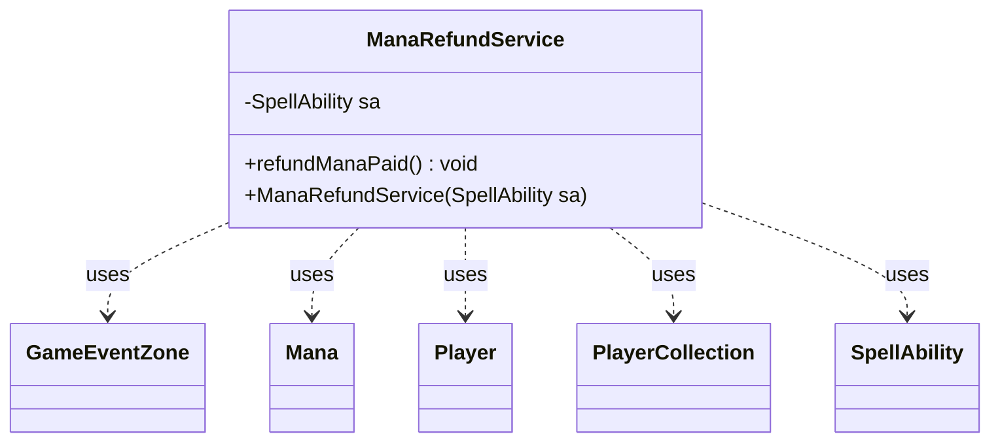

---
aliases:
  - ManaRefundService
tags:
  - java/class
  - module/forge-game
  - pkg/forge/game/mana
fqn: forge.game.mana.ManaRefundService
package: forge.game.mana
module: forge-game
kind: Class
---

# ManaRefundService

**Package:** `forge.game.mana` &nbsp; **Module:** `forge-game` &nbsp; **Kind:** Class



## Relationships
**Uses:**
- [[forge.game.event.GameEventZone|GameEventZone]]
- [[forge.game.mana.Mana|Mana]]
- [[forge.game.player.Player|Player]]
- [[forge.game.player.PlayerCollection|PlayerCollection]]
- [[forge.game.spellability.SpellAbility|SpellAbility]]

## Design Description

ManaRefundService encapsulates the logic for reversing mana payment when a spell or ability's cost needs to be refunded, taking a single SpellAbility through its constructor and exposing one operation, refundManaPaid(). It returns spent Mana to each contributing Player's mana pool, clears the SpellAbility's paying mana, and undoes the paying mana-abilities in reverse (most-recent-first) order, recursively constructing a new ManaRefundService for each to unwind nested payments and clearing their undo stacks.

As a lightweight, stateless service object scoped to one SpellAbility, it collaborates with Mana, Player, and PlayerCollection to track affected payers, then fires a GameEventZone battlefield update so cards tapped for mana are redrawn as untapped. The recursive design and reverse-order traversal reflect deliberate intent to correctly unwind chained mana abilities, though an inline comment flags an unresolved edge case around abilities owned by a different player.

## Source
`forge-game/src/main/java/forge/game/mana/ManaRefundService.java`

```java
package forge.game.mana;

import forge.game.event.EventValueChangeType;
import forge.game.event.GameEventZone;
import forge.game.player.Player;
import forge.game.player.PlayerCollection;
import forge.game.spellability.SpellAbility;
import forge.game.zone.ZoneType;

import java.util.Collections;
import java.util.List;

public class ManaRefundService {

    private final SpellAbility sa;

    public ManaRefundService(SpellAbility sa) {
        this.sa = sa;
    }

    public void refundManaPaid() {
        PlayerCollection payers = new PlayerCollection(sa.getActivatingPlayer());

        // move non-undoable paying mana back to floating
        for (Mana mana : sa.getPayingMana()) {
            Player pl = mana.getPlayer();
            pl.getManaPool().addMana(mana);
            payers.add(pl);
        }

        sa.getPayingMana().clear();

        List<SpellAbility> payingAbilities = sa.getPayingManaAbilities();

        // start with the most recent
        Collections.reverse(payingAbilities);

        for (final SpellAbility am : payingAbilities) {
            // What if am is owned by a different player?
            am.undo();
        }

        for (final SpellAbility am : payingAbilities) {
            // Recursively refund abilities that were used.
            ManaRefundService refundService = new ManaRefundService(am);
            refundService.refundManaPaid();
            sa.getHostCard().getGame().getStack().clearUndoStack(am);
        }

        payingAbilities.clear();

        // update battlefield of all activating players - to redraw cards used to pay mana as untapped
        for (Player p : payers) {
            p.getGame().fireEvent(new GameEventZone(ZoneType.Battlefield, p, EventValueChangeType.ComplexUpdate, null));
        }
    }
}
```

## Python
`forge/game/mana/ManaRefundService.py`

```python
package forge.game.mana

from forge.game.event.EventValueChangeType import EventValueChangeType
from forge.game.event.GameEventZone import GameEventZone
from forge.game.player.Player import Player
from forge.game.player.PlayerCollection import PlayerCollection
from forge.game.spellability.SpellAbility import SpellAbility
from forge.game.zone.ZoneType import ZoneType


class ManaRefundService:

    def __init__(self, sa: SpellAbility):
        self.sa = sa

    def refundManaPaid(self) -> None:
        payers = PlayerCollection(self.sa.getActivatingPlayer())

        # move non-undoable paying mana back to floating
        for mana in self.sa.getPayingMana():
            pl = mana.getPlayer()
            pl.getManaPool().addMana(mana)
            payers.add(pl)

        self.sa.getPayingMana().clear()

        payingAbilities = self.sa.getPayingManaAbilities()

        # start with the most recent
        payingAbilities.reverse()

        for am in payingAbilities:
            # What if am is owned by a different player?
            am.undo()

        for am in payingAbilities:
            # Recursively refund abilities that were used.
            refundService = ManaRefundService(am)
            refundService.refundManaPaid()
            self.sa.getHostCard().getGame().getStack().clearUndoStack(am)

        payingAbilities.clear()

        # update battlefield of all activating players - to redraw cards used to pay mana as untapped
        for p in payers:
            p.getGame().fireEvent(GameEventZone(ZoneType.Battlefield, p, EventValueChangeType.ComplexUpdate, None))
```
