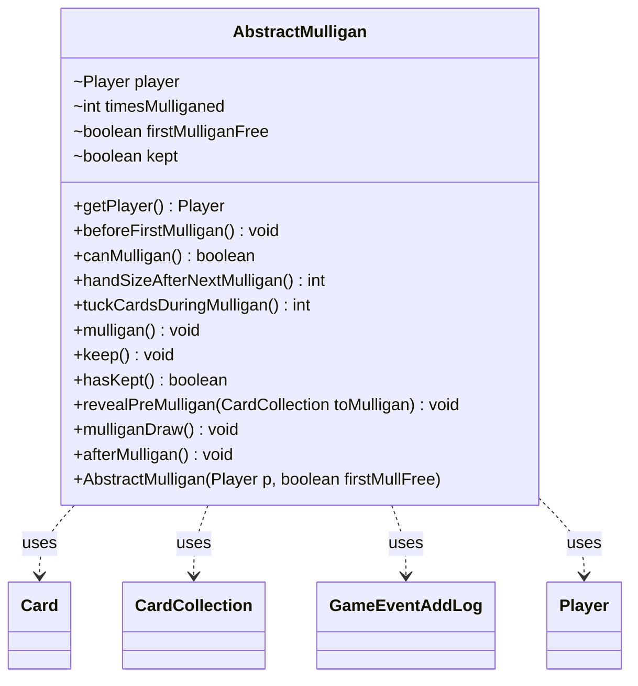

---
aliases:
  - AbstractMulligan
tags:
  - java/class
  - module/forge-game
  - pkg/forge/game/mulligan
fqn: forge.game.mulligan.AbstractMulligan
package: forge.game.mulligan
module: forge-game
kind: Class
---

# AbstractMulligan

**Package:** `forge.game.mulligan`   **Module:** `forge-game`   **Kind:** Class



## Relationships
**Uses:**
- [[forge.game.card.Card|Card]]
- [[forge.game.card.CardCollection|CardCollection]]
- [[forge.game.event.GameEventAddLog|GameEventAddLog]]
- [[forge.game.player.Player|Player]]

## Design Description

Mulligan resolution is implemented as a template-method base class. Concrete subclasses override the format-specific rules—`canMulligan()` and `handSizeAfterNextMulligan()` are abstract—while the base supplies the shared resolution flow.

`AbstractMulligan` encapsulates the mechanics of mulliganing a hand for a single `Player`, tracking mutable state (`timesMulliganed`, `firstMulliganFree`, `kept`). Its core `mulligan()` method orchestrates the shared sequence: collecting the `Card`s in hand into a `CardCollection`, returning them to the library, shuffling, redrawing, and notifying the player. Extension hooks (`beforeFirstMulligan()`, `revealPreMulligan()`, `tuckCardsDuringMulligan()`, `afterMulligan()`) are empty or default-valued so subclasses can customize each phase, and `afterMulligan()` fires a `GameEventAddLog` to record the kept hand size in the game log. The design cleanly separates invariant mulligan plumbing from variant rule-set policy.

## Source
`forge-game/src/main/java/forge/game/mulligan/AbstractMulligan.java`

```java
package forge.game.mulligan;

import forge.game.GameLogEntryType;
import forge.game.event.GameEventAddLog;
import forge.game.card.Card;
import forge.game.card.CardCollection;
import forge.game.player.Player;
import forge.game.zone.ZoneType;
import forge.util.Localizer;

public abstract class AbstractMulligan {
    Player player;
    int timesMulliganed = 0;
    boolean firstMulliganFree = false;
    boolean kept = false;

    public AbstractMulligan(Player p, boolean firstMullFree) {
        player = p;
        firstMulliganFree = firstMullFree;
    }

    public Player getPlayer() { return player; }

    public void beforeFirstMulligan() {}
    public abstract boolean canMulligan();
    public abstract int handSizeAfterNextMulligan();

    public int tuckCardsDuringMulligan() {
        return 0;
    }

    public void mulligan() {
        CardCollection toMulligan = new CardCollection(player.getCardsIn(ZoneType.Hand));
        if (toMulligan.isEmpty()) return;
        revealPreMulligan(toMulligan);
        for (final Card c : toMulligan) {
            player.getGame().getAction().moveToLibrary(c, null);
        }
        try {
            Thread.sleep(100);
        } catch (InterruptedException e) {
            e.printStackTrace();
        }
        player.shuffle(null);
        timesMulliganed++;
        mulliganDraw();
        player.onMulliganned();
    }

    public void keep() {
        kept = true;
    }

    public boolean hasKept() {
        return kept;
    }

    public void revealPreMulligan(CardCollection toMulligan) {}

    public void mulliganDraw() {
        player.drawCards(handSizeAfterNextMulligan());
    }

    public void afterMulligan() {
        player.getGame().fireEvent(new GameEventAddLog(GameLogEntryType.MULLIGAN, Localizer.getInstance().getMessage("lblPlayerKeepNCardsHand", player.getName(), String.valueOf(player.getZone(ZoneType.Hand).size()))));
    }
}
```

## Python
`forge/game/mulligan/AbstractMulligan.py`

```python
from abc import ABC, abstractmethod
import time
import traceback

from forge.game.GameLogEntryType import GameLogEntryType
from forge.game.event.GameEventAddLog import GameEventAddLog
from forge.game.card.Card import Card
from forge.game.card.CardCollection import CardCollection
from forge.game.player.Player import Player
from forge.game.zone.ZoneType import ZoneType
from forge.util.Localizer import Localizer


class AbstractMulligan(ABC):
    def __init__(self, p: Player, firstMullFree: bool):
        self.player = p
        self.timesMulliganed = 0
        self.firstMulliganFree = firstMullFree
        self.kept = False

    def getPlayer(self) -> Player:
        return self.player

    def beforeFirstMulligan(self) -> None:
        pass

    @abstractmethod
    def canMulligan(self) -> bool:
        ...

    @abstractmethod
    def handSizeAfterNextMulligan(self) -> int:
        ...

    def tuckCardsDuringMulligan(self) -> int:
        return 0

    def mulligan(self) -> None:
        toMulligan = CardCollection(self.player.getCardsIn(ZoneType.Hand))
        if toMulligan.isEmpty():
            return
        self.revealPreMulligan(toMulligan)
        for c in toMulligan:
            self.player.getGame().getAction().moveToLibrary(c, None)
        try:
            time.sleep(0.1)
        except InterruptedError as e:
            traceback.print_exc()
        self.player.shuffle(None)
        self.timesMulliganed += 1
        self.mulliganDraw()
        self.player.onMulliganned()

    def keep(self) -> None:
        self.kept = True

    def hasKept(self) -> bool:
        return self.kept

    def revealPreMulligan(self, toMulligan: CardCollection) -> None:
        pass

    def mulliganDraw(self) -> None:
        self.player.drawCards(self.handSizeAfterNextMulligan())

    def afterMulligan(self) -> None:
        self.player.getGame().fireEvent(GameEventAddLog(GameLogEntryType.MULLIGAN, Localizer.getInstance().getMessage("lblPlayerKeepNCardsHand", self.player.getName(), str(self.player.getZone(ZoneType.Hand).size()))))
```
