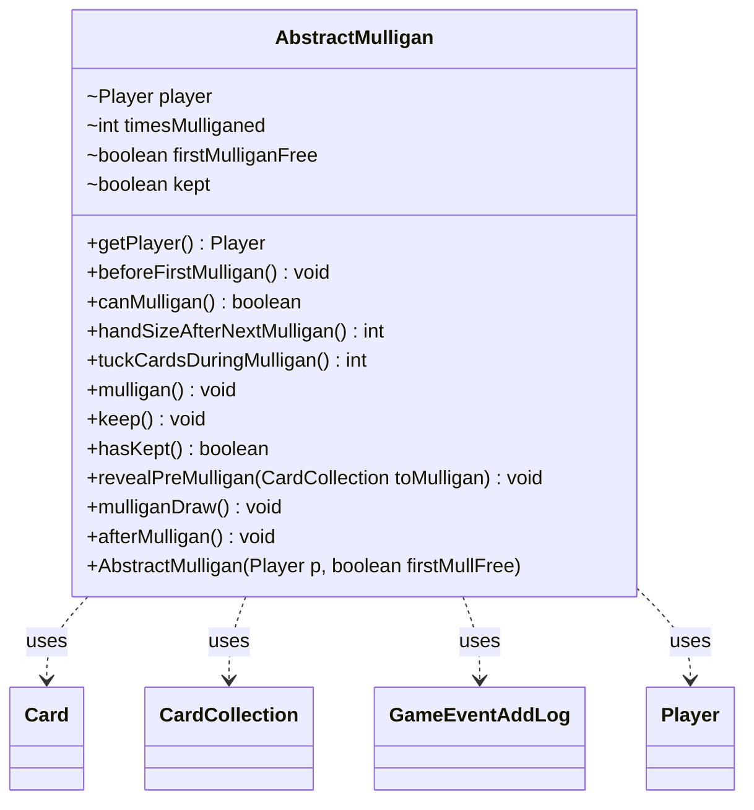

---
aliases:
  - AbstractMulligan
tags:
  - java/class
  - module/forge-game
  - pkg/forge/game/mulligan
fqn: forge.game.mulligan.AbstractMulligan
package: forge.game.mulligan
module: forge-game
kind: Class
---

# AbstractMulligan

**Package:** `forge.game.mulligan` &nbsp; **Module:** `forge-game` &nbsp; **Kind:** Class



## Relationships
**Uses:**
- [[forge.game.card.Card|Card]]
- [[forge.game.card.CardCollection|CardCollection]]
- [[forge.game.event.GameEventAddLog|GameEventAddLog]]
- [[forge.game.player.Player|Player]]

## Source
`forge-game/src/main/java/forge/game/mulligan/AbstractMulligan.java`

```java
package forge.game.mulligan;

import forge.game.GameLogEntryType;
import forge.game.event.GameEventAddLog;
import forge.game.card.Card;
import forge.game.card.CardCollection;
import forge.game.player.Player;
import forge.game.zone.ZoneType;
import forge.util.Localizer;

public abstract class AbstractMulligan {
    Player player;
    int timesMulliganed = 0;
    boolean firstMulliganFree = false;
    boolean kept = false;

    public AbstractMulligan(Player p, boolean firstMullFree) {
        player = p;
        firstMulliganFree = firstMullFree;
    }

    public Player getPlayer() { return player; }

    public void beforeFirstMulligan() {}
    public abstract boolean canMulligan();
    public abstract int handSizeAfterNextMulligan();

    public int tuckCardsDuringMulligan() {
        return 0;
    }

    public void mulligan() {
        CardCollection toMulligan = new CardCollection(player.getCardsIn(ZoneType.Hand));
        if (toMulligan.isEmpty()) return;
        revealPreMulligan(toMulligan);
        for (final Card c : toMulligan) {
            player.getGame().getAction().moveToLibrary(c, null);
        }
        try {
            Thread.sleep(100);
        } catch (InterruptedException e) {
            e.printStackTrace();
        }
        player.shuffle(null);
        timesMulliganed++;
        mulliganDraw();
        player.onMulliganned();
    }

    public void keep() {
        kept = true;
    }

    public boolean hasKept() {
        return kept;
    }

    public void revealPreMulligan(CardCollection toMulligan) {}

    public void mulliganDraw() {
        player.drawCards(handSizeAfterNextMulligan());
    }

    public void afterMulligan() {
        player.getGame().fireEvent(new GameEventAddLog(GameLogEntryType.MULLIGAN, Localizer.getInstance().getMessage("lblPlayerKeepNCardsHand", player.getName(), String.valueOf(player.getZone(ZoneType.Hand).size()))));
    }
}
```
