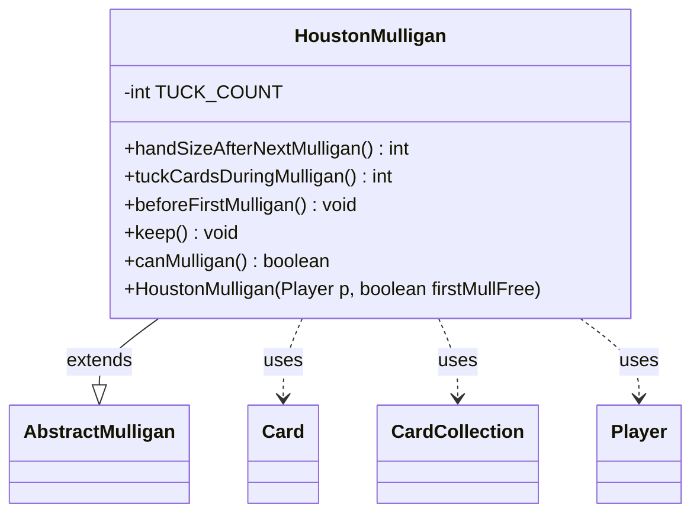

---
aliases:
  - HoustonMulligan
tags:
  - java/class
  - module/forge-game
  - pkg/forge/game/mulligan
fqn: forge.game.mulligan.HoustonMulligan
package: forge.game.mulligan
module: forge-game
kind: Class
---

# HoustonMulligan

**Package:** `forge.game.mulligan` &nbsp; **Module:** `forge-game` &nbsp; **Kind:** Class



## Relationships
**Extends:**
- [[forge.game.mulligan.AbstractMulligan|AbstractMulligan]]
**Uses:**
- [[forge.game.card.Card|Card]]
- [[forge.game.card.CardCollection|CardCollection]]
- [[forge.game.player.Player|Player]]

## Design Description

The HoustonMulligan class implements the "Houston" mulligan rule variant as a concrete subclass of AbstractMulligan, plugging into Forge's pluggable mulligan-strategy hierarchy. It collaborates with Player to draw and inspect cards, ZoneType to locate the hand, and CardCollection/Card to gather the cards that must be returned to the library. The design centers on a fixed TUCK_COUNT of three: the player draws three extra cards before the first mulligan and, on keeping a hand, delegates to the controller's tuckCardsViaMulligan to choose three cards that are then moved to the bottom of the library. By overriding canMulligan to return false and handSizeAfterNextMulligan to the player's maximum, it expresses that this variant resolves in a single keep-and-tuck step rather than iterative mulligans.

## Source
`forge-game/src/main/java/forge/game/mulligan/HoustonMulligan.java`

```java
package forge.game.mulligan;

import forge.game.card.Card;
import forge.game.card.CardCollection;
import forge.game.player.Player;
import forge.game.zone.ZoneType;

public class HoustonMulligan extends AbstractMulligan {

    private static final int TUCK_COUNT = 3;

    @Override
    public int handSizeAfterNextMulligan() {
        return player.getMaxHandSize();
    }

    public HoustonMulligan(Player p, boolean firstMullFree) {
        super(p, firstMullFree);
    }

    public int tuckCardsDuringMulligan() {
        return TUCK_COUNT;
    }

    public void beforeFirstMulligan() {
        player.drawCards(TUCK_COUNT);
    }

    @Override
    public void keep() {
        super.keep();
        CardCollection hand = new CardCollection(player.getCardsIn(ZoneType.Hand));
        for (final Card c : player.getController().tuckCardsViaMulligan(hand, tuckCardsDuringMulligan())) {
            player.getGame().getAction().moveToLibrary(c, -1, null);
        }
    }

    @Override
    public boolean canMulligan() {
        return false;
    }
}
```

## Python
`forge/game/mulligan/HoustonMulligan.py`

```python
from forge.game.card.Card import Card
from forge.game.card.CardCollection import CardCollection
from forge.game.player.Player import Player
from forge.game.zone.ZoneType import ZoneType
from forge.game.mulligan.AbstractMulligan import AbstractMulligan


class HoustonMulligan(AbstractMulligan):

    TUCK_COUNT = 3

    def handSizeAfterNextMulligan(self) -> int:
        return self.player.getMaxHandSize()

    def __init__(self, p: Player, firstMullFree: bool):
        super().__init__(p, firstMullFree)

    def tuckCardsDuringMulligan(self) -> int:
        return HoustonMulligan.TUCK_COUNT

    def beforeFirstMulligan(self) -> None:
        self.player.drawCards(HoustonMulligan.TUCK_COUNT)

    def keep(self) -> None:
        super().keep()
        hand = CardCollection(self.player.getCardsIn(ZoneType.Hand))
        for c in self.player.getController().tuckCardsViaMulligan(hand, self.tuckCardsDuringMulligan()):
            self.player.getGame().getAction().moveToLibrary(c, -1, None)

    def canMulligan(self) -> bool:
        return False
```
