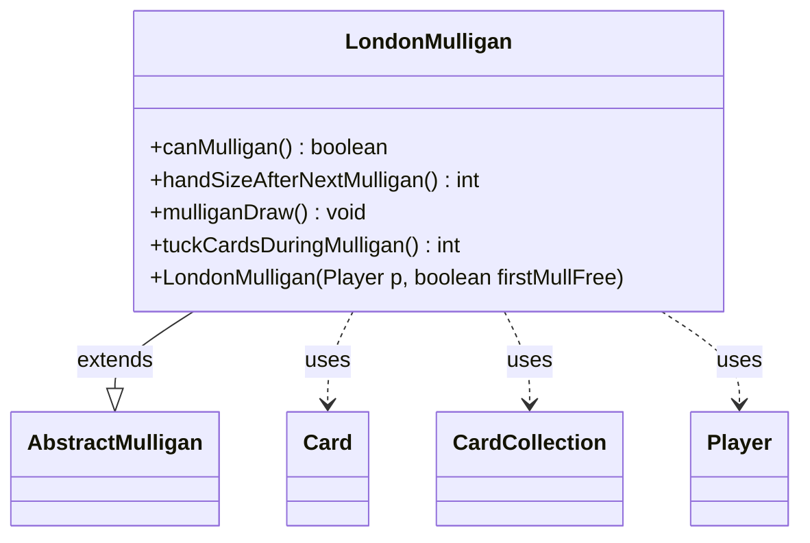

---
aliases:
  - LondonMulligan
tags:
  - java/class
  - module/forge-game
  - pkg/forge/game/mulligan
fqn: forge.game.mulligan.LondonMulligan
package: forge.game.mulligan
module: forge-game
kind: Class
---

# LondonMulligan

**Package:** `forge.game.mulligan` &nbsp; **Module:** `forge-game` &nbsp; **Kind:** Class



## Relationships
**Extends:**
- [[forge.game.mulligan.AbstractMulligan|AbstractMulligan]]
**Uses:**
- [[forge.game.card.Card|Card]]
- [[forge.game.card.CardCollection|CardCollection]]
- [[forge.game.player.Player|Player]]

## Design Description

The LondonMulligan class implements the "London Mulligan" rule variant of Magic: The Gathering's mulligan procedure. As a concrete subclass of AbstractMulligan, it overrides the abstract template's hooks to encode this variant's distinctive mechanic: a player always redraws a full hand (handSizeAfterNextMulligan returns the maximum hand size) but must afterward tuck a number of cards equal to how many times they have mulliganed, less one if the first mulligan is free.

Collaborating with Player, it draws cards and queries hand limits; it builds a CardCollection of the current hand and delegates the tuck choice to the player's controller before moving the selected Card instances to the library. The canMulligan guard prevents mulligans that would require tucking more cards than the hand can hold, and tuckCardsDuringMulligan centralizes the free-mulligan adjustment, keeping the variant's rules cohesive within a single class.

## Source
`forge-game/src/main/java/forge/game/mulligan/LondonMulligan.java`

```java
package forge.game.mulligan;

import forge.game.card.Card;
import forge.game.card.CardCollection;
import forge.game.player.Player;
import forge.game.zone.ZoneType;

public class LondonMulligan extends AbstractMulligan {
    public LondonMulligan(Player p, boolean firstMullFree) {
        super(p, firstMullFree);
    }

    @Override
    public boolean canMulligan() {
        return !kept && tuckCardsDuringMulligan() <= player.getMaxHandSize();
    }

    @Override
    public int handSizeAfterNextMulligan() {
        return player.getMaxHandSize();
    }

    @Override
    public void mulliganDraw() {
        player.drawCards(handSizeAfterNextMulligan());
        int tuckingCards = tuckCardsDuringMulligan();
        CardCollection hand = new CardCollection(player.getCardsIn(ZoneType.Hand));

        for (final Card c : player.getController().tuckCardsViaMulligan(hand, tuckingCards)) {
            player.getGame().getAction().moveToLibrary(c, -1, null);
        }
    }

    @Override
    public int tuckCardsDuringMulligan() {
        if (timesMulliganed == 0) {
            return 0;
        }

        int extraCard = firstMulliganFree ? 1 : 0;
        return timesMulliganed - extraCard;
    }
}
```

## Python
`forge/game/mulligan/LondonMulligan.py`

```python
from forge.game.mulligan.AbstractMulligan import AbstractMulligan
from forge.game.card.Card import Card
from forge.game.card.CardCollection import CardCollection
from forge.game.player.Player import Player
from forge.game.zone.ZoneType import ZoneType


class LondonMulligan(AbstractMulligan):
    def __init__(self, p: Player, firstMullFree: bool):
        super().__init__(p, firstMullFree)

    def canMulligan(self) -> bool:
        return not self.kept and self.tuckCardsDuringMulligan() <= self.player.getMaxHandSize()

    def handSizeAfterNextMulligan(self) -> int:
        return self.player.getMaxHandSize()

    def mulliganDraw(self) -> None:
        self.player.drawCards(self.handSizeAfterNextMulligan())
        tuckingCards = self.tuckCardsDuringMulligan()
        hand = CardCollection(self.player.getCardsIn(ZoneType.Hand))

        for c in self.player.getController().tuckCardsViaMulligan(hand, tuckingCards):
            self.player.getGame().getAction().moveToLibrary(c, -1, None)

    def tuckCardsDuringMulligan(self) -> int:
        if self.timesMulliganed == 0:
            return 0

        extraCard = 1 if self.firstMulliganFree else 0
        return self.timesMulliganed - extraCard
```
