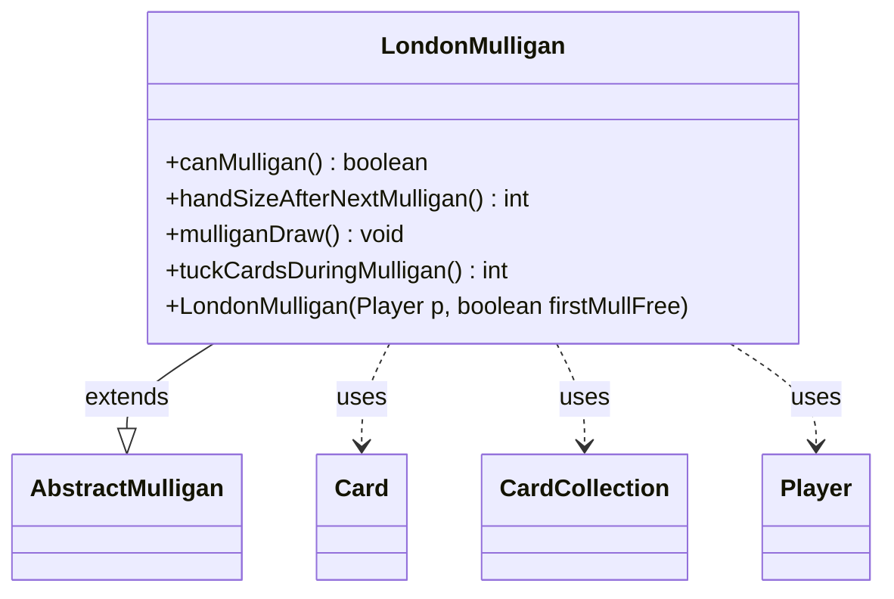

---
aliases:
  - LondonMulligan
tags:
  - java/class
  - module/forge-game
  - pkg/forge/game/mulligan
fqn: forge.game.mulligan.LondonMulligan
package: forge.game.mulligan
module: forge-game
kind: Class
---

# LondonMulligan

**Package:** `forge.game.mulligan` &nbsp; **Module:** `forge-game` &nbsp; **Kind:** Class



## Relationships
**Extends:**
- [[forge.game.mulligan.AbstractMulligan|AbstractMulligan]]
**Uses:**
- [[forge.game.card.Card|Card]]
- [[forge.game.card.CardCollection|CardCollection]]
- [[forge.game.player.Player|Player]]

## Source
`forge-game/src/main/java/forge/game/mulligan/LondonMulligan.java`

```java
package forge.game.mulligan;

import forge.game.card.Card;
import forge.game.card.CardCollection;
import forge.game.player.Player;
import forge.game.zone.ZoneType;

public class LondonMulligan extends AbstractMulligan {
    public LondonMulligan(Player p, boolean firstMullFree) {
        super(p, firstMullFree);
    }

    @Override
    public boolean canMulligan() {
        return !kept && tuckCardsDuringMulligan() <= player.getMaxHandSize();
    }

    @Override
    public int handSizeAfterNextMulligan() {
        return player.getMaxHandSize();
    }

    @Override
    public void mulliganDraw() {
        player.drawCards(handSizeAfterNextMulligan());
        int tuckingCards = tuckCardsDuringMulligan();
        CardCollection hand = new CardCollection(player.getCardsIn(ZoneType.Hand));

        for (final Card c : player.getController().tuckCardsViaMulligan(hand, tuckingCards)) {
            player.getGame().getAction().moveToLibrary(c, -1, null);
        }
    }

    @Override
    public int tuckCardsDuringMulligan() {
        if (timesMulliganed == 0) {
            return 0;
        }

        int extraCard = firstMulliganFree ? 1 : 0;
        return timesMulliganed - extraCard;
    }
}
```
