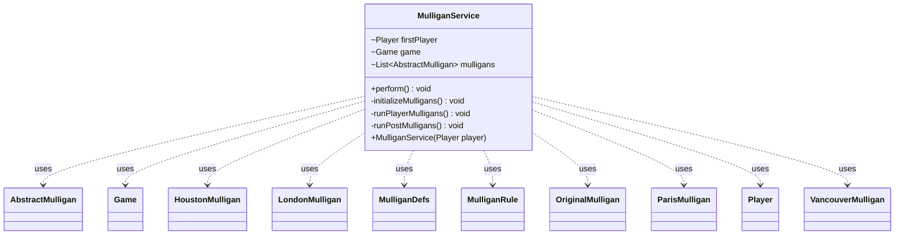

---
aliases:
  - MulliganService
tags:
  - java/class
  - module/forge-game
  - pkg/forge/game/mulligan
fqn: forge.game.mulligan.MulliganService
package: forge.game.mulligan
module: forge-game
kind: Class
---

# MulliganService

**Package:** `forge.game.mulligan` &nbsp; **Module:** `forge-game` &nbsp; **Kind:** Class



## Relationships
**Uses:**
- [[forge.MulliganDefs|MulliganDefs]]
- [[forge.MulliganDefs.MulliganRule|MulliganRule]]
- [[forge.game.Game|Game]]
- [[forge.game.mulligan.AbstractMulligan|AbstractMulligan]]
- [[forge.game.mulligan.HoustonMulligan|HoustonMulligan]]
- [[forge.game.mulligan.LondonMulligan|LondonMulligan]]
- [[forge.game.mulligan.OriginalMulligan|OriginalMulligan]]
- [[forge.game.mulligan.ParisMulligan|ParisMulligan]]
- [[forge.game.mulligan.VancouverMulligan|VancouverMulligan]]
- [[forge.game.player.Player|Player]]

## Source
`forge-game/src/main/java/forge/game/mulligan/MulliganService.java`

```java
package forge.game.mulligan;

import java.util.List;

import com.google.common.collect.Lists;

import forge.MulliganDefs;
import forge.StaticData;
import forge.game.Game;
import forge.game.GameType;
import forge.game.player.Player;

public class MulliganService {
    Player firstPlayer;
    Game game;
    List<AbstractMulligan> mulligans = Lists.newArrayList();

    public MulliganService(Player player) {
        firstPlayer = player;
        game = firstPlayer.getGame();
    }

    public void perform() {
        initializeMulligans();
        runPlayerMulligans();
        runPostMulligans();
    }

    private void initializeMulligans() {
        List<Player> whoCanMulligan = Lists.newArrayList(game.getPlayers());
        int offset = whoCanMulligan.indexOf(firstPlayer);

        for (int i = 0; i < offset; i++) {
            whoCanMulligan.add(whoCanMulligan.remove(0));
        }

        boolean firstMullFree = game.getPlayers().size() > 2 || game.getRules().hasAppliedVariant(GameType.Brawl);

        for (Player player : whoCanMulligan) {
            MulliganDefs.MulliganRule rule = StaticData.instance().getMulliganRule();
            AbstractMulligan mulligan;
            switch (rule) {
                case Original:
                    mulligan = new OriginalMulligan(player, firstMullFree);
                    break;
                case Paris:
                    mulligan = new ParisMulligan(player, firstMullFree);
                    break;
                case Vancouver:
                    mulligan = new VancouverMulligan(player, firstMullFree);
                    break;
                case London:
                    mulligan = new LondonMulligan(player, firstMullFree);
                    break;
                case Houston:
                    mulligan = new HoustonMulligan(player, firstMullFree);
                    break;
                default:
                    mulligan = new VancouverMulligan(player, firstMullFree);
                    break;
            }

            mulligans.add(mulligan);
            mulligan.beforeFirstMulligan();
        }
    }

    private void runPlayerMulligans() {
        boolean allKept;
        do {
            allKept = true;
            for (AbstractMulligan mulligan : mulligans) {
                if (mulligan.hasKept()) {
                    continue;
                }

                Player p = mulligan.getPlayer();

                boolean keep = !mulligan.canMulligan() ||
                        p.getController().mulliganKeepHand(
                                firstPlayer,
                                mulligan.tuckCardsDuringMulligan()
                        );

                if (game.isGameOver()) {
                    // conceded during mulligan prompt
                    return;
                }

                if (keep) {
                    mulligan.keep();
                    continue;
                }

                allKept = false;
                mulligan.mulligan();
            }
        } while (!allKept);
    }

    private void runPostMulligans() {
        for (AbstractMulligan mulligan : mulligans) {
            mulligan.afterMulligan();
        }
    }
}
```
