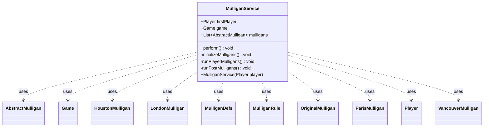

---
aliases:
  - MulliganService
tags:
  - java/class
  - module/forge-game
  - pkg/forge/game/mulligan
fqn: forge.game.mulligan.MulliganService
package: forge.game.mulligan
module: forge-game
kind: Class
---

# MulliganService

**Package:** `forge.game.mulligan`   **Module:** `forge-game`   **Kind:** Class



## Relationships
**Uses:**
- [[forge.MulliganDefs|MulliganDefs]]
- [[forge.MulliganDefs.MulliganRule|MulliganRule]]
- [[forge.game.Game|Game]]
- [[forge.game.mulligan.AbstractMulligan|AbstractMulligan]]
- [[forge.game.mulligan.HoustonMulligan|HoustonMulligan]]
- [[forge.game.mulligan.LondonMulligan|LondonMulligan]]
- [[forge.game.mulligan.OriginalMulligan|OriginalMulligan]]
- [[forge.game.mulligan.ParisMulligan|ParisMulligan]]
- [[forge.game.mulligan.VancouverMulligan|VancouverMulligan]]
- [[forge.game.player.Player|Player]]

## Design Description

MulliganService orchestrates the opening-hand mulligan phase for a game of Magic, encapsulating the multi-player keep/mulligan loop behind a single `perform()` entry point. Constructed from the starting Player, it derives its Game context and drives three sequential stages: building per-player mulligan handlers, running the interactive keep-or-mulligan rounds, and applying post-mulligan cleanup.

It acts as a coordinator over the AbstractMulligan hierarchy, selecting the concrete rule implementation—Original, Paris, Vancouver, London, or Houston—via a factory switch keyed on the globally configured MulliganRule, defaulting to Vancouver. Notable design intent includes rotating turn order so the first player mulligans first, granting a free first mulligan in multiplayer or Brawl games, and short-circuiting the loop if a player concedes mid-prompt, keeping rule-specific behavior delegated to the polymorphic AbstractMulligan subtypes.

## Source
`forge-game/src/main/java/forge/game/mulligan/MulliganService.java`

```java
package forge.game.mulligan;

import java.util.List;

import com.google.common.collect.Lists;

import forge.MulliganDefs;
import forge.StaticData;
import forge.game.Game;
import forge.game.GameType;
import forge.game.player.Player;

public class MulliganService {
    Player firstPlayer;
    Game game;
    List<AbstractMulligan> mulligans = Lists.newArrayList();

    public MulliganService(Player player) {
        firstPlayer = player;
        game = firstPlayer.getGame();
    }

    public void perform() {
        initializeMulligans();
        runPlayerMulligans();
        runPostMulligans();
    }

    private void initializeMulligans() {
        List<Player> whoCanMulligan = Lists.newArrayList(game.getPlayers());
        int offset = whoCanMulligan.indexOf(firstPlayer);

        for (int i = 0; i < offset; i++) {
            whoCanMulligan.add(whoCanMulligan.remove(0));
        }

        boolean firstMullFree = game.getPlayers().size() > 2 || game.getRules().hasAppliedVariant(GameType.Brawl);

        for (Player player : whoCanMulligan) {
            MulliganDefs.MulliganRule rule = StaticData.instance().getMulliganRule();
            AbstractMulligan mulligan;
            switch (rule) {
                case Original:
                    mulligan = new OriginalMulligan(player, firstMullFree);
                    break;
                case Paris:
                    mulligan = new ParisMulligan(player, firstMullFree);
                    break;
                case Vancouver:
                    mulligan = new VancouverMulligan(player, firstMullFree);
                    break;
                case London:
                    mulligan = new LondonMulligan(player, firstMullFree);
                    break;
                case Houston:
                    mulligan = new HoustonMulligan(player, firstMullFree);
                    break;
                default:
                    mulligan = new VancouverMulligan(player, firstMullFree);
                    break;
            }

            mulligans.add(mulligan);
            mulligan.beforeFirstMulligan();
        }
    }

    private void runPlayerMulligans() {
        boolean allKept;
        do {
            allKept = true;
            for (AbstractMulligan mulligan : mulligans) {
                if (mulligan.hasKept()) {
                    continue;
                }

                Player p = mulligan.getPlayer();

                boolean keep = !mulligan.canMulligan() ||
                        p.getController().mulliganKeepHand(
                                firstPlayer,
                                mulligan.tuckCardsDuringMulligan()
                        );

                if (game.isGameOver()) {
                    // conceded during mulligan prompt
                    return;
                }

                if (keep) {
                    mulligan.keep();
                    continue;
                }

                allKept = false;
                mulligan.mulligan();
            }
        } while (!allKept);
    }

    private void runPostMulligans() {
        for (AbstractMulligan mulligan : mulligans) {
            mulligan.afterMulligan();
        }
    }
}
```

## Python
`forge/game/mulligan/MulliganService.py`

```python
package: forge.game.mulligan

I'll output the Python port directly.

from forge.MulliganDefs import MulliganDefs
from forge.MulliganDefs.MulliganRule import MulliganRule
from forge.StaticData import StaticData
from forge.game.Game import Game
from forge.game.GameType import GameType
from forge.game.mulligan.AbstractMulligan import AbstractMulligan
from forge.game.mulligan.HoustonMulligan import HoustonMulligan
from forge.game.mulligan.LondonMulligan import LondonMulligan
from forge.game.mulligan.OriginalMulligan import OriginalMulligan
from forge.game.mulligan.ParisMulligan import ParisMulligan
from forge.game.mulligan.VancouverMulligan import VancouverMulligan
from forge.game.player.Player import Player


class MulliganService:
    def __init__(self, player: Player):
        self.firstPlayer = player
        self.game = self.firstPlayer.getGame()
        self.mulligans: list[AbstractMulligan] = []

    def perform(self) -> None:
        self.initializeMulligans()
        self.runPlayerMulligans()
        self.runPostMulligans()

    def initializeMulligans(self) -> None:
        whoCanMulligan = list(self.game.getPlayers())
        offset = whoCanMulligan.index(self.firstPlayer)

        for i in range(offset):
            whoCanMulligan.append(whoCanMulligan.pop(0))

        firstMullFree = len(self.game.getPlayers()) > 2 or self.game.getRules().hasAppliedVariant(GameType.Brawl)

        for player in whoCanMulligan:
            rule = StaticData.instance().getMulliganRule()
            if rule == MulliganRule.Original:
                mulligan = OriginalMulligan(player, firstMullFree)
            elif rule == MulliganRule.Paris:
                mulligan = ParisMulligan(player, firstMullFree)
            elif rule == MulliganRule.Vancouver:
                mulligan = VancouverMulligan(player, firstMullFree)
            elif rule == MulliganRule.London:
                mulligan = LondonMulligan(player, firstMullFree)
            elif rule == MulliganRule.Houston:
                mulligan = HoustonMulligan(player, firstMullFree)
            else:
                mulligan = VancouverMulligan(player, firstMullFree)

            self.mulligans.append(mulligan)
            mulligan.beforeFirstMulligan()

    def runPlayerMulligans(self) -> None:
        while True:
            allKept = True
            for mulligan in self.mulligans:
                if mulligan.hasKept():
                    continue

                p = mulligan.getPlayer()

                keep = not mulligan.canMulligan() or \
                    p.getController().mulliganKeepHand(
                        self.firstPlayer,
                        mulligan.tuckCardsDuringMulligan()
                    )

                if self.game.isGameOver():
                    # conceded during mulligan prompt
                    return

                if keep:
                    mulligan.keep()
                    continue

                allKept = False
                mulligan.mulligan()
            if allKept:
                break

    def runPostMulligans(self) -> None:
        for mulligan in self.mulligans:
            mulligan.afterMulligan()
```
