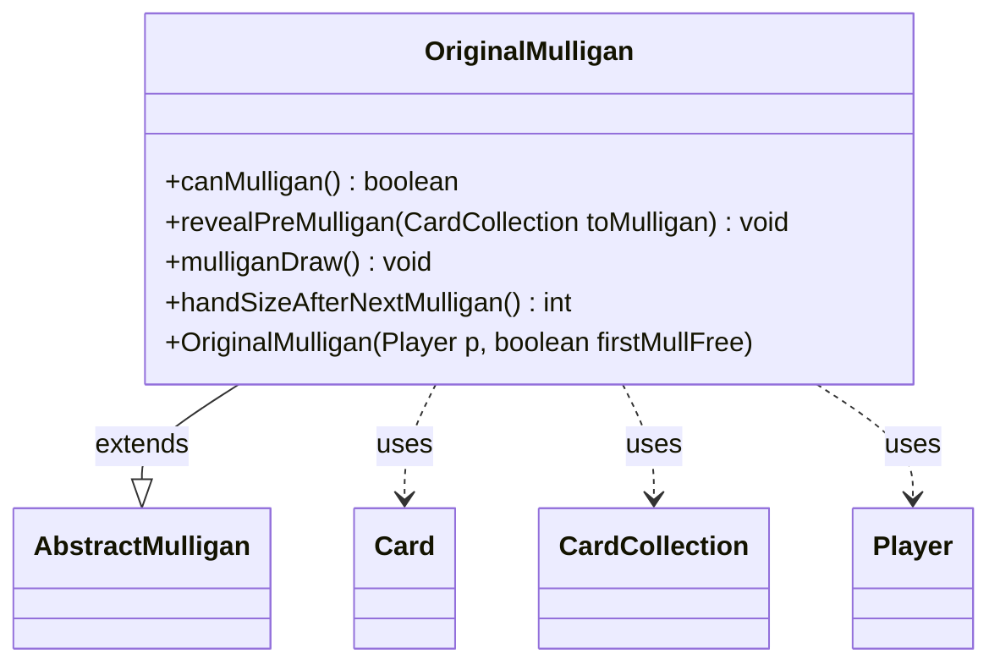

---
aliases:
  - OriginalMulligan
tags:
  - java/class
  - module/forge-game
  - pkg/forge/game/mulligan
fqn: forge.game.mulligan.OriginalMulligan
package: forge.game.mulligan
module: forge-game
kind: Class
---

# OriginalMulligan

**Package:** `forge.game.mulligan`   **Module:** `forge-game`   **Kind:** Class



## Relationships
**Extends:**
- [[forge.game.mulligan.AbstractMulligan|AbstractMulligan]]
**Uses:**
- [[forge.game.card.Card|Card]]
- [[forge.game.card.CardCollection|CardCollection]]
- [[forge.game.player.Player|Player]]

## Design Description

OriginalMulligan implements the classic Magic mulligan rule as a concrete strategy within the mulligan framework, extending AbstractMulligan and inheriting its player reference and mulligan-count tracking. Its core responsibility is deciding eligibility and executing the redraw: canMulligan permits only a first, never-yet-taken mulligan and restricts it to the historic "all lands or no lands" opening hand, while mulliganDraw redraws a fresh hand equal to the player's maximum hand size, reflecting that the original rule shuffles back and draws seven without penalty. It collaborates with Player to inspect and modify the hand zone (via ZoneType.Hand) and with Card and CardCollection to evaluate land composition and the cards being mulliganed. The empty revealPreMulligan override signals an intentional no-op placeholder, with a TODO marking reveal behavior as deferred—indicating this variant predates or omits the hand-reveal step required by later mulligan rules.

## Source
`forge-game/src/main/java/forge/game/mulligan/OriginalMulligan.java`

```java
package forge.game.mulligan;

import forge.game.card.Card;
import forge.game.card.CardCollection;
import forge.game.player.Player;
import forge.game.zone.ZoneType;

public class OriginalMulligan extends AbstractMulligan {
    public OriginalMulligan(Player p, boolean firstMullFree) {
        super(p, firstMullFree);
    }

    public boolean canMulligan() {
        if (timesMulliganed > 0) {
            return false;
        }

        int totalCards = 0;
        int lands = 0;
        for(Card c : player.getCardsIn(ZoneType.Hand)) {
            if (c.isLand()) {
                lands++;
            }
            totalCards++;
        }

        return lands == 0 || lands == totalCards;
    }
    
    @Override
    public void revealPreMulligan(CardCollection toMulligan) {
        //for(Card card : toMulligan) {
            // TODO Reveal the cards. 
        //}
    }

    public void mulliganDraw() {
        player.drawCards(handSizeAfterNextMulligan());
    }

    public int handSizeAfterNextMulligan() {
        return player.getMaxHandSize();
    }
}
```

## Python
`forge/game/mulligan/OriginalMulligan.py`

```python
from forge.game.card.Card import Card
from forge.game.card.CardCollection import CardCollection
from forge.game.player.Player import Player
from forge.game.zone.ZoneType import ZoneType
from forge.game.mulligan.AbstractMulligan import AbstractMulligan


class OriginalMulligan(AbstractMulligan):
    def __init__(self, p: Player, firstMullFree: bool):
        super().__init__(p, firstMullFree)

    def canMulligan(self) -> bool:
        if self.timesMulliganed > 0:
            return False

        totalCards = 0
        lands = 0
        for c in self.player.getCardsIn(ZoneType.Hand):
            if c.isLand():
                lands += 1
            totalCards += 1

        return lands == 0 or lands == totalCards

    def revealPreMulligan(self, toMulligan: CardCollection) -> None:
        # for card in toMulligan:
            # TODO Reveal the cards.
        pass

    def mulliganDraw(self) -> None:
        self.player.drawCards(self.handSizeAfterNextMulligan())

    def handSizeAfterNextMulligan(self) -> int:
        return self.player.getMaxHandSize()
```
