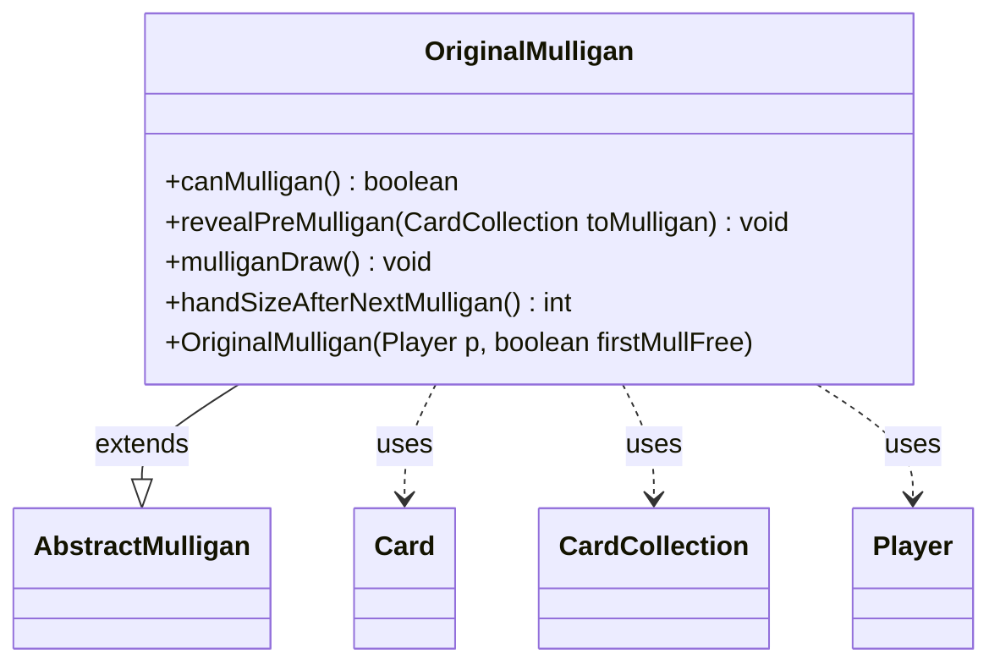

---
aliases:
  - OriginalMulligan
tags:
  - java/class
  - module/forge-game
  - pkg/forge/game/mulligan
fqn: forge.game.mulligan.OriginalMulligan
package: forge.game.mulligan
module: forge-game
kind: Class
---

# OriginalMulligan

**Package:** `forge.game.mulligan` &nbsp; **Module:** `forge-game` &nbsp; **Kind:** Class



## Relationships
**Extends:**
- [[forge.game.mulligan.AbstractMulligan|AbstractMulligan]]
**Uses:**
- [[forge.game.card.Card|Card]]
- [[forge.game.card.CardCollection|CardCollection]]
- [[forge.game.player.Player|Player]]

## Source
`forge-game/src/main/java/forge/game/mulligan/OriginalMulligan.java`

```java
package forge.game.mulligan;

import forge.game.card.Card;
import forge.game.card.CardCollection;
import forge.game.player.Player;
import forge.game.zone.ZoneType;

public class OriginalMulligan extends AbstractMulligan {
    public OriginalMulligan(Player p, boolean firstMullFree) {
        super(p, firstMullFree);
    }

    public boolean canMulligan() {
        if (timesMulliganed > 0) {
            return false;
        }

        int totalCards = 0;
        int lands = 0;
        for(Card c : player.getCardsIn(ZoneType.Hand)) {
            if (c.isLand()) {
                lands++;
            }
            totalCards++;
        }

        return lands == 0 || lands == totalCards;
    }
    
    @Override
    public void revealPreMulligan(CardCollection toMulligan) {
        //for(Card card : toMulligan) {
            // TODO Reveal the cards. 
        //}
    }

    public void mulliganDraw() {
        player.drawCards(handSizeAfterNextMulligan());
    }

    public int handSizeAfterNextMulligan() {
        return player.getMaxHandSize();
    }
}
```
