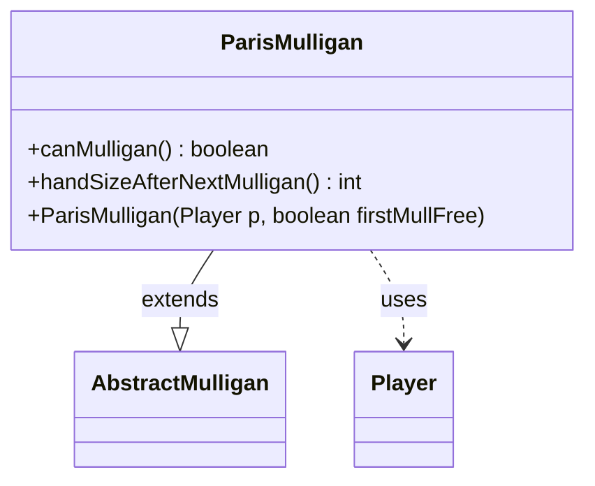

---
aliases:
  - ParisMulligan
tags:
  - java/class
  - module/forge-game
  - pkg/forge/game/mulligan
fqn: forge.game.mulligan.ParisMulligan
package: forge.game.mulligan
module: forge-game
kind: Class
---

# ParisMulligan

**Package:** `forge.game.mulligan` &nbsp; **Module:** `forge-game` &nbsp; **Kind:** Class



## Relationships
**Extends:**
- [[forge.game.mulligan.AbstractMulligan|AbstractMulligan]]
**Uses:**
- [[forge.game.player.Player|Player]]

## Design Description

The ParisMulligan class implements the "Paris" mulligan rule variant within Forge's mulligan subsystem. Extending AbstractMulligan, it inherits the shared player state, kept-hand tracking, and mulligan-count bookkeeping while supplying only the two rule-specific behaviors the abstract base leaves open: deciding whether another mulligan is permitted and computing the resulting hand size. It collaborates with Player to inspect the hand zone and maximum hand size.

Under the Paris rule, a player may mulligan as long as the hand has not been kept and is not empty, and each successive mulligan reduces the new hand size by one card relative to the maximum, with an optional free first mulligan granting one extra card. This concise subclass concentrates all variant-specific logic in two overrides, leaving common orchestration to the supertype.

## Source
`forge-game/src/main/java/forge/game/mulligan/ParisMulligan.java`

```java
package forge.game.mulligan;

import forge.game.player.Player;
import forge.game.zone.ZoneType;

public class ParisMulligan extends AbstractMulligan {
    public ParisMulligan(Player p, boolean firstMullFree) {
        super(p, firstMullFree);
    }

    public boolean canMulligan() {
        return !kept && !player.getZone(ZoneType.Hand).isEmpty();
    }

    public int handSizeAfterNextMulligan() {
        int extraCard = firstMulliganFree ? 1 : 0;

        return player.getMaxHandSize() - timesMulliganed + extraCard;
    }
}
```

## Python
`forge/game/mulligan/ParisMulligan.py`

```python
from forge.game.mulligan.AbstractMulligan import AbstractMulligan
from forge.game.player.Player import Player
from forge.game.zone.ZoneType import ZoneType


class ParisMulligan(AbstractMulligan):
    def __init__(self, p: Player, firstMullFree: bool):
        super().__init__(p, firstMullFree)

    def canMulligan(self) -> bool:
        return not self.kept and not self.player.getZone(ZoneType.Hand).isEmpty()

    def handSizeAfterNextMulligan(self) -> int:
        extraCard = 1 if self.firstMulliganFree else 0

        return self.player.getMaxHandSize() - self.timesMulliganed + extraCard
```
