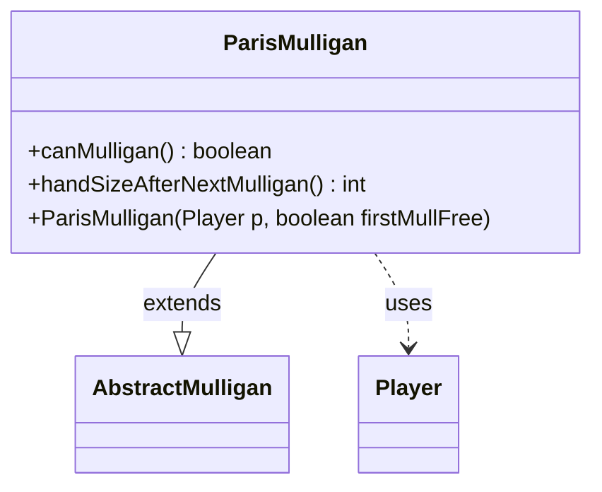

---
aliases:
  - ParisMulligan
tags:
  - java/class
  - module/forge-game
  - pkg/forge/game/mulligan
fqn: forge.game.mulligan.ParisMulligan
package: forge.game.mulligan
module: forge-game
kind: Class
---

# ParisMulligan

**Package:** `forge.game.mulligan` &nbsp; **Module:** `forge-game` &nbsp; **Kind:** Class



## Relationships
**Extends:**
- [[forge.game.mulligan.AbstractMulligan|AbstractMulligan]]
**Uses:**
- [[forge.game.player.Player|Player]]

## Source
`forge-game/src/main/java/forge/game/mulligan/ParisMulligan.java`

```java
package forge.game.mulligan;

import forge.game.player.Player;
import forge.game.zone.ZoneType;

public class ParisMulligan extends AbstractMulligan {
    public ParisMulligan(Player p, boolean firstMullFree) {
        super(p, firstMullFree);
    }

    public boolean canMulligan() {
        return !kept && !player.getZone(ZoneType.Hand).isEmpty();
    }

    public int handSizeAfterNextMulligan() {
        int extraCard = firstMulliganFree ? 1 : 0;

        return player.getMaxHandSize() - timesMulliganed + extraCard;
    }
}
```
