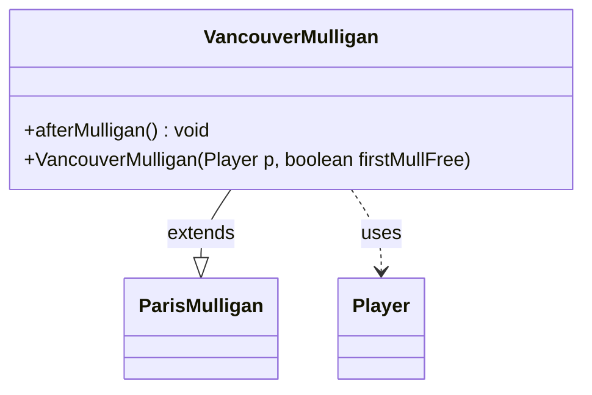

---
aliases:
  - VancouverMulligan
tags:
  - java/class
  - module/forge-game
  - pkg/forge/game/mulligan
fqn: forge.game.mulligan.VancouverMulligan
package: forge.game.mulligan
module: forge-game
kind: Class
---

# VancouverMulligan

**Package:** `forge.game.mulligan` &nbsp; **Module:** `forge-game` &nbsp; **Kind:** Class



## Relationships
**Extends:**
- [[forge.game.mulligan.ParisMulligan|ParisMulligan]]
**Uses:**
- [[forge.game.player.Player|Player]]

## Source
`forge-game/src/main/java/forge/game/mulligan/VancouverMulligan.java`

```java
package forge.game.mulligan;

import forge.game.player.Player;
import forge.game.zone.ZoneType;

import java.util.List;

public class VancouverMulligan extends ParisMulligan {
    public VancouverMulligan(Player p, boolean firstMullFree) {
        super(p, firstMullFree);
    }

    public void afterMulligan() {
        super.afterMulligan();
        if (player.getStartingHandSize() > player.getZone(ZoneType.Hand).size()) {
            player.getGame().getAction().scry(List.of(player), 1, null);
        }
    }
}
```
