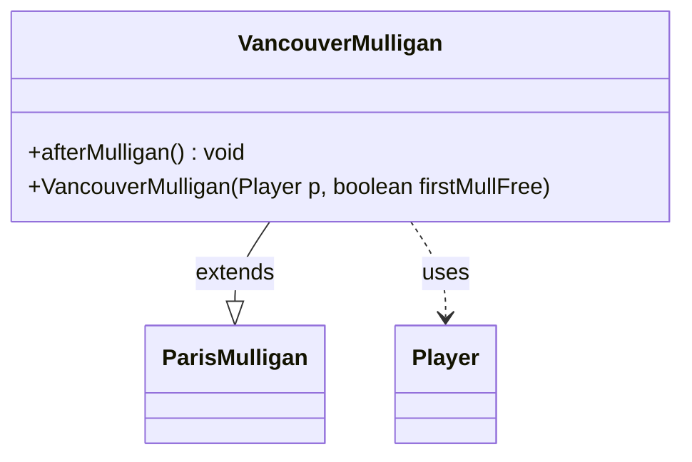

---
aliases:
  - VancouverMulligan
tags:
  - java/class
  - module/forge-game
  - pkg/forge/game/mulligan
fqn: forge.game.mulligan.VancouverMulligan
package: forge.game.mulligan
module: forge-game
kind: Class
---

# VancouverMulligan

**Package:** `forge.game.mulligan` &nbsp; **Module:** `forge-game` &nbsp; **Kind:** Class



## Relationships
**Extends:**
- [[forge.game.mulligan.ParisMulligan|ParisMulligan]]
**Uses:**
- [[forge.game.player.Player|Player]]

## Design Description

VancouverMulligan implements Magic's Vancouver mulligan rule as a thin specialization of ParisMulligan, extending its London/Paris-style hand-resolution with the rule's distinguishing scry step. Its sole behavioral override, afterMulligan(), first defers to the superclass and then, if the player mulliganed at least once (their current hand is smaller than the starting hand size), triggers a scry 1 through the game's action system.

By overriding only the post-mulligan hook and reusing the parent's construction and card-handling logic, the class keeps the variant-specific rule isolated and minimal. It collaborates with Player to inspect hand and zone state and to reach the Game's action layer that performs the scry, reflecting a deliberate design intent of expressing each mulligan variant as a small, focused subclass in the mulligan hierarchy.

## Source
`forge-game/src/main/java/forge/game/mulligan/VancouverMulligan.java`

```java
package forge.game.mulligan;

import forge.game.player.Player;
import forge.game.zone.ZoneType;

import java.util.List;

public class VancouverMulligan extends ParisMulligan {
    public VancouverMulligan(Player p, boolean firstMullFree) {
        super(p, firstMullFree);
    }

    public void afterMulligan() {
        super.afterMulligan();
        if (player.getStartingHandSize() > player.getZone(ZoneType.Hand).size()) {
            player.getGame().getAction().scry(List.of(player), 1, null);
        }
    }
}
```

## Python
`forge/game/mulligan/VancouverMulligan.py`

```python
from forge.game.mulligan.ParisMulligan import ParisMulligan
from forge.game.player.Player import Player
from forge.game.zone.ZoneType import ZoneType


class VancouverMulligan(ParisMulligan):
    def __init__(self, p: Player, firstMullFree: bool):
        super().__init__(p, firstMullFree)

    def afterMulligan(self):
        super().afterMulligan()
        if self.player.getStartingHandSize() > self.player.getZone(ZoneType.Hand).size():
            self.player.getGame().getAction().scry([self.player], 1, None)
```
