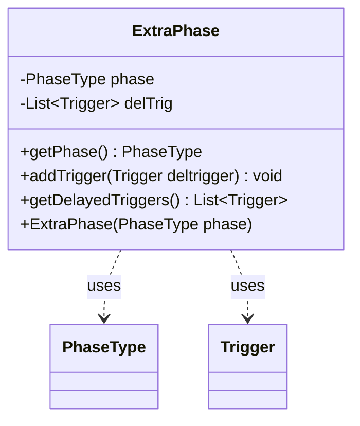

---
aliases:
  - ExtraPhase
tags:
  - java/class
  - module/forge-game
  - pkg/forge/game/phase
fqn: forge.game.phase.ExtraPhase
package: forge.game.phase
module: forge-game
kind: Class
---

# ExtraPhase

**Package:** `forge.game.phase` &nbsp; **Module:** `forge-game` &nbsp; **Kind:** Class



## Relationships
**Uses:**
- [[forge.game.phase.PhaseType|PhaseType]]
- [[forge.game.trigger.Trigger|Trigger]]

## Design Description

Forge's `ExtraPhase` is a small mutable value object that models an additional, dynamically inserted game phase. It pairs an immutable `PhaseType` (the kind of phase being added) with a mutable, lazily populated collection of delayed `Trigger`s that should fire during that phase. Its responsibility is purely to carry this association: it exposes the phase via `getPhase()`, accepts triggers through `addTrigger()`, and surfaces them via `getDelayedTriggers()`.

It is a standalone class with no supertype, collaborating only with `PhaseType` and `Trigger` from sibling packages. The `final` phase field signals that the phase identity is fixed at construction, while the trigger list is wrapped in `Collections.synchronizedList`, indicating an intent to tolerate concurrent access as triggers accumulate across the game engine.

## Source
`forge-game/src/main/java/forge/game/phase/ExtraPhase.java`

```java
package forge.game.phase;

import java.util.ArrayList;
import java.util.Collections;
import java.util.List;

import forge.game.trigger.Trigger;

public class ExtraPhase {
    private final PhaseType phase;
    private List<Trigger> delTrig = Collections.synchronizedList(new ArrayList<>());

    public ExtraPhase(PhaseType phase) {
        this.phase = phase;
    }

    public PhaseType getPhase() {
        return phase;
    }

    public void addTrigger(Trigger deltrigger) {
        this.delTrig.add(deltrigger);
    }

    public List<Trigger> getDelayedTriggers() {
        return delTrig;
    }

}
```

## Python
`forge/game/phase/ExtraPhase.py`

```python
from forge.game.phase.PhaseType import PhaseType
from forge.game.trigger.Trigger import Trigger


class ExtraPhase:
    def __init__(self, phase: PhaseType):
        self.phase = phase
        self.delTrig: list[Trigger] = []

    def getPhase(self) -> PhaseType:
        return self.phase

    def addTrigger(self, deltrigger: Trigger) -> None:
        self.delTrig.append(deltrigger)

    def getDelayedTriggers(self) -> list[Trigger]:
        return self.delTrig
```
