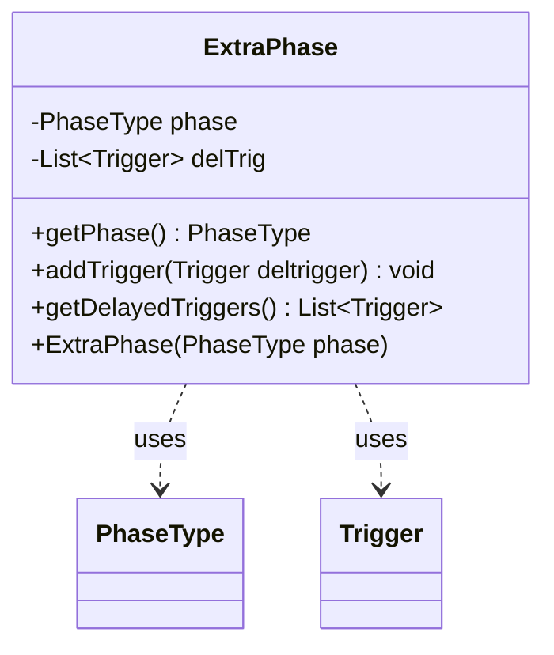

---
aliases:
  - ExtraPhase
tags:
  - java/class
  - module/forge-game
  - pkg/forge/game/phase
fqn: forge.game.phase.ExtraPhase
package: forge.game.phase
module: forge-game
kind: Class
---

# ExtraPhase

**Package:** `forge.game.phase` &nbsp; **Module:** `forge-game` &nbsp; **Kind:** Class



## Relationships
**Uses:**
- [[forge.game.phase.PhaseType|PhaseType]]
- [[forge.game.trigger.Trigger|Trigger]]

## Source
`forge-game/src/main/java/forge/game/phase/ExtraPhase.java`

```java
package forge.game.phase;

import java.util.ArrayList;
import java.util.Collections;
import java.util.List;

import forge.game.trigger.Trigger;

public class ExtraPhase {
    private final PhaseType phase;
    private List<Trigger> delTrig = Collections.synchronizedList(new ArrayList<>());

    public ExtraPhase(PhaseType phase) {
        this.phase = phase;
    }

    public PhaseType getPhase() {
        return phase;
    }

    public void addTrigger(Trigger deltrigger) {
        this.delTrig.add(deltrigger);
    }

    public List<Trigger> getDelayedTriggers() {
        return delTrig;
    }

}
```
