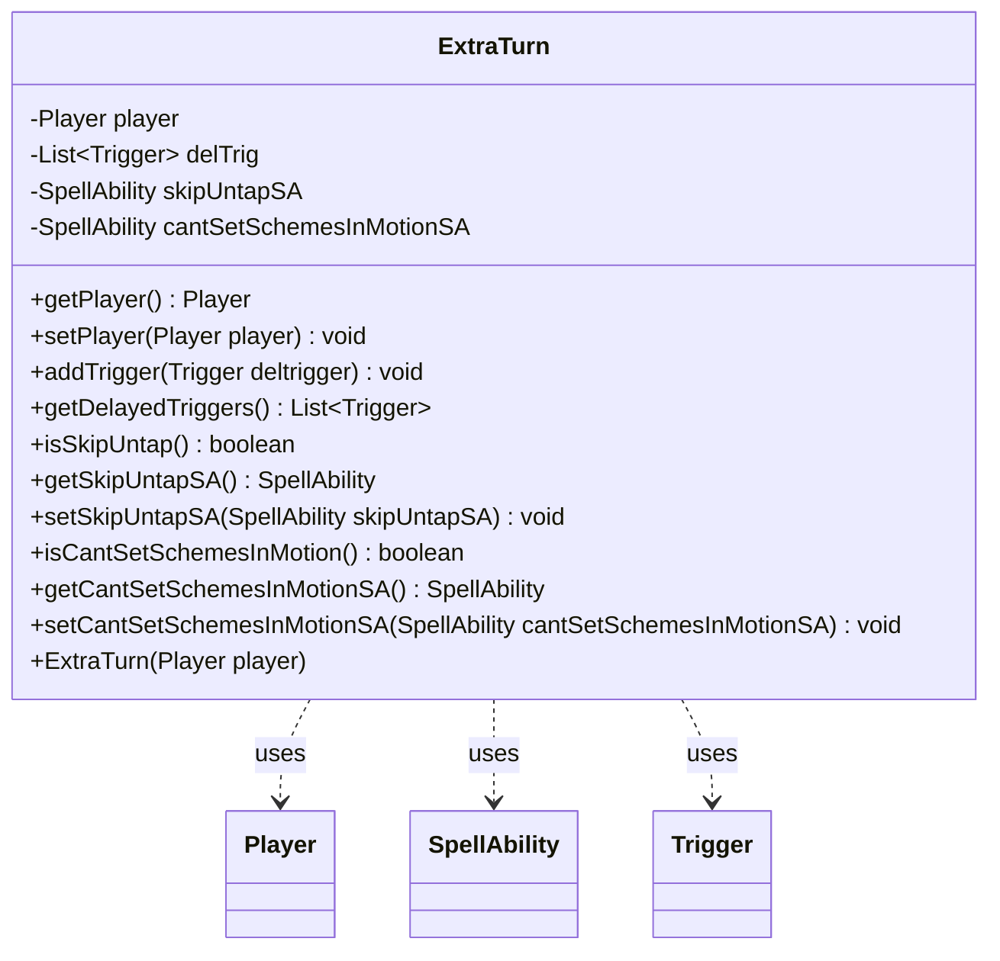

---
aliases:
  - ExtraTurn
tags:
  - java/class
  - module/forge-game
  - pkg/forge/game/phase
fqn: forge.game.phase.ExtraTurn
package: forge.game.phase
module: forge-game
kind: Class
---

# ExtraTurn

**Package:** `forge.game.phase` &nbsp; **Module:** `forge-game` &nbsp; **Kind:** Class



## Relationships
**Uses:**
- [[forge.game.player.Player|Player]]
- [[forge.game.spellability.SpellAbility|SpellAbility]]
- [[forge.game.trigger.Trigger|Trigger]]

## Source
`forge-game/src/main/java/forge/game/phase/ExtraTurn.java`

```java
/*
 * Forge: Play Magic: the Gathering.
 * Copyright (C) 2011  Forge Team
 *
 * This program is free software: you can redistribute it and/or modify
 * it under the terms of the GNU General Public License as published by
 * the Free Software Foundation, either version 3 of the License, or
 * (at your option) any later version.
 * 
 * This program is distributed in the hope that it will be useful,
 * but WITHOUT ANY WARRANTY; without even the implied warranty of
 * MERCHANTABILITY or FITNESS FOR A PARTICULAR PURPOSE.  See the
 * GNU General Public License for more details.
 * 
 * You should have received a copy of the GNU General Public License
 * along with this program.  If not, see <http://www.gnu.org/licenses/>.
 */
package forge.game.phase;

import java.util.ArrayList;
import java.util.Collections;
import java.util.List;

import forge.game.player.Player;
import forge.game.spellability.SpellAbility;
import forge.game.trigger.Trigger;

/**
 * <p>
 * ExtraTurn class.
 * Stores information about extra turns
 * </p>
 * 
 * @author Forge
 * @version $Id: ExtraTurn 12482 2011-12-06 11:14:11Z Sloth $
 */
public class ExtraTurn {

    private Player player = null;
    private List<Trigger> delTrig = Collections.synchronizedList(new ArrayList<>());
    private SpellAbility skipUntapSA;
    private SpellAbility cantSetSchemesInMotionSA;
    /**
     * TODO: Write javadoc for Constructor.
     * @param player the player
     */
    public ExtraTurn(Player player) {
        this.player = player;
    }

    /**
     * @return the player
     */
    public Player getPlayer() {
        return player;
    }

    /**
     * @param player the player to set
     */
    public void setPlayer(Player player) {
        this.player = player;
    }

    /**
     * @param deltrigger the Trigger to add
     */
    public void addTrigger(Trigger deltrigger) {
        this.delTrig.add(deltrigger);
    }

    /**
     * @return the delTrig
     */
    public List<Trigger> getDelayedTriggers() {
        return delTrig;
    }

    /**
     * @return the skipUntap
     */
    public boolean isSkipUntap() {
        return skipUntapSA != null;
    }

    /**
     * @return the skipUntapSA;
     */
    public SpellAbility getSkipUntapSA() {
        return skipUntapSA;
    }

    /**
     * @param skipUntapSA the skipUntapSA to set
     */
    public void setSkipUntapSA(SpellAbility skipUntapSA) {
        this.skipUntapSA = skipUntapSA;
    }

    public boolean isCantSetSchemesInMotion() {
        return cantSetSchemesInMotionSA != null;
    }

    public SpellAbility getCantSetSchemesInMotionSA() {
        return cantSetSchemesInMotionSA;
    }

    public void setCantSetSchemesInMotionSA(SpellAbility cantSetSchemesInMotionSA) {
        this.cantSetSchemesInMotionSA = cantSetSchemesInMotionSA;
    }

}
```
