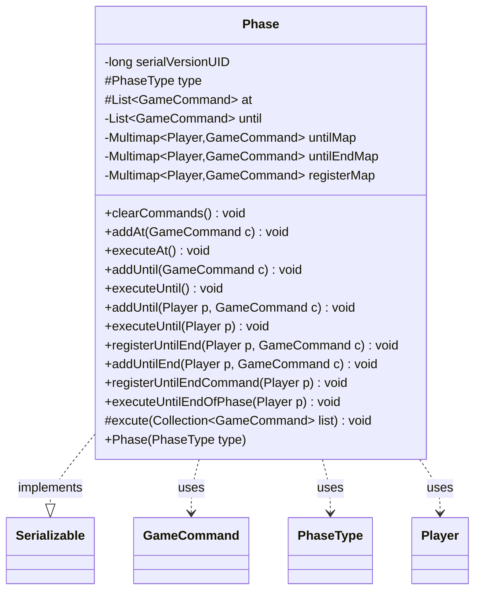

---
aliases:
  - Phase
tags:
  - java/class
  - module/forge-game
  - pkg/forge/game/phase
fqn: forge.game.phase.Phase
package: forge.game.phase
module: forge-game
kind: Class
---

# Phase

**Package:** `forge.game.phase` &nbsp; **Module:** `forge-game` &nbsp; **Kind:** Class



## Relationships
**Uses:**
- [[forge.GameCommand|GameCommand]]
- [[forge.game.phase.PhaseType|PhaseType]]
- [[forge.game.player.Player|Player]]

## Source
`forge-game/src/main/java/forge/game/phase/Phase.java`

```java
/*
 * Forge: Play Magic: the Gathering.
 * Copyright (C) 2011  Forge Team
 *
 * This program is free software: you can redistribute it and/or modify
 * it under the terms of the GNU General Public License as published by
 * the Free Software Foundation, either version 3 of the License, or
 * (at your option) any later version.
 * 
 * This program is distributed in the hope that it will be useful,
 * but WITHOUT ANY WARRANTY; without even the implied warranty of
 * MERCHANTABILITY or FITNESS FOR A PARTICULAR PURPOSE.  See the
 * GNU General Public License for more details.
 * 
 * You should have received a copy of the GNU General Public License
 * along with this program.  If not, see <http://www.gnu.org/licenses/>.
 */
package forge.game.phase;

import java.util.Collection;
import java.util.List;

import com.google.common.collect.Lists;
import com.google.common.collect.Multimap;
import com.google.common.collect.MultimapBuilder;

import forge.GameCommand;
import forge.game.player.Player;


/**
 * <p>
 * Phase class.
 * </p>
 * 
 * @author Forge
 * @version $Id$
 */
public class Phase implements java.io.Serializable {

    private static final long serialVersionUID = 4665309652476851977L;

    protected final PhaseType type; // mostly decorative field - it's never used

    public Phase(PhaseType type) {
        this.type = type;
    }

    protected final List<GameCommand> at = Lists.newArrayList();
    private final List<GameCommand> until = Lists.newArrayList();
    private final Multimap<Player, GameCommand> untilMap = MultimapBuilder.hashKeys().arrayListValues().build();
    private final Multimap<Player, GameCommand> untilEndMap = MultimapBuilder.hashKeys().arrayListValues().build();
    private final Multimap<Player, GameCommand> registerMap = MultimapBuilder.hashKeys().arrayListValues().build();

    public void clearCommands() {
        at.clear();
        until.clear();
        untilMap.clear();
        untilEndMap.clear();
        registerMap.clear();
    }

    /**
     * <p>
     * Add a hardcoded trigger that will execute "at <phase>".
     * </p>
     * 
     * @param c
     *            a {@link forge.GameCommand} object.
     */
    public final void addAt(final GameCommand c) {
        this.at.add(c);
    }

    /**
     * <p>
     * Executes any hardcoded triggers that happen "at <phase>".
     * </p>
     */
    public void executeAt() {
        excute(this.at);
    }

    /**
     * <p>
     * Add a Command that will terminate an effect with "until <phase>".
     * </p>
     * 
     * @param c
     *            a {@link forge.GameCommand} object.
     */
    public final void addUntil(final GameCommand c) {
        this.until.add(c);
    }

    /**
     * <p>
     * Executes the termination of effects that apply "until <phase>".
     * </p>
     */
    public final void executeUntil() {
        excute(this.until);
    }

    /**
     * <p>
     * Add a Command that will terminate an effect with "until <Player's> next <phase>".
     * Use cleanup phase to terminate an effect with "until <Player's> next turn"
     */
    public final void addUntil(Player p, final GameCommand c) {
        this.untilMap.put(p, c);
    }

    /**
     * <p>
     * Executes the termination of effects that apply "until <Player's> next <phase>".
     * </p>
     * 
     * @param p
     *            the player the execute until for
     */
    public final void executeUntil(final Player p) {
        excute(untilMap.get(p));
    }

    public final void registerUntilEnd(Player p, final GameCommand c) {
        this.registerMap.put(p, c);
    }

    public final void addUntilEnd(Player p, final GameCommand c) {
        this.untilEndMap.put(p, c);
    }

    public final void registerUntilEndCommand(final Player p) {
        untilEndMap.putAll(p, registerMap.get(p));
        registerMap.removeAll(p);
    }

    public final void executeUntilEndOfPhase(final Player p) {
        excute(untilEndMap.get(p));
    }
    protected void excute(Collection<GameCommand> list) {
        List<GameCommand> events = Lists.newArrayList(list);
        events.forEach(GameCommand::run);
        list.removeAll(events);
    }
}
```
