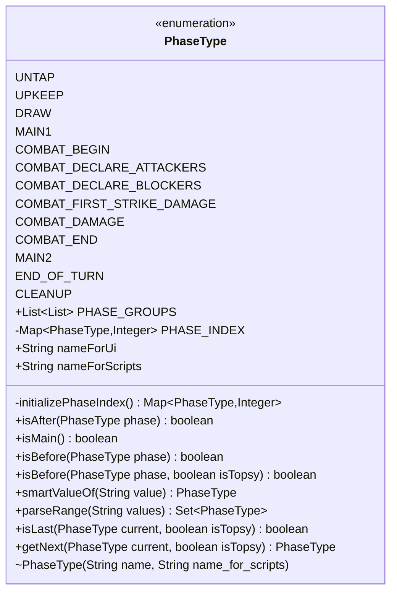

---
aliases:
  - PhaseType
tags:
  - java/enum
  - module/forge-game
  - pkg/forge/game/phase
fqn: forge.game.phase.PhaseType
package: forge.game.phase
module: forge-game
kind: Enum
---

# PhaseType

**Package:** `forge.game.phase`   **Module:** `forge-game`   **Kind:** Enum



## Design Description

PhaseType enumerates the thirteen sequential steps of a Magic: The Gathering turn—from UNTAP through CLEANUP—serving as the canonical model of turn structure consumed throughout the forge-game module's phase and turn-management logic. Beyond identifying each step, it encodes turn order: phases are grouped into ordered super-phases (PHASE_GROUPS) and indexed (PHASE_INDEX) so that ordering queries (isBefore, isAfter), main-phase tests (isMain), and traversal (getNext, isLast) can be answered without external state. Each constant carries a localized UI name, resolved via the Localizer collaborator, and a stable script name for card-script parsing.

The design intentionally folds sequencing into the enum itself, and a boolean isTopsy parameter threads through the comparison and traversal methods to support reverse turn order (the Topsy Turvy effect), with CLEANUP pinned last regardless. Static helpers smartValueOf and parseRange bridge textual card scripts to the type, accepting aliases, "Main", and "A->B" ranges, making PhaseType the central vocabulary linking the rules engine to card definitions.

## Source
`forge-game/src/main/java/forge/game/phase/PhaseType.java`

```java
package forge.game.phase;

import java.util.Arrays;
import java.util.EnumSet;
import java.util.List;
import java.util.Map;
import java.util.Set;

import com.google.common.collect.Maps;
import org.apache.commons.lang3.StringUtils;

import forge.util.Localizer;


public enum PhaseType {
    UNTAP("lblUntapStep", "Untap"),
    UPKEEP("lblUpkeepStep", "Upkeep"),
    DRAW("lblDrawStep", "Draw"),
    MAIN1("lblMainPhase1", "Main1"),
    COMBAT_BEGIN("lblCombatBeginStep", "BeginCombat"),
    COMBAT_DECLARE_ATTACKERS("lblCombatDeclareAttackersStep", "Declare Attackers"),
    COMBAT_DECLARE_BLOCKERS("lblCombatDeclareBlockersStep", "Declare Blockers"),
    COMBAT_FIRST_STRIKE_DAMAGE("lblCombatFirstStrikeDamageStep", "First Strike Damage"),
    COMBAT_DAMAGE("lblCombatDamageStep", "Combat Damage"),
    COMBAT_END("lblCombatEndStep", "EndCombat"),
    MAIN2("lblMainPhase2", "Main2"),
    END_OF_TURN("lblEndStep", "End of Turn"),
    CLEANUP("lblCleanupStep", "Cleanup");

    public static final List<List<PhaseType>> PHASE_GROUPS = Arrays.asList(
                    Arrays.asList(UNTAP, UPKEEP, DRAW),
                    Arrays.asList(MAIN1),
                    Arrays.asList(COMBAT_BEGIN, COMBAT_DECLARE_ATTACKERS, COMBAT_DECLARE_BLOCKERS, COMBAT_FIRST_STRIKE_DAMAGE, COMBAT_DAMAGE, COMBAT_END),
                    Arrays.asList(MAIN2),
                    Arrays.asList(END_OF_TURN),
                    Arrays.asList(CLEANUP)
            );

    private static final Map<PhaseType, Integer> PHASE_INDEX = initializePhaseIndex();

    private static Map<PhaseType, Integer> initializePhaseIndex() {
        Map<PhaseType, Integer> phaseIndex = Maps.newEnumMap(PhaseType.class);
        phaseIndex.put(UNTAP, 0);
        phaseIndex.put(UPKEEP, 0);
        phaseIndex.put(DRAW, 0);
        phaseIndex.put(MAIN1, 1);
        phaseIndex.put(COMBAT_BEGIN, 2);
        phaseIndex.put(COMBAT_DECLARE_ATTACKERS, 2);
        phaseIndex.put(COMBAT_DECLARE_BLOCKERS, 2);
        phaseIndex.put(COMBAT_FIRST_STRIKE_DAMAGE, 2);
        phaseIndex.put(COMBAT_DAMAGE, 2);
        phaseIndex.put(COMBAT_END, 2);
        phaseIndex.put(MAIN2, 3);
        phaseIndex.put(END_OF_TURN, 4);
        phaseIndex.put(CLEANUP, 5);
        return phaseIndex;
    }

    public final String nameForUi;
    public final String nameForScripts;
    
    PhaseType(String name, String name_for_scripts) {
        nameForUi = Localizer.getInstance().getMessage(name);
        nameForScripts = name_for_scripts;
    }

    public final boolean isAfter(final PhaseType phase) {
        return isBefore(phase, true);
    }

    public final boolean isMain() {
        return this == MAIN1 || this == MAIN2;
    }

    public final boolean isBefore(final PhaseType phase) {
        return isBefore(phase, false);
    }

    public final boolean isBefore(final PhaseType phase, boolean isTopsy) {
        int thisPhaseIndex = PHASE_INDEX.get(this);
        int cmpPhaseIndex = PHASE_INDEX.get(phase);
        if (thisPhaseIndex == cmpPhaseIndex) {
            final List<PhaseType> phaseGroup = PHASE_GROUPS.get(thisPhaseIndex);
            return isTopsy ? phaseGroup.indexOf(this) > phaseGroup.indexOf(phase) : phaseGroup.indexOf(this) < phaseGroup.indexOf(phase);
        }
        return isTopsy ? thisPhaseIndex > cmpPhaseIndex : thisPhaseIndex < cmpPhaseIndex;
    }

    public static PhaseType smartValueOf(final String value) {
        if (value == null) {
            return null;
        }
        if ("All".equals(value)) {
            return null;
        }
        final String valToCompate = value.trim();
        for (final PhaseType v : PhaseType.values()) {
            if (v.nameForScripts.equalsIgnoreCase(valToCompate)|| v.name().equalsIgnoreCase(valToCompate)) {
                return v;
            }
        }
        throw new IllegalArgumentException("No element named " + value + " in enum PhaseType");
    }

    /**
     * TODO: Write javadoc for this method.
     * @param string
     * @return
     */
    public static Set<PhaseType> parseRange(String values) {
        final Set<PhaseType> result = EnumSet.noneOf(PhaseType.class);
        for (final String s : values.split(",")) {
            int idxArrow = s.indexOf("->");
            if (idxArrow >= 0) {
                PhaseType from = PhaseType.smartValueOf(s.substring(0, idxArrow));
                String sTo = s.substring(idxArrow + 2);
                PhaseType to = StringUtils.isBlank(sTo) ? PhaseType.CLEANUP : PhaseType.smartValueOf(sTo);
                result.addAll(EnumSet.range(from, to));
            } else if (s.equals("Main")) {
                result.add(MAIN1);
                result.add(MAIN2);
            } else {
                result.add(PhaseType.smartValueOf(s));
            }
        }
        return result;
    }

    public static boolean isLast(PhaseType current, boolean isTopsy) {
        if (current == null) {
            return true;
        }
        // Some cards get confused if cleanup isn't last (comment from who initially implemented Topsy Turvy)
        // So the last phase will always be CLEANUP even if isTopsy == true
        return current == CLEANUP;
    }

    /**
     * Get the next PhaseType in turn order. 
     * @return
     */
    public static PhaseType getNext(PhaseType current, boolean isTopsy) {
        if (current == null) return PHASE_GROUPS.get(0).get(0);
        int phaseIndex = PHASE_INDEX.get(current);
        final List<PhaseType> phaseGroup = PHASE_GROUPS.get(phaseIndex);
        int nextStepIndex = phaseGroup.indexOf(current) + 1;
        if (nextStepIndex >= phaseGroup.size()) {
            nextStepIndex = 0;
            if (!isTopsy) {
                phaseIndex += 1;
                if (phaseIndex >= PHASE_GROUPS.size()) {
                    phaseIndex = 0;
                }
            } else {
                phaseIndex -= 1;
                if (phaseIndex < 0) {
                    phaseIndex = PHASE_GROUPS.size() - 1;
                }
            }
        }
        return PHASE_GROUPS.get(phaseIndex).get(nextStepIndex);
    }
}
```

## Python
`forge/game/phase/PhaseType.py`

```python
package: forge.game.phase, fqn forge.game.phase.PhaseType. Dependency: forge.util.Localizer.

Let me produce the Python port.

The enum has members with two args (nameForUi via Localizer, nameForScripts). PHASE_GROUPS and PHASE_INDEX reference members. In Python enum, I'll use Enum with values.

Let me write faithfully.

For the enum, each member's value... In Java the constructor takes (name, name_for_scripts) and sets nameForUi = Localizer.getInstance().getMessage(name). I'll replicate.

I'll use Python's enum.Enum. Members need distinct values. I'll give value as the script name or a tuple. Let me make value a tuple (name, name_for_scripts) and __init__ set fields.

Static structures PHASE_GROUPS and PHASE_INDEX defined after class. Methods reference them.

Let me write it.from enum import Enum
from typing import List, Set, Dict, Optional

from forge.util.Localizer import Localizer


class PhaseType(Enum):
    UNTAP = ("lblUntapStep", "Untap")
    UPKEEP = ("lblUpkeepStep", "Upkeep")
    DRAW = ("lblDrawStep", "Draw")
    MAIN1 = ("lblMainPhase1", "Main1")
    COMBAT_BEGIN = ("lblCombatBeginStep", "BeginCombat")
    COMBAT_DECLARE_ATTACKERS = ("lblCombatDeclareAttackersStep", "Declare Attackers")
    COMBAT_DECLARE_BLOCKERS = ("lblCombatDeclareBlockersStep", "Declare Blockers")
    COMBAT_FIRST_STRIKE_DAMAGE = ("lblCombatFirstStrikeDamageStep", "First Strike Damage")
    COMBAT_DAMAGE = ("lblCombatDamageStep", "Combat Damage")
    COMBAT_END = ("lblCombatEndStep", "EndCombat")
    MAIN2 = ("lblMainPhase2", "Main2")
    END_OF_TURN = ("lblEndStep", "End of Turn")
    CLEANUP = ("lblCleanupStep", "Cleanup")

    def __init__(self, name: str, name_for_scripts: str):
        self.nameForUi = Localizer.getInstance().getMessage(name)
        self.nameForScripts = name_for_scripts

    def isAfter(self, phase: "PhaseType") -> bool:
        return self.isBefore(phase, True)

    def isMain(self) -> bool:
        return self == PhaseType.MAIN1 or self == PhaseType.MAIN2

    def isBefore(self, phase: "PhaseType", isTopsy: bool = False) -> bool:
        thisPhaseIndex = PHASE_INDEX[self]
        cmpPhaseIndex = PHASE_INDEX[phase]
        if thisPhaseIndex == cmpPhaseIndex:
            phaseGroup = PHASE_GROUPS[thisPhaseIndex]
            return phaseGroup.index(self) > phaseGroup.index(phase) if isTopsy else phaseGroup.index(self) < phaseGroup.index(phase)
        return thisPhaseIndex > cmpPhaseIndex if isTopsy else thisPhaseIndex < cmpPhaseIndex

    @staticmethod
    def smartValueOf(value: Optional[str]) -> Optional["PhaseType"]:
        if value is None:
            return None
        if "All" == value:
            return None
        valToCompate = value.strip()
        for v in PhaseType:
            if v.nameForScripts.lower() == valToCompate.lower() or v.name.lower() == valToCompate.lower():
                return v
        raise ValueError("No element named " + value + " in enum PhaseType")

    @staticmethod
    def parseRange(values: str) -> Set["PhaseType"]:
        result: Set[PhaseType] = set()
        for s in values.split(","):
            idxArrow = s.find("->")
            if idxArrow >= 0:
                from_ = PhaseType.smartValueOf(s[0:idxArrow])
                sTo = s[idxArrow + 2:]
                to = PhaseType.CLEANUP if (sTo is None or sTo.strip() == "") else PhaseType.smartValueOf(sTo)
                members = list(PhaseType)
                result.update(members[members.index(from_):members.index(to) + 1])
            elif s == "Main":
                result.add(PhaseType.MAIN1)
                result.add(PhaseType.MAIN2)
            else:
                result.add(PhaseType.smartValueOf(s))
        return result

    @staticmethod
    def isLast(current: Optional["PhaseType"], isTopsy: bool) -> bool:
        if current is None:
            return True
        # Some cards get confused if cleanup isn't last (comment from who initially implemented Topsy Turvy)
        # So the last phase will always be CLEANUP even if isTopsy == True
        return current == PhaseType.CLEANUP

    @staticmethod
    def getNext(current: Optional["PhaseType"], isTopsy: bool) -> "PhaseType":
        if current is None:
            return PHASE_GROUPS[0][0]
        phaseIndex = PHASE_INDEX[current]
        phaseGroup = PHASE_GROUPS[phaseIndex]
        nextStepIndex = phaseGroup.index(current) + 1
        if nextStepIndex >= len(phaseGroup):
            nextStepIndex = 0
            if not isTopsy:
                phaseIndex += 1
                if phaseIndex >= len(PHASE_GROUPS):
                    phaseIndex = 0
            else:
                phaseIndex -= 1
                if phaseIndex < 0:
                    phaseIndex = len(PHASE_GROUPS) - 1
        return PHASE_GROUPS[phaseIndex][nextStepIndex]


PHASE_GROUPS: List[List[PhaseType]] = [
    [PhaseType.UNTAP, PhaseType.UPKEEP, PhaseType.DRAW],
    [PhaseType.MAIN1],
    [PhaseType.COMBAT_BEGIN, PhaseType.COMBAT_DECLARE_ATTACKERS, PhaseType.COMBAT_DECLARE_BLOCKERS, PhaseType.COMBAT_FIRST_STRIKE_DAMAGE, PhaseType.COMBAT_DAMAGE, PhaseType.COMBAT_END],
    [PhaseType.MAIN2],
    [PhaseType.END_OF_TURN],
    [PhaseType.CLEANUP],
]


def initializePhaseIndex() -> Dict[PhaseType, int]:
    phaseIndex: Dict[PhaseType, int] = {}
    phaseIndex[PhaseType.UNTAP] = 0
    phaseIndex[PhaseType.UPKEEP] = 0
    phaseIndex[PhaseType.DRAW] = 0
    phaseIndex[PhaseType.MAIN1] = 1
    phaseIndex[PhaseType.COMBAT_BEGIN] = 2
    phaseIndex[PhaseType.COMBAT_DECLARE_ATTACKERS] = 2
    phaseIndex[PhaseType.COMBAT_DECLARE_BLOCKERS] = 2
    phaseIndex[PhaseType.COMBAT_FIRST_STRIKE_DAMAGE] = 2
    phaseIndex[PhaseType.COMBAT_DAMAGE] = 2
    phaseIndex[PhaseType.COMBAT_END] = 2
    phaseIndex[PhaseType.MAIN2] = 3
    phaseIndex[PhaseType.END_OF_TURN] = 4
    phaseIndex[PhaseType.CLEANUP] = 5
    return phaseIndex


PHASE_INDEX: Dict[PhaseType, int] = initializePhaseIndex()
```
