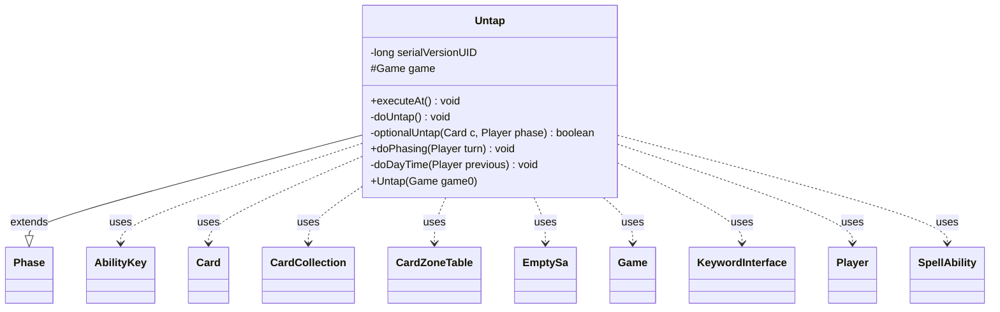

---
aliases:
  - Untap
tags:
  - java/class
  - module/forge-game
  - pkg/forge/game/phase
fqn: forge.game.phase.Untap
package: forge.game.phase
module: forge-game
kind: Class
---

# Untap

**Package:** `forge.game.phase`   **Module:** `forge-game`   **Kind:** Class



## Relationships
**Extends:**
- [[forge.game.phase.Phase|Phase]]
**Uses:**
- [[forge.game.Game|Game]]
- [[forge.game.ability.AbilityKey|AbilityKey]]
- [[forge.game.card.Card|Card]]
- [[forge.game.card.CardCollection|CardCollection]]
- [[forge.game.card.CardZoneTable|CardZoneTable]]
- [[forge.game.keyword.KeywordInterface|KeywordInterface]]
- [[forge.game.player.Player|Player]]
- [[forge.game.spellability.SpellAbility|SpellAbility]]
- [[forge.game.spellability.SpellAbility.EmptySa|EmptySa]]

## Design Description

Untap is a concrete game-phase handler that extends Phase to model Magic's untap step. Constructed with the owning Game and bound to PhaseType.UNTAP, it overrides executeAt() to orchestrate the step's ordered work: phasing permanents in and out, resolving day/night transitions, refreshing static abilities, and then untapping the active player's permanents. The private doUntap() centralizes the rules-heavy logic — honoring bounce-on-untap effects, UntapAdjust/OnlyUntapChosen restrictions, optional "you may choose not to untap" prompts, and untapping other players' permanents via static abilities.

The class collaborates broadly with the game model: it queries Player and Card collections (CardCollection), routes zone moves through CardZoneTable, consults KeywordInterface and static-ability helpers, and uses throwaway EmptySa SpellAbility instances to drive controller choices. Notably it fires AbilityKey-parameterized triggers (UntapAll, PhaseOutAll) so other systems react, and its static doPhasing/doDayTime helpers keep that comprehensive-rules logic reusable and self-contained.

## Source
`forge-game/src/main/java/forge/game/phase/Untap.java`

```java
/*
 * Forge: Play Magic: the Gathering.
 * Copyright (C) 2011  Forge Team
 *
 * This program is free software: you can redistribute it and/or modify
 * it under the terms of the GNU General Public License as published by
 * the Free Software Foundation, either version 3 of the License, or
 * (at your option) any later version.
 * 
 * This program is distributed in the hope that it will be useful,
 * but WITHOUT ANY WARRANTY; without even the implied warranty of
 * MERCHANTABILITY or FITNESS FOR A PARTICULAR PURPOSE.  See the
 * GNU General Public License for more details.
 * 
 * You should have received a copy of the GNU General Public License
 * along with this program.  If not, see <http://www.gnu.org/licenses/>.
 */
package forge.game.phase;

import java.util.Arrays;
import java.util.List;
import java.util.Map;
import java.util.Map.Entry;

import com.google.common.collect.Maps;

import forge.game.Game;
import forge.game.ability.AbilityKey;
import forge.game.ability.ApiType;
import forge.game.card.Card;
import forge.game.card.CardCollection;
import forge.game.card.CardLists;
import forge.game.card.CardPredicates;
import forge.game.card.CardZoneTable;
import forge.game.keyword.Keyword;
import forge.game.keyword.KeywordInterface;
import forge.game.player.Player;
import forge.game.player.PlayerController.BinaryChoiceType;
import forge.game.spellability.SpellAbility;
import forge.game.staticability.StaticAbilityCantPhase;
import forge.game.staticability.StaticAbilityUntapOtherPlayer;
import forge.game.trigger.TriggerType;
import forge.game.zone.ZoneType;

/**
 * <p>
 * Untap class.
 * Handles "until next untap", "until your next untap" and "at beginning of untap"
 * commands from cards.
 * </p>
 * 
 * @author Forge
 * @version $Id: Untap 12482 2011-12-06 11:14:11Z Sloth $
 */
public class Untap extends Phase {
    private static final long serialVersionUID = 4515266331266259123L;
    protected final Game game;

    public Untap(final Game game0) {
        super(PhaseType.UNTAP);
        game = game0;
    }

    /**
     * <p>
     * Executes any hardcoded triggers that happen "at end of combat".
     * </p>
     */
    @Override
    public void executeAt() {
        super.executeAt();

        doPhasing(game.getPhaseHandler().getPlayerTurn());
        doDayTime(game.getPhaseHandler().getPreviousPlayerTurn());

        game.getAction().checkStaticAbilities();

        doUntap();
    }

    /**
     * <p>
     * doUntap.
     * </p>
     */
    private void doUntap() {
        final Player active = game.getPhaseHandler().getPlayerTurn();
        Map<Player, CardCollection> untapMap = Maps.newHashMap();

        CardCollection untapList = new CardCollection(active.getCardsIn(ZoneType.Battlefield));

        CardZoneTable triggerList = new CardZoneTable(game.getLastStateBattlefield(), game.getLastStateGraveyard());
        CardCollection bounceList = CardLists.getKeyword(untapList, "During your next untap step, as you untap your permanents, return CARDNAME to its owner's hand.");
        for (final Card c : bounceList) {
            Card moved = game.getAction().moveToHand(c, null);
            triggerList.put(ZoneType.Battlefield, moved.getZone().getZoneType(), moved);
        }
        triggerList.triggerChangesZoneAll(game, null);
        untapList.removeAll(bounceList);

        final Map<String, Integer> restrictUntap = Maps.newHashMap();
        for (KeywordInterface ki : active.getKeywords()) {
            String kw = ki.getOriginal();
            if (kw.startsWith("UntapAdjust")) {
                String[] parse = kw.split(":");
                if (!restrictUntap.containsKey(parse[1])
                        || Integer.parseInt(parse[2]) < restrictUntap.get(parse[1])) {
                    restrictUntap.put(parse[1], Integer.parseInt(parse[2]));
                }
            }
            if (kw.startsWith("OnlyUntapChosen")) {
                List<String> validTypes = Arrays.asList(kw.split(":")[1].split(","));
                final String chosen = active.getController().chooseSomeType("Card", new SpellAbility.EmptySa(ApiType.ChooseType, null, active), validTypes);
                untapList = CardLists.getType(untapList, chosen);
            }
        }

        untapList = CardLists.filter(untapList,  c -> c.canUntap(active, false));

        final String[] restrict = restrictUntap.keySet().toArray(new String[0]);
        final CardCollection restrictList = CardLists.getValidCards(untapList, restrict, active, null, null);
        untapList.removeAll(restrictList);
        CardCollection restrictUntapped = new CardCollection();
        while (!restrictList.isEmpty()) {
            Map<String, Integer> remaining = Maps.newHashMap(restrictUntap);
            for (Entry<String, Integer> entry : remaining.entrySet()) {
                if (entry.getValue() == 0) {
                    restrictList.removeAll(CardLists.getValidCards(restrictList, entry.getKey(), active, null, null));
                    restrictUntap.remove(entry.getKey());
                }
            }
            Card chosen = active.getController().chooseSingleEntityForEffect(restrictList, new SpellAbility.EmptySa(ApiType.Untap, null, active), 
                    "Select a card to untap\r\n(Selected:" + restrictUntapped + ")\r\n" + "Remaining cards that can untap: " + remaining, null);
            if (chosen != null) {
                for (Entry<String, Integer> rest : restrictUntap.entrySet()) {
                    if (chosen.isValid(rest.getKey(), active, null, null)) {
                        restrictUntap.put(rest.getKey(), rest.getValue() - 1);
                    }
                }
                untapList.add(chosen);
                restrictList.remove(chosen);
            }
        }

        for (final Card c : untapList) {
            if (optionalUntap(c, active)) {
                untapMap.computeIfAbsent(active, i -> new CardCollection()).add(c);
            }
        }

        for (final Card c : active.getAllOtherPlayers().getCardsIn(ZoneType.Battlefield)) {
            if (c.isTapped() && StaticAbilityUntapOtherPlayer.untap(c, active) && c.untap(active)) {
                untapMap.computeIfAbsent(c.getController(), i -> new CardCollection()).add(c);
            }
        }

        // Remove temporary keywords
        // TODO Replace with Static Abilities
        for (final Card c : active.getCardsIn(ZoneType.Battlefield)) {
            c.removeHiddenExtrinsicKeyword("This card doesn't untap during your next untap step.");
        }

        // remove exerted flags from all things in play
        // even if they are not creatures
        for (final Card c : game.getCardsIn(ZoneType.Battlefield)) {
            c.removeExertedBy(active);
        }

        final Map<AbilityKey, Object> runParams = AbilityKey.newMap();
        runParams.put(AbilityKey.Map, untapMap);
        game.getTriggerHandler().runTrigger(TriggerType.UntapAll, runParams, false);
    }

    private static boolean optionalUntap(final Card c, Player phase) {
        boolean untap = true;

        if (c.hasKeyword("You may choose not to untap CARDNAME during your untap step.")) {
            StringBuilder prompt = new StringBuilder("Untap " + c.toString() + "?");
            boolean defaultChoice = true;
            if (c.hasGainControlTarget()) {
                final Iterable<Card> targets = c.getGainControlTargets();
                prompt.append("\r\n").append(c).append(" is controlling: ");
                for (final Card target : targets) {
                    prompt.append(target);
                    if (target.isInPlay()) {
                        defaultChoice = false;
                    }
                }
            }
            untap = c.getController().getController().chooseBinary(new SpellAbility.EmptySa(c, c.getController()), prompt.toString(), BinaryChoiceType.UntapOrLeaveTapped, defaultChoice);
        }
        if (untap && !c.untap(phase)) {
            untap = false;
        }
        return untap;
    }

    public static void doPhasing(final Player turn) {
        Game game = turn.getGame();

        // Needs to include phased out cards
        final List<Card> list = CardLists.filter(game.getCardsIncludePhasingIn(ZoneType.Battlefield),
                c -> (c.isPhasedOut(turn) && c.isDirectlyPhasedOut())
                        || (c.hasKeyword(Keyword.PHASING) && c.getController().equals(turn))
        );

        CardCollection toPhase = new CardCollection();
        for (final Card tgtC : list) {
            if (tgtC.isPhasedOut() && StaticAbilityCantPhase.cantPhaseIn(tgtC)) {
                continue;
            }
            if (!tgtC.isPhasedOut() && StaticAbilityCantPhase.cantPhaseOut(tgtC)) {
                continue;
            }
            toPhase.add(tgtC);
        }
        // If c has things attached to it, they phase out simultaneously, and
        // will phase back in with it
        // If c is attached to something, it will phase out on its own, and try
        // to attach back to that thing when it comes back
        CardCollection phasedOut = new CardCollection();
        for (final Card c : toPhase) {
            if (c.isPhasedOut() && c.isDirectlyPhasedOut()) {
                c.phase(true);
            } else if (c.hasKeyword(Keyword.PHASING)) {
                // CR 702.26h If an object would simultaneously phase out directly
                // and indirectly, it just phases out indirectly.
                if (c.isAttachment()) {
                    final Card ent = c.getAttachedTo();
                    if (ent != null && list.contains(ent) && !StaticAbilityCantPhase.cantPhaseOut(ent)) {
                        continue;
                    }
                }
                c.phase(true);
                phasedOut.add(c);
            }
        }
        if (!phasedOut.isEmpty()) {
            final Map<AbilityKey, Object> runParams = AbilityKey.newMap();
            runParams.put(AbilityKey.Cards, phasedOut);
            game.getTriggerHandler().runTrigger(TriggerType.PhaseOutAll, runParams, false);
        }
        if (!toPhase.isEmpty()) {
            // refresh statics for phased in permanents (e.g. so King of the Oathbreakers sees Changeling)
            game.getAction().checkStaticAbilities();
            // collect now before some zone change during Untap resets triggers
            game.getTriggerHandler().collectTriggerForWaiting();
        }
    }

    private static void doDayTime(final Player previous) {
        if (previous == null) {
            return;
        }
        final Game game = previous.getGame();
        List<Card> casted = game.getStack().getSpellsCastLastTurn();

        if (game.isDay() && casted.stream().noneMatch(CardPredicates.isController(previous))) {
            game.setDayTime(true);
        } else if (game.isNight() && CardLists.count(casted, CardPredicates.isController(previous)) > 1) {
            game.setDayTime(false);
        }
    }
}
```

## Python
`forge/game/phase/Untap.py`

```python
/*
 * Forge: Play Magic: the Gathering.
 * Copyright (C) 2011  Forge Team
 *
 * This program is free software: you can redistribute it and/or modify
 * it under the terms of the GNU General Public License as published by
 * the Free Software Foundation, either version 3 of the License, or
 * (at your option) any later version.
 *
 * This program is distributed in the hope that it will be useful,
 * but WITHOUT ANY WARRANTY; without even the implied warranty of
 * MERCHANTABILITY or FITNESS FOR A PARTICULAR PURPOSE.  See the
 * GNU General Public License for more details.
 *
 * You should have received a copy of the GNU General Public License
 * along with this program.  If not, see <http://www.gnu.org/licenses/>.
 */

from forge.game.Game import Game
from forge.game.ability.AbilityKey import AbilityKey
from forge.game.ability.ApiType import ApiType
from forge.game.card.Card import Card
from forge.game.card.CardCollection import CardCollection
from forge.game.card.CardLists import CardLists
from forge.game.card.CardPredicates import CardPredicates
from forge.game.card.CardZoneTable import CardZoneTable
from forge.game.keyword.Keyword import Keyword
from forge.game.keyword.KeywordInterface import KeywordInterface
from forge.game.player.Player import Player
from forge.game.player.PlayerController import BinaryChoiceType
from forge.game.spellability.SpellAbility import SpellAbility
from forge.game.staticability.StaticAbilityCantPhase import StaticAbilityCantPhase
from forge.game.staticability.StaticAbilityUntapOtherPlayer import StaticAbilityUntapOtherPlayer
from forge.game.trigger.TriggerType import TriggerType
from forge.game.zone.ZoneType import ZoneType

from forge.game.phase.Phase import Phase
from forge.game.phase.PhaseType import PhaseType


class Untap(Phase):
    """
    Untap class.
    Handles "until next untap", "until your next untap" and "at beginning of untap"
    commands from cards.

    @author Forge
    @version $Id: Untap 12482 2011-12-06 11:14:11Z Sloth $
    """
    serialVersionUID = 4515266331266259123

    def __init__(self, game0: Game):
        super().__init__(PhaseType.UNTAP)
        self.game = game0

    def executeAt(self) -> None:
        """
        Executes any hardcoded triggers that happen "at end of combat".
        """
        super().executeAt()

        Untap.doPhasing(self.game.getPhaseHandler().getPlayerTurn())
        Untap.doDayTime(self.game.getPhaseHandler().getPreviousPlayerTurn())

        self.game.getAction().checkStaticAbilities()

        self.doUntap()

    def doUntap(self) -> None:
        """
        doUntap.
        """
        active = self.game.getPhaseHandler().getPlayerTurn()
        untapMap: dict[Player, CardCollection] = {}

        untapList = CardCollection(active.getCardsIn(ZoneType.Battlefield))

        triggerList = CardZoneTable(self.game.getLastStateBattlefield(), self.game.getLastStateGraveyard())
        bounceList = CardLists.getKeyword(untapList, "During your next untap step, as you untap your permanents, return CARDNAME to its owner's hand.")
        for c in bounceList:
            moved = self.game.getAction().moveToHand(c, None)
            triggerList.put(ZoneType.Battlefield, moved.getZone().getZoneType(), moved)
        triggerList.triggerChangesZoneAll(self.game, None)
        untapList.removeAll(bounceList)

        restrictUntap: dict[str, int] = {}
        for ki in active.getKeywords():
            kw = ki.getOriginal()
            if kw.startswith("UntapAdjust"):
                parse = kw.split(":")
                if (parse[1] not in restrictUntap
                        or int(parse[2]) < restrictUntap[parse[1]]):
                    restrictUntap[parse[1]] = int(parse[2])
            if kw.startswith("OnlyUntapChosen"):
                validTypes = kw.split(":")[1].split(",")
                chosen = active.getController().chooseSomeType("Card", SpellAbility.EmptySa(ApiType.ChooseType, None, active), validTypes)
                untapList = CardLists.getType(untapList, chosen)

        untapList = CardLists.filter(untapList, lambda c: c.canUntap(active, False))

        restrict = list(restrictUntap.keys())
        restrictList = CardLists.getValidCards(untapList, restrict, active, None, None)
        untapList.removeAll(restrictList)
        restrictUntapped = CardCollection()
        while not restrictList.isEmpty():
            remaining = dict(restrictUntap)
            for key, value in list(remaining.items()):
                if value == 0:
                    restrictList.removeAll(CardLists.getValidCards(restrictList, key, active, None, None))
                    del restrictUntap[key]
            chosen = active.getController().chooseSingleEntityForEffect(restrictList, SpellAbility.EmptySa(ApiType.Untap, None, active),
                    "Select a card to untap\r\n(Selected:" + str(restrictUntapped) + ")\r\n" + "Remaining cards that can untap: " + str(remaining), None)
            if chosen is not None:
                for restKey, restValue in list(restrictUntap.items()):
                    if chosen.isValid(restKey, active, None, None):
                        restrictUntap[restKey] = restValue - 1
                untapList.add(chosen)
                restrictList.remove(chosen)

        for c in untapList:
            if Untap.optionalUntap(c, active):
                untapMap.setdefault(active, CardCollection()).add(c)

        for c in active.getAllOtherPlayers().getCardsIn(ZoneType.Battlefield):
            if c.isTapped() and StaticAbilityUntapOtherPlayer.untap(c, active) and c.untap(active):
                untapMap.setdefault(c.getController(), CardCollection()).add(c)

        # Remove temporary keywords
        # TODO Replace with Static Abilities
        for c in active.getCardsIn(ZoneType.Battlefield):
            c.removeHiddenExtrinsicKeyword("This card doesn't untap during your next untap step.")

        # remove exerted flags from all things in play
        # even if they are not creatures
        for c in self.game.getCardsIn(ZoneType.Battlefield):
            c.removeExertedBy(active)

        runParams = AbilityKey.newMap()
        runParams[AbilityKey.Map] = untapMap
        self.game.getTriggerHandler().runTrigger(TriggerType.UntapAll, runParams, False)

    @staticmethod
    def optionalUntap(c: Card, phase: Player) -> bool:
        untap = True

        if c.hasKeyword("You may choose not to untap CARDNAME during your untap step."):
            prompt = "Untap " + c.toString() + "?"
            defaultChoice = True
            if c.hasGainControlTarget():
                targets = c.getGainControlTargets()
                prompt += "\r\n" + str(c) + " is controlling: "
                for target in targets:
                    prompt += str(target)
                    if target.isInPlay():
                        defaultChoice = False
            untap = c.getController().getController().chooseBinary(SpellAbility.EmptySa(c, c.getController()), prompt, BinaryChoiceType.UntapOrLeaveTapped, defaultChoice)
        if untap and not c.untap(phase):
            untap = False
        return untap

    @staticmethod
    def doPhasing(turn: Player) -> None:
        game = turn.getGame()

        # Needs to include phased out cards
        list_ = CardLists.filter(game.getCardsIncludePhasingIn(ZoneType.Battlefield),
                lambda c: (c.isPhasedOut(turn) and c.isDirectlyPhasedOut())
                        or (c.hasKeyword(Keyword.PHASING) and c.getController() == turn)
        )

        toPhase = CardCollection()
        for tgtC in list_:
            if tgtC.isPhasedOut() and StaticAbilityCantPhase.cantPhaseIn(tgtC):
                continue
            if not tgtC.isPhasedOut() and StaticAbilityCantPhase.cantPhaseOut(tgtC):
                continue
            toPhase.add(tgtC)
        # If c has things attached to it, they phase out simultaneously, and
        # will phase back in with it
        # If c is attached to something, it will phase out on its own, and try
        # to attach back to that thing when it comes back
        phasedOut = CardCollection()
        for c in toPhase:
            if c.isPhasedOut() and c.isDirectlyPhasedOut():
                c.phase(True)
            elif c.hasKeyword(Keyword.PHASING):
                # CR 702.26h If an object would simultaneously phase out directly
                # and indirectly, it just phases out indirectly.
                if c.isAttachment():
                    ent = c.getAttachedTo()
                    if ent is not None and ent in list_ and not StaticAbilityCantPhase.cantPhaseOut(ent):
                        continue
                c.phase(True)
                phasedOut.add(c)
        if not phasedOut.isEmpty():
            runParams = AbilityKey.newMap()
            runParams[AbilityKey.Cards] = phasedOut
            game.getTriggerHandler().runTrigger(TriggerType.PhaseOutAll, runParams, False)
        if not toPhase.isEmpty():
            # refresh statics for phased in permanents (e.g. so King of the Oathbreakers sees Changeling)
            game.getAction().checkStaticAbilities()
            # collect now before some zone change during Untap resets triggers
            game.getTriggerHandler().collectTriggerForWaiting()

    @staticmethod
    def doDayTime(previous: Player) -> None:
        if previous is None:
            return
        game = previous.getGame()
        casted = game.getStack().getSpellsCastLastTurn()

        if game.isDay() and not any(CardPredicates.isController(previous)(s) for s in casted):
            game.setDayTime(True)
        elif game.isNight() and CardLists.count(casted, CardPredicates.isController(previous)) > 1:
            game.setDayTime(False)
```
