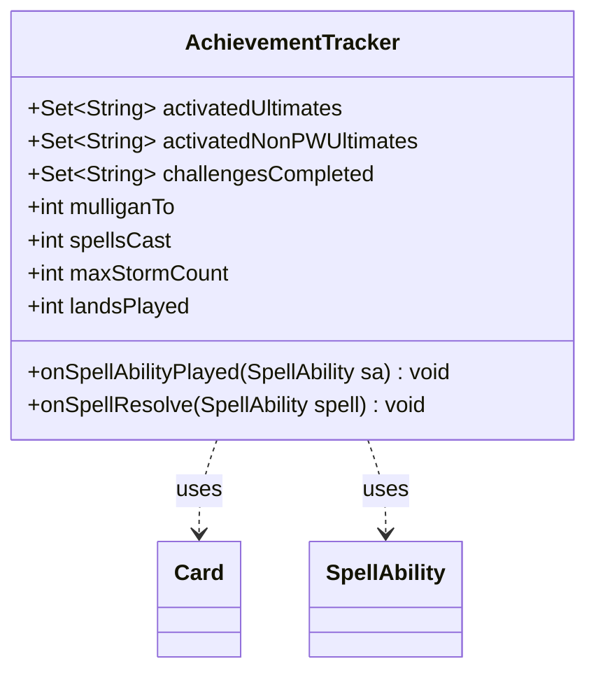

---
aliases:
  - AchievementTracker
tags:
  - java/class
  - module/forge-game
  - pkg/forge/game/player
fqn: forge.game.player.AchievementTracker
package: forge.game.player
module: forge-game
kind: Class
---

# AchievementTracker

**Package:** `forge.game.player` &nbsp; **Module:** `forge-game` &nbsp; **Kind:** Class



## Relationships
**Uses:**
- [[forge.game.card.Card|Card]]
- [[forge.game.spellability.SpellAbility|SpellAbility]]

## Source
`forge-game/src/main/java/forge/game/player/AchievementTracker.java`

```java
package forge.game.player;

import java.util.HashSet;
import java.util.Set;

import forge.card.ColorSet;
import forge.game.card.Card;
import forge.game.keyword.Keyword;
import forge.game.spellability.SpellAbility;

//class for storing information during a game that is used at the end of the game to determine achievements
public class AchievementTracker {
    public final Set<String> activatedUltimates = new HashSet<>();
    public final Set<String> activatedNonPWUltimates = new HashSet<>();
    public final Set<String> challengesCompleted = new HashSet<>();
    public int mulliganTo = 7;
    public int spellsCast = 0;
    public int maxStormCount = 0;
    public int landsPlayed = 0;

    public void onSpellAbilityPlayed(final SpellAbility sa) {
        final Card card = sa.getHostCard();
        if (sa.hasParam("Ultimate")) {
            if (sa.isPwAbility()) {
                activatedUltimates.add(card.getName());
            } else {
                activatedNonPWUltimates.add(card.getName());
            }
        }
        if (card.getColor().equals(ColorSet.WUBRG)) {
            challengesCompleted.add("Chromatic");
        }
    }

    public void onSpellResolve(final SpellAbility spell) {
        final Card card = spell.getHostCard();
        if (card.hasKeyword(Keyword.EPIC)) {
            challengesCompleted.add("Epic");
        }
    }
}
```
