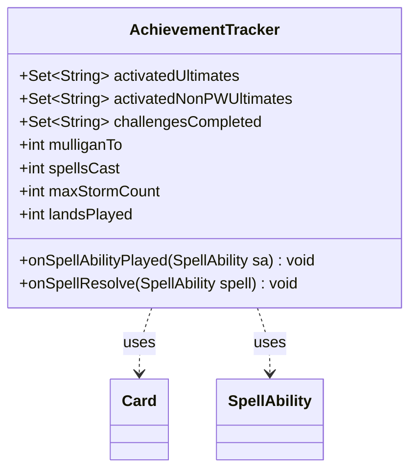

---
aliases:
  - AchievementTracker
tags:
  - java/class
  - module/forge-game
  - pkg/forge/game/player
fqn: forge.game.player.AchievementTracker
package: forge.game.player
module: forge-game
kind: Class
---

# AchievementTracker

**Package:** `forge.game.player` &nbsp; **Module:** `forge-game` &nbsp; **Kind:** Class



## Relationships
**Uses:**
- [[forge.game.card.Card|Card]]
- [[forge.game.spellability.SpellAbility|SpellAbility]]

## Design Description

AchievementTracker is a lightweight, mutable data container in the `forge.game.player` package that accumulates per-game statistics used after a game ends to evaluate which achievements a player has earned. It exposes public fields tracking activated planeswalker and non-planeswalker ultimates, completed challenges, mulligan depth, spells cast, maximum storm count, and lands played.

Rather than implementing any supertype or interface, it stands alone and is updated by the game engine through two event hooks. `onSpellAbilityPlayed` inspects a SpellAbility's host Card to record ultimate activations and the multicolor "Chromatic" challenge, while `onSpellResolve` flags the "Epic" challenge via the Card's keywords. Its collaboration with Card and SpellAbility is read-only, reflecting a deliberately simple, observer-style design that passively records game events without influencing gameplay.

## Source
`forge-game/src/main/java/forge/game/player/AchievementTracker.java`

```java
package forge.game.player;

import java.util.HashSet;
import java.util.Set;

import forge.card.ColorSet;
import forge.game.card.Card;
import forge.game.keyword.Keyword;
import forge.game.spellability.SpellAbility;

//class for storing information during a game that is used at the end of the game to determine achievements
public class AchievementTracker {
    public final Set<String> activatedUltimates = new HashSet<>();
    public final Set<String> activatedNonPWUltimates = new HashSet<>();
    public final Set<String> challengesCompleted = new HashSet<>();
    public int mulliganTo = 7;
    public int spellsCast = 0;
    public int maxStormCount = 0;
    public int landsPlayed = 0;

    public void onSpellAbilityPlayed(final SpellAbility sa) {
        final Card card = sa.getHostCard();
        if (sa.hasParam("Ultimate")) {
            if (sa.isPwAbility()) {
                activatedUltimates.add(card.getName());
            } else {
                activatedNonPWUltimates.add(card.getName());
            }
        }
        if (card.getColor().equals(ColorSet.WUBRG)) {
            challengesCompleted.add("Chromatic");
        }
    }

    public void onSpellResolve(final SpellAbility spell) {
        final Card card = spell.getHostCard();
        if (card.hasKeyword(Keyword.EPIC)) {
            challengesCompleted.add("Epic");
        }
    }
}
```

## Python
`forge/game/player/AchievementTracker.py`

```python
from forge.card.ColorSet import ColorSet
from forge.game.card.Card import Card
from forge.game.keyword.Keyword import Keyword
from forge.game.spellability.SpellAbility import SpellAbility


# class for storing information during a game that is used at the end of the game to determine achievements
class AchievementTracker:
    def __init__(self):
        self.activatedUltimates: set[str] = set()
        self.activatedNonPWUltimates: set[str] = set()
        self.challengesCompleted: set[str] = set()
        self.mulliganTo = 7
        self.spellsCast = 0
        self.maxStormCount = 0
        self.landsPlayed = 0

    def onSpellAbilityPlayed(self, sa: SpellAbility) -> None:
        card = sa.getHostCard()
        if sa.hasParam("Ultimate"):
            if sa.isPwAbility():
                self.activatedUltimates.add(card.getName())
            else:
                self.activatedNonPWUltimates.add(card.getName())
        if card.getColor() == ColorSet.WUBRG:
            self.challengesCompleted.add("Chromatic")

    def onSpellResolve(self, spell: SpellAbility) -> None:
        card = spell.getHostCard()
        if card.hasKeyword(Keyword.EPIC):
            self.challengesCompleted.add("Epic")
```
