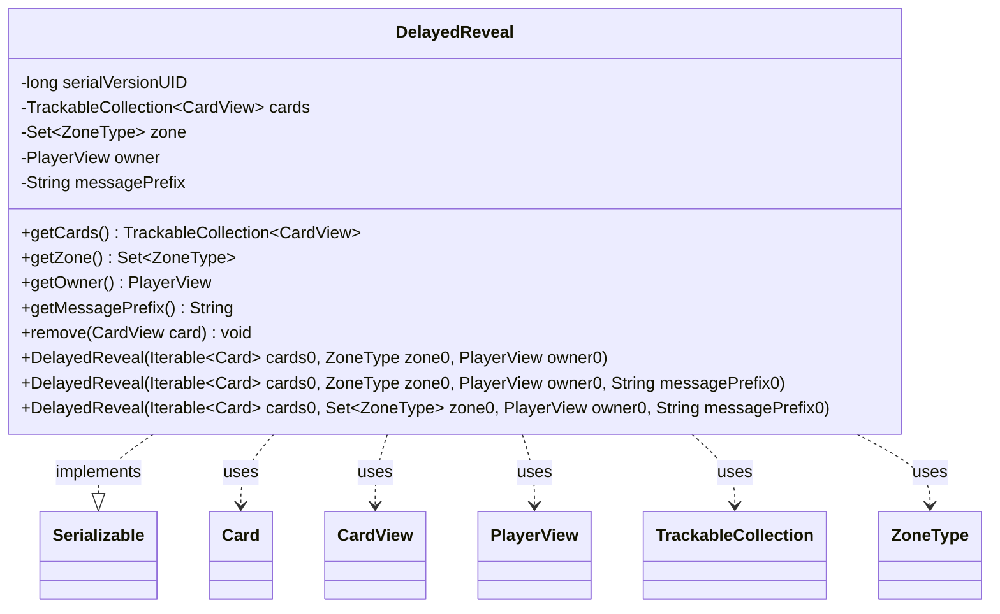

---
aliases:
  - DelayedReveal
tags:
  - java/class
  - module/forge-game
  - pkg/forge/game/player
fqn: forge.game.player.DelayedReveal
package: forge.game.player
module: forge-game
kind: Class
---

# DelayedReveal

**Package:** `forge.game.player`   **Module:** `forge-game`   **Kind:** Class



## Relationships
**Uses:**
- [[forge.game.card.Card|Card]]
- [[forge.game.card.CardView|CardView]]
- [[forge.game.player.PlayerView|PlayerView]]
- [[forge.game.zone.ZoneType|ZoneType]]
- [[forge.trackable.TrackableCollection|TrackableCollection]]

## Design Description

DelayedReveal is a small serializable value object in `forge.game.player` that captures the information needed to reveal a set of cards to a player after a delay—specifically when those cards cannot be folded into the same dialog used for an in-progress card selection. It bundles a `TrackableCollection<CardView>` of the cards, the `Set<ZoneType>` they originate from, the owning `PlayerView`, and an optional message prefix, exposing each through simple getters plus a `remove` method to drop a card once handled.

As an immutable-by-design holder (all fields are `final`), it carries data rather than behavior, collaborating with the view layer by converting incoming `Card` instances into `CardView` via `CardView.getCollection`. Overloaded constructors offer convenience defaults—an empty prefix and wrapping a single `ZoneType` into a set—so callers can specify reveal scope flexibly while the engine defers the actual presentation to the UI.

## Source
`forge-game/src/main/java/forge/game/player/DelayedReveal.java`

```java
package forge.game.player;

import java.io.Serializable;
import java.util.Set;

import forge.game.card.Card;
import forge.game.card.CardView;
import forge.game.zone.ZoneType;
import forge.trackable.TrackableCollection;

/**
 * Stores information to reveal cards after a delay unless those cards can be
 * revealed in the same dialog as cards being selected
 */
public class DelayedReveal implements Serializable {
    private static final long serialVersionUID = 5516713460440436615L;

    private final TrackableCollection<CardView> cards;
    private final Set<ZoneType> zone;
    private final PlayerView owner;
    private final String messagePrefix;

    public DelayedReveal(final Iterable<Card> cards0, final ZoneType zone0, final PlayerView owner0) {
        this(cards0, zone0, owner0, "");
    }
    public DelayedReveal(final Iterable<Card> cards0, final ZoneType zone0, final PlayerView owner0, final String messagePrefix0) {
        this(cards0, Set.of(zone0), owner0, "");
    }
    public DelayedReveal(final Iterable<Card> cards0, final Set<ZoneType> zone0, final PlayerView owner0, final String messagePrefix0) {
        cards = CardView.getCollection(cards0);
        zone = zone0;
        owner = owner0;
        messagePrefix = messagePrefix0;
    }

    public TrackableCollection<CardView> getCards() {
        return cards;
    }

    public Set<ZoneType> getZone() {
        return zone;
    }

    public PlayerView getOwner() {
        return owner;
    }

    public String getMessagePrefix() {
        return messagePrefix;
    }

    public void remove(final CardView card) {
        cards.remove(card);
    }

}
```

## Python
`forge/game/player/DelayedReveal.py`

```python
package: forge.game.player → module forge/game/player/DelayedReveal.py.

Translating faithfully, including the quirk in the second constructor (it passes `""` rather than `messagePrefix0` ΓÇö preserved as-is). Python lacks Java's constructor overloading, so I dispatch on argument types in a single `__init__` mirroring the three signatures.

from typing import Iterable, Optional, Set

from forge.game.card.Card import Card
from forge.game.card.CardView import CardView
from forge.game.player.PlayerView import PlayerView
from forge.game.zone.ZoneType import ZoneType
from forge.trackable.TrackableCollection import TrackableCollection


class DelayedReveal:
    """
    Stores information to reveal cards after a delay unless those cards can be
    revealed in the same dialog as cards being selected
    """
    serialVersionUID = 5516713460440436615

    def __init__(self, cards0: Iterable[Card], zone0, owner0: PlayerView, messagePrefix0: Optional[str] = None):
        # Overloaded constructors:
        #   DelayedReveal(Iterable<Card>, ZoneType, PlayerView)
        #   DelayedReveal(Iterable<Card>, ZoneType, PlayerView, String)
        #   DelayedReveal(Iterable<Card>, Set<ZoneType>, PlayerView, String)
        if isinstance(zone0, (set, frozenset)):
            zone: Set[ZoneType] = zone0
            messagePrefix = messagePrefix0
        else:
            # zone0 is a single ZoneType
            zone = {zone0}
            # Faithful to Java: both ZoneType-overloads pass "" as the prefix
            messagePrefix = ""

        self.cards: TrackableCollection[CardView] = CardView.getCollection(cards0)
        self.zone: Set[ZoneType] = zone
        self.owner: PlayerView = owner0
        self.messagePrefix: str = messagePrefix

    def getCards(self) -> TrackableCollection[CardView]:
        return self.cards

    def getZone(self) -> Set[ZoneType]:
        return self.zone

    def getOwner(self) -> PlayerView:
        return self.owner

    def getMessagePrefix(self) -> str:
        return self.messagePrefix

    def remove(self, card: CardView) -> None:
        self.cards.remove(card)
```
