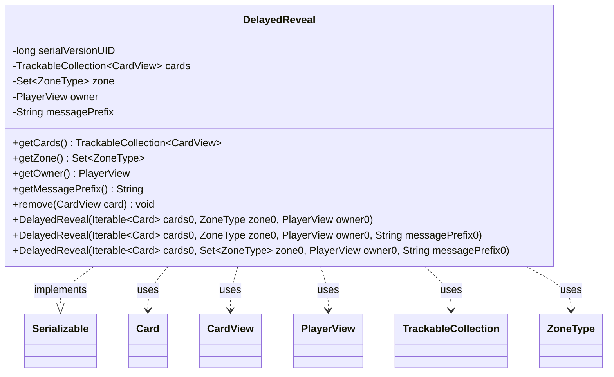

---
aliases:
  - DelayedReveal
tags:
  - java/class
  - module/forge-game
  - pkg/forge/game/player
fqn: forge.game.player.DelayedReveal
package: forge.game.player
module: forge-game
kind: Class
---

# DelayedReveal

**Package:** `forge.game.player` &nbsp; **Module:** `forge-game` &nbsp; **Kind:** Class



## Relationships
**Uses:**
- [[forge.game.card.Card|Card]]
- [[forge.game.card.CardView|CardView]]
- [[forge.game.player.PlayerView|PlayerView]]
- [[forge.game.zone.ZoneType|ZoneType]]
- [[forge.trackable.TrackableCollection|TrackableCollection]]

## Source
`forge-game/src/main/java/forge/game/player/DelayedReveal.java`

```java
package forge.game.player;

import java.io.Serializable;
import java.util.Set;

import forge.game.card.Card;
import forge.game.card.CardView;
import forge.game.zone.ZoneType;
import forge.trackable.TrackableCollection;

/**
 * Stores information to reveal cards after a delay unless those cards can be
 * revealed in the same dialog as cards being selected
 */
public class DelayedReveal implements Serializable {
    private static final long serialVersionUID = 5516713460440436615L;

    private final TrackableCollection<CardView> cards;
    private final Set<ZoneType> zone;
    private final PlayerView owner;
    private final String messagePrefix;

    public DelayedReveal(final Iterable<Card> cards0, final ZoneType zone0, final PlayerView owner0) {
        this(cards0, zone0, owner0, "");
    }
    public DelayedReveal(final Iterable<Card> cards0, final ZoneType zone0, final PlayerView owner0, final String messagePrefix0) {
        this(cards0, Set.of(zone0), owner0, "");
    }
    public DelayedReveal(final Iterable<Card> cards0, final Set<ZoneType> zone0, final PlayerView owner0, final String messagePrefix0) {
        cards = CardView.getCollection(cards0);
        zone = zone0;
        owner = owner0;
        messagePrefix = messagePrefix0;
    }

    public TrackableCollection<CardView> getCards() {
        return cards;
    }

    public Set<ZoneType> getZone() {
        return zone;
    }

    public PlayerView getOwner() {
        return owner;
    }

    public String getMessagePrefix() {
        return messagePrefix;
    }

    public void remove(final CardView card) {
        cards.remove(card);
    }

}
```
