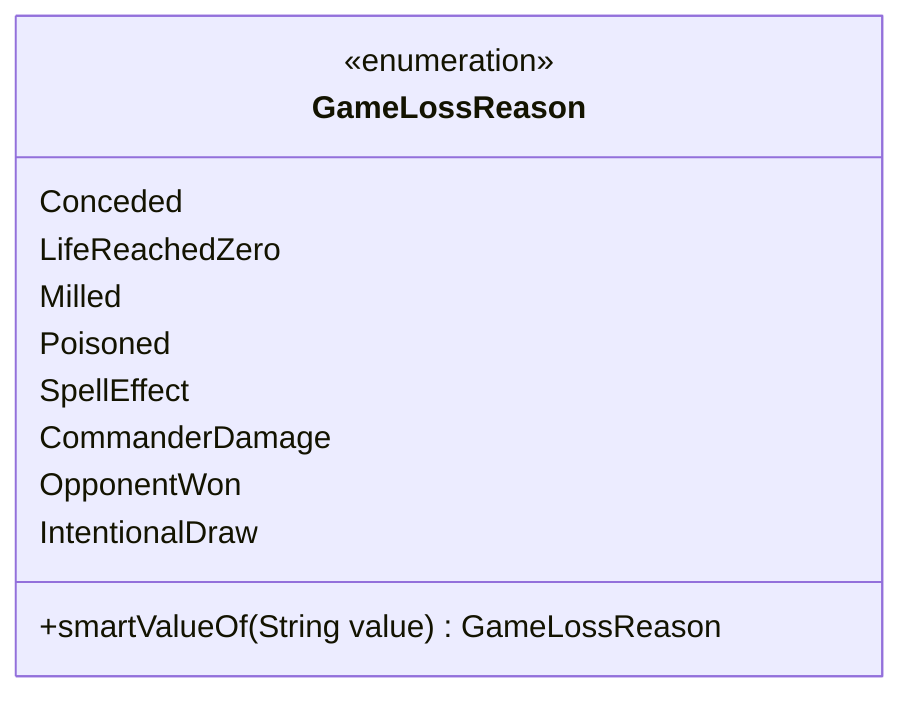

---
aliases:
  - GameLossReason
tags:
  - java/enum
  - module/forge-game
  - pkg/forge/game/player
fqn: forge.game.player.GameLossReason
package: forge.game.player
module: forge-game
kind: Enum
---

# GameLossReason

**Package:** `forge.game.player`   **Module:** `forge-game`   **Kind:** Enum



## Design Description

GameLossReason is an enumeration in the `forge.game.player` package that catalogs the distinct conditions under which a player loses (or ceases to continue) a game of Magic: the Gathering. Each constant maps to a specific comprehensive-rules clause—Conceded (104.3a), LifeReachedZero (104.3b), Milled (104.3c), Poisoned (104.3d), and SpellEffect (104.3e)—while CommanderDamage, OpponentWon, and IntentionalDraw cover format-specific and non-defeat termination cases.

As a plain enum, it serves as a typed, self-documenting vocabulary that collaborating game-state and player classes use to record and branch on why a game ended, replacing error-prone string or integer codes. Its sole behavior, the static `smartValueOf` helper, supports lenient deserialization by matching names case-insensitively and trimming whitespace, throwing a runtime exception on unknown input—reflecting an intent to integrate cleanly with text-based card scripting and persisted state.

## Source
`forge-game/src/main/java/forge/game/player/GameLossReason.java`

```java
/*
 * Forge: Play Magic: the Gathering.
 * Copyright (C) 2011  Forge Team
 *
 * This program is free software: you can redistribute it and/or modify
 * it under the terms of the GNU General Public License as published by
 * the Free Software Foundation, either version 3 of the License, or
 * (at your option) any later version.
 * 
 * This program is distributed in the hope that it will be useful,
 * but WITHOUT ANY WARRANTY; without even the implied warranty of
 * MERCHANTABILITY or FITNESS FOR A PARTICULAR PURPOSE.  See the
 * GNU General Public License for more details.
 * 
 * You should have received a copy of the GNU General Public License
 * along with this program.  If not, see <http://www.gnu.org/licenses/>.
 */
package forge.game.player;

/**
 * The Enum GameLossReason.
 */
public enum GameLossReason {
    /** The Conceded. */
    Conceded, // rule 104.3a
    /** The Life reached zero. */
    LifeReachedZero, // rule 104.3b
    /** The Milled. */
    Milled, // 104.3c
    /** The Poisoned. */
    Poisoned, // 104.3d

    // 104.3e and others
    /** The Spell effect. */
    SpellEffect,
    
    CommanderDamage,

    OpponentWon,

    IntentionalDraw // Not a real "game loss" as such, but a reason not to continue playing.
    ;

    /**
     * Parses a string into an enum member.
     * @param string to parse
     * @return enum equivalent
     */
    public static GameLossReason smartValueOf(String value) {
        final String valToCompate = value.trim();
        for (final GameLossReason v : GameLossReason.values()) {
            if (v.name().compareToIgnoreCase(valToCompate) == 0) {
                return v;
            }
        }

        throw new RuntimeException("Element " + value + " not found in GameLossReason enum");
    }
}
```

## Python
`forge/game/player/GameLossReason.py`

```python
from enum import Enum


class GameLossReason(Enum):
    """The Enum GameLossReason."""

    Conceded = "Conceded"  # rule 104.3a
    LifeReachedZero = "LifeReachedZero"  # rule 104.3b
    Milled = "Milled"  # 104.3c
    Poisoned = "Poisoned"  # 104.3d

    # 104.3e and others
    SpellEffect = "SpellEffect"

    CommanderDamage = "CommanderDamage"

    OpponentWon = "OpponentWon"

    IntentionalDraw = "IntentionalDraw"  # Not a real "game loss" as such, but a reason not to continue playing.

    @staticmethod
    def smartValueOf(value: str) -> "GameLossReason":
        """
        Parses a string into an enum member.
        :param value: string to parse
        :return: enum equivalent
        """
        valToCompate = value.strip()
        for v in GameLossReason.values():
            if v.name.casefold() == valToCompate.casefold():
                return v

        raise RuntimeError("Element " + value + " not found in GameLossReason enum")

    @classmethod
    def values(cls) -> list["GameLossReason"]:
        return list(cls)
```
