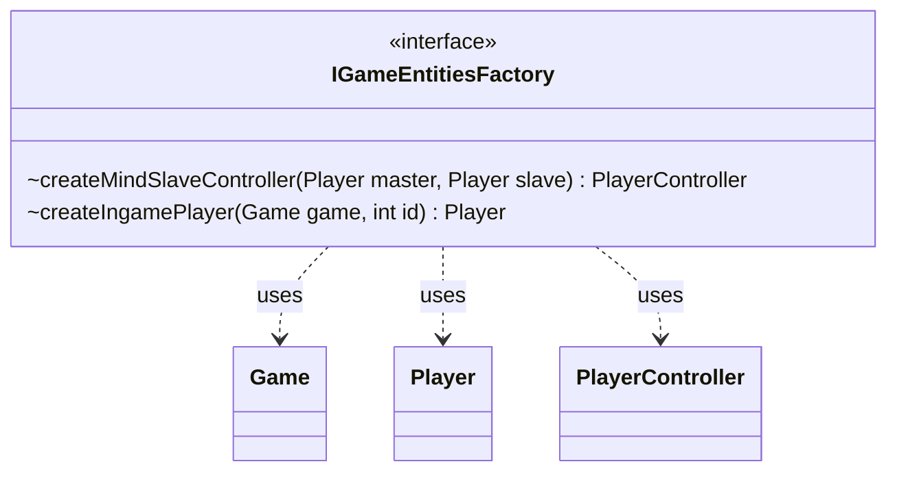

---
aliases:
  - IGameEntitiesFactory
tags:
  - java/interface
  - module/forge-game
  - pkg/forge/game/player
fqn: forge.game.player.IGameEntitiesFactory
package: forge.game.player
module: forge-game
kind: Interface
---

# IGameEntitiesFactory

**Package:** `forge.game.player` &nbsp; **Module:** `forge-game` &nbsp; **Kind:** Interface



## Relationships
**Uses:**
- [[forge.game.Game|Game]]
- [[forge.game.player.Player|Player]]
- [[forge.game.player.PlayerController|PlayerController]]

## Source
`forge-game/src/main/java/forge/game/player/IGameEntitiesFactory.java`

```java
package forge.game.player;

import forge.game.Game;

public interface IGameEntitiesFactory {
	PlayerController createMindSlaveController(Player master, Player slave);
	Player createIngamePlayer(Game game, int id);
}
```
