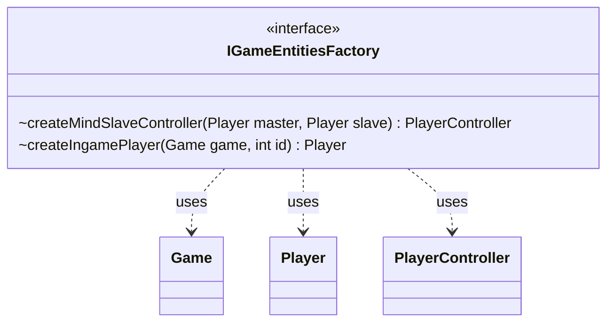

---
aliases:
  - IGameEntitiesFactory
tags:
  - java/interface
  - module/forge-game
  - pkg/forge/game/player
fqn: forge.game.player.IGameEntitiesFactory
package: forge.game.player
module: forge-game
kind: Interface
---

# IGameEntitiesFactory

**Package:** `forge.game.player`   **Module:** `forge-game`   **Kind:** Interface



## Relationships
**Uses:**
- [[forge.game.Game|Game]]
- [[forge.game.player.Player|Player]]
- [[forge.game.player.PlayerController|PlayerController]]

## Design Description

IGameEntitiesFactory is a factory interface in the `forge.game.player` package that abstracts the creation of the game's core player-related entities, decoupling instantiation from the rest of the game engine. It declares two factory methods: `createIngamePlayer`, which produces a `Player` bound to a given `Game` and id, and `createMindSlaveController`, which produces a `PlayerController` letting one player (the master) control another (the slave), supporting the Mindslaver mechanic. By defining these as an interface rather than concrete constructors, it lets implementations supply the appropriate `Player` and `PlayerController` subtypes—for example AI versus human controllers—so the engine can collaborate with `Game`, `Player`, and `PlayerController` without depending on their concrete classes.

## Source
`forge-game/src/main/java/forge/game/player/IGameEntitiesFactory.java`

```java
package forge.game.player;

import forge.game.Game;

public interface IGameEntitiesFactory {
	PlayerController createMindSlaveController(Player master, Player slave);
	Player createIngamePlayer(Game game, int id);
}
```

## Python
`forge/game/player/IGameEntitiesFactory.py`

```python
package forge.game.player;

from forge.game.Game import Game
from forge.game.player.Player import Player
from forge.game.player.PlayerController import PlayerController


class IGameEntitiesFactory:
    def createMindSlaveController(self, master: Player, slave: Player) -> PlayerController:
        raise NotImplementedError

    def createIngamePlayer(self, game: Game, id: int) -> Player:
        raise NotImplementedError
```
