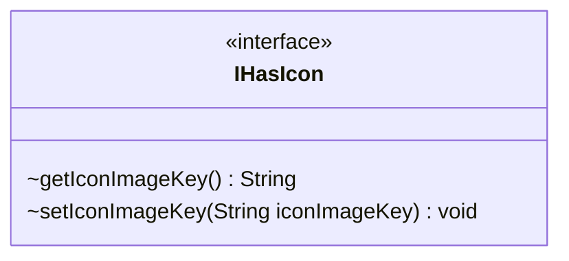

---
aliases:
  - IHasIcon
tags:
  - java/interface
  - module/forge-game
  - pkg/forge/game/player
fqn: forge.game.player.IHasIcon
package: forge.game.player
module: forge-game
kind: Interface
---

# IHasIcon

**Package:** `forge.game.player`   **Module:** `forge-game`   **Kind:** Interface



## Design Description

Player and card entities that can display a custom icon implement IHasIcon, exposing paired accessor and mutator methods for an icon image key—a String identifier resolved against the engine's image-caching system rather than a direct image reference. By abstracting icon ownership behind this minimal interface, the game layer lets rendering and UI code query and assign icons uniformly across any holder, decoupling icon-bearing entities from the asset-loading mechanism. The deliberately narrow contract—two methods over a single key string—keeps the abstraction lightweight and imposes no storage or display strategy on implementers, leaving those concerns to the concrete types within the `forge.game.player` package and their collaborators.

## Source
`forge-game/src/main/java/forge/game/player/IHasIcon.java`

```java
package forge.game.player;

public interface IHasIcon {
    String getIconImageKey();
    void   setIconImageKey(String iconImageKey);
}
```

## Python
`forge/game/player/IHasIcon.py`

```python
from abc import ABC, abstractmethod


class IHasIcon(ABC):
    @abstractmethod
    def getIconImageKey(self) -> str:
        ...

    @abstractmethod
    def setIconImageKey(self, iconImageKey: str) -> None:
        ...
```
