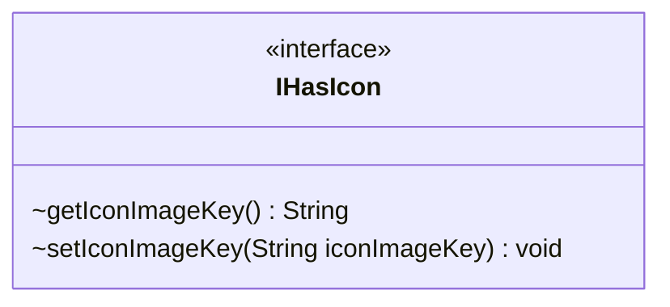

---
aliases:
  - IHasIcon
tags:
  - java/interface
  - module/forge-game
  - pkg/forge/game/player
fqn: forge.game.player.IHasIcon
package: forge.game.player
module: forge-game
kind: Interface
---

# IHasIcon

**Package:** `forge.game.player` &nbsp; **Module:** `forge-game` &nbsp; **Kind:** Interface



## Source
`forge-game/src/main/java/forge/game/player/IHasIcon.java`

```java
package forge.game.player;

public interface IHasIcon {
    String getIconImageKey();
    void   setIconImageKey(String iconImageKey);
}
```
