---
aliases:
  - PlaySpellAbility
tags:
  - java/class
  - module/forge-game
  - pkg/forge/game/player
fqn: forge.game.player.PlaySpellAbility
package: forge.game.player
module: forge-game
kind: Class
---

# PlaySpellAbility

**Package:** `forge.game.player` &nbsp; **Module:** `forge-game` &nbsp; **Kind:** Class

```mermaid
classDiagram
    class PlaySpellAbility {
        -PlayerController controller
        -SpellAbility ability
        -boolean needX
        +playSpellAbility(PlayerController controller, Player p, SpellAbility sa) boolean
        ~chooseOptionalAdditionalCosts(Player p, SpellAbility original) SpellAbility
        +payCostDuringAbilityResolve(PlayerController controller, Player p, Cost cost, SpellAbility sourceAbility, String prompt) boolean
        +getOrStringFromCost(SpellAbility sourceAbility, String prompt) String
        -payCostPart(PlayerController controller, Player p, SpellAbility sourceAbility, boolean effect, CostPartWithList cpl, int amount, CardCollectionView list, String actionName) boolean
        +payManaCost(PlayerController controller, ManaCost realCost, CostPartMana mc, SpellAbility ability, Player activator, String prompt, ManaConversionMatrix matrix, boolean effect) boolean
        -handleOfferingConvokeAndDelve(SpellAbility ability, CardCollection cardsToDelve, boolean manaInputCancelled) boolean
        +playSaWithoutPayingManaCost(PlayerController controller, SpellAbility sa, boolean mayChooseNewTargets) void
        +playSpellAbilityNoStack(PlayerController controller, Player player, SpellAbility sa) boolean
        +playSpellAbilityNoStack(PlayerController controller, Player player, SpellAbility sa, boolean useOldTargets) boolean
        +playAbility(boolean mayChooseTargets, boolean isFree, boolean skipStack) boolean
        -announceValuesLikeX() boolean
        -announceType() boolean
        -ensureAbilityHasDescription(SpellAbility ability) void
        +PlaySpellAbility(PlayerController controller, SpellAbility ability)
    }
    PlaySpellAbility ..> AbilityKey : uses
    PlaySpellAbility ..> Card : uses
    PlaySpellAbility ..> CardCollection : uses
    PlaySpellAbility ..> CardCollectionView : uses
    PlaySpellAbility ..> CardPlayOption : uses
    PlaySpellAbility ..> CardStateName : uses
    PlaySpellAbility ..> CardZoneTable : uses
    PlaySpellAbility ..> Cost : uses
    PlaySpellAbility ..> CostAddMana : uses
    PlaySpellAbility ..> CostCollectEvidence : uses
    PlaySpellAbility ..> CostDamage : uses
    PlaySpellAbility ..> CostDecisionMakerBase : uses
    PlaySpellAbility ..> CostDiscard : uses
    PlaySpellAbility ..> CostDraw : uses
    PlaySpellAbility ..> CostEnlist : uses
    PlaySpellAbility ..> CostExert : uses
    PlaySpellAbility ..> CostExile : uses
    PlaySpellAbility ..> CostExileFromStack : uses
    PlaySpellAbility ..> CostFlipCoin : uses
    PlaySpellAbility ..> CostGainControl : uses
    PlaySpellAbility ..> CostGainLife : uses
    PlaySpellAbility ..> CostMill : uses
    PlaySpellAbility ..> CostPart : uses
    PlaySpellAbility ..> CostPartMana : uses
    PlaySpellAbility ..> CostPartWithList : uses
    PlaySpellAbility ..> CostPayEnergy : uses
    PlaySpellAbility ..> CostPayLife : uses
    PlaySpellAbility ..> CostPayShards : uses
    PlaySpellAbility ..> CostPayment : uses
    PlaySpellAbility ..> CostPutCardToLib : uses
    PlaySpellAbility ..> CostPutCounter : uses
    PlaySpellAbility ..> CostRemoveAnyCounter : uses
    PlaySpellAbility ..> CostRemoveCounter : uses
    PlaySpellAbility ..> CostReturn : uses
    PlaySpellAbility ..> CostReveal : uses
    PlaySpellAbility ..> CostRollDice : uses
    PlaySpellAbility ..> CostSacrifice : uses
    PlaySpellAbility ..> CostTapType : uses
    PlaySpellAbility ..> CounterType : uses
    PlaySpellAbility ..> Game : uses
    PlaySpellAbility ..> GameObject : uses
    PlaySpellAbility ..> ManaConversionMatrix : uses
    PlaySpellAbility ..> ManaCost : uses
    PlaySpellAbility ..> ManaCostBeingPaid : uses
    PlaySpellAbility ..> ManaPool : uses
    PlaySpellAbility ..> ManaRefundService : uses
    PlaySpellAbility ..> OptionalCostValue : uses
    PlaySpellAbility ..> PaymentDecision : uses
    PlaySpellAbility ..> Player : uses
    PlaySpellAbility ..> PlayerCollection : uses
    PlaySpellAbility ..> PlayerController : uses
    PlaySpellAbility ..> SpellAbility : uses
    PlaySpellAbility ..> Zone : uses
    PlaySpellAbility ..> ZoneType : uses
```



## Relationships
**Uses:**
- [[forge.card.CardStateName|CardStateName]]
- [[forge.card.mana.ManaCost|ManaCost]]
- [[forge.game.Game|Game]]
- [[forge.game.GameObject|GameObject]]
- [[forge.game.ability.AbilityKey|AbilityKey]]
- [[forge.game.card.Card|Card]]
- [[forge.game.card.CardCollection|CardCollection]]
- [[forge.game.card.CardCollectionView|CardCollectionView]]
- [[forge.game.card.CardPlayOption|CardPlayOption]]
- [[forge.game.card.CardZoneTable|CardZoneTable]]
- [[forge.game.card.CounterType|CounterType]]
- [[forge.game.cost.Cost|Cost]]
- [[forge.game.cost.CostAddMana|CostAddMana]]
- [[forge.game.cost.CostCollectEvidence|CostCollectEvidence]]
- [[forge.game.cost.CostDamage|CostDamage]]
- [[forge.game.cost.CostDecisionMakerBase|CostDecisionMakerBase]]
- [[forge.game.cost.CostDiscard|CostDiscard]]
- [[forge.game.cost.CostDraw|CostDraw]]
- [[forge.game.cost.CostEnlist|CostEnlist]]
- [[forge.game.cost.CostExert|CostExert]]
- [[forge.game.cost.CostExile|CostExile]]
- [[forge.game.cost.CostExileFromStack|CostExileFromStack]]
- [[forge.game.cost.CostFlipCoin|CostFlipCoin]]
- [[forge.game.cost.CostGainControl|CostGainControl]]
- [[forge.game.cost.CostGainLife|CostGainLife]]
- [[forge.game.cost.CostMill|CostMill]]
- [[forge.game.cost.CostPart|CostPart]]
- [[forge.game.cost.CostPartMana|CostPartMana]]
- [[forge.game.cost.CostPartWithList|CostPartWithList]]
- [[forge.game.cost.CostPayEnergy|CostPayEnergy]]
- [[forge.game.cost.CostPayLife|CostPayLife]]
- [[forge.game.cost.CostPayShards|CostPayShards]]
- [[forge.game.cost.CostPayment|CostPayment]]
- [[forge.game.cost.CostPutCardToLib|CostPutCardToLib]]
- [[forge.game.cost.CostPutCounter|CostPutCounter]]
- [[forge.game.cost.CostRemoveAnyCounter|CostRemoveAnyCounter]]
- [[forge.game.cost.CostRemoveCounter|CostRemoveCounter]]
- [[forge.game.cost.CostReturn|CostReturn]]
- [[forge.game.cost.CostReveal|CostReveal]]
- [[forge.game.cost.CostRollDice|CostRollDice]]
- [[forge.game.cost.CostSacrifice|CostSacrifice]]
- [[forge.game.cost.CostTapType|CostTapType]]
- [[forge.game.cost.PaymentDecision|PaymentDecision]]
- [[forge.game.mana.ManaConversionMatrix|ManaConversionMatrix]]
- [[forge.game.mana.ManaCostBeingPaid|ManaCostBeingPaid]]
- [[forge.game.mana.ManaPool|ManaPool]]
- [[forge.game.mana.ManaRefundService|ManaRefundService]]
- [[forge.game.player.Player|Player]]
- [[forge.game.player.PlayerCollection|PlayerCollection]]
- [[forge.game.player.PlayerController|PlayerController]]
- [[forge.game.spellability.OptionalCostValue|OptionalCostValue]]
- [[forge.game.spellability.SpellAbility|SpellAbility]]
- [[forge.game.zone.Zone|Zone]]
- [[forge.game.zone.ZoneType|ZoneType]]

## Design Description

PlaySpellAbility orchestrates the act of putting a spell or activated ability onto the stack on behalf of a player, serving as the shared (non-UI) engine logic behind casting. Constructed with a PlayerController and a SpellAbility, it drives the full play sequence: choosing optional and additional costs, announcing X values and chosen types, validating restrictions and targeting, freezing the stack, paying costs, and finally resolving the ability or adding it to the stack. Its static entry points (playSpellAbility, playSpellAbilityNoStack, playSaWithoutPayingManaCost) cover the common casting modes, while payCostDuringAbilityResolve and payManaCost handle costs incurred mid-resolution.

The class collaborates heavily with the Cost hierarchy, dispatching each CostPart subtype to its appropriate payment path, and with mana types (ManaCostBeingPaid, ManaConversionMatrix, ManaPool, ManaRefundService) to apply, convert, and refund mana. Design intent centers on correctness and reversibility: it carefully tracks prior card state and zone position to roll back failed or cancelled plays, honors comprehensive-rules requirements (freezing top library cards, mode-choice removal), and delegates all player decisions through the PlayerController abstraction so the same logic works for human and AI controllers.

## Source
`forge-game/src/main/java/forge/game/player/PlaySpellAbility.java`

```java
/*
 * Forge: Play Magic: the Gathering.
 * Copyright (C) 2011  Forge Team
 *
 * This program is free software: you can redistribute it and/or modify
 * it under the terms of the GNU General Public License as published by
 * the Free Software Foundation, either version 3 of the License, or
 * (at your option) any later version.
 *
 * This program is distributed in the hope that it will be useful,
 * but WITHOUT ANY WARRANTY; without even the implied warranty of
 * MERCHANTABILITY or FITNESS FOR A PARTICULAR PURPOSE.  See the
 * GNU General Public License for more details.
 *
 * You should have received a copy of the GNU General Public License
 * along with this program.  If not, see <http://www.gnu.org/licenses/>.
 */
package forge.game.player;

import com.google.common.collect.Iterables;
import forge.card.CardStateName;
import forge.card.CardType;
import forge.card.mana.ManaCost;
import forge.game.Game;
import forge.game.GameActionUtil;
import forge.game.GameObject;
import forge.game.ability.AbilityKey;
import forge.game.ability.AbilityUtils;
import forge.game.ability.ApiType;
import forge.game.ability.effects.CharmEffect;
import forge.game.card.*;
import forge.game.cost.*;
import forge.game.mana.ManaConversionMatrix;
import forge.game.mana.ManaCostBeingPaid;
import forge.game.mana.ManaPool;
import forge.game.mana.ManaRefundService;
import forge.game.spellability.OptionalCostValue;
import forge.game.spellability.SpellAbility;
import forge.game.staticability.StaticAbilityManaConvert;
import forge.game.zone.Zone;
import forge.game.zone.ZoneType;
import forge.util.Aggregates;
import forge.util.Lang;
import forge.util.Localizer;
import forge.util.TextUtil;
import org.apache.commons.lang3.Range;
import org.apache.commons.lang3.StringUtils;

import java.util.ArrayList;
import java.util.List;
import java.util.Map;
import java.util.stream.Collectors;

/**
 * <p>
 * SpellAbility_Requirements class.
 * </p>
 *
 * @author Forge
 * @version $Id: HumanPlaySpellAbility.java 24317 2014-01-17 08:32:39Z Max mtg $
 */
public class PlaySpellAbility {
    private final PlayerController controller;
    private SpellAbility ability;
    private boolean needX = true;

    public PlaySpellAbility(final PlayerController controller, final SpellAbility ability) {
        this.controller = controller;
        this.ability = ability;
    }

    /**
     * <p>
     * playSpellAbility.
     * </p>
     *
     * @param sa
     *            a {@link SpellAbility} object.
     */
    public static boolean playSpellAbility(final PlayerController controller, final Player p, SpellAbility sa) {
        //FThreads.assertExecutedByEdt(false); //TODO: Find a new home for this.

        // Should I be storing state here? It should be the same as last stored state though?

        Card source = sa.getHostCard();
        sa.setActivatingPlayer(p);

        if (sa.isLandAbility()) {
            if (sa.canPlay()) {
                sa.resolve();
            }
            return true;
        }

        boolean castFaceDown = sa.isCastFaceDown();
        boolean flippedToCast = sa.isSpell() && source.isFaceDown();

        sa = chooseOptionalAdditionalCosts(p, sa);
        if (sa == null) {
            return false;
        }

        final CardStateName oldState = source.getCurrentStateName();
        source.setSplitStateToPlayAbility(sa);

        // extra play check
        if (sa.isSpell() && !sa.canPlay()) {
            // in case human won't pay optional cost
            if (source.getCurrentStateName() != oldState) {
                source.setState(oldState, true);
            }
            return false;
        }

        if (flippedToCast && !castFaceDown) {
            source.forceTurnFaceUp();
        }

        final PlaySpellAbility req = new PlaySpellAbility(controller, sa);
        if (!req.playAbility(true, false, false)) {
            if (!controller.getGame().EXPERIMENTAL_RESTORE_SNAPSHOT) {
                Card rollback = p.getGame().getCardState(source);
                if (castFaceDown) {
                    rollback.setFaceDown(false);
                    rollback.updateStateForView();
                } else if (flippedToCast) {
                    // need to get the changed card if able
                    rollback.turnFaceDown(true);
                    if (rollback.isInZone(ZoneType.Exile)) {
                        rollback.addMayLookFaceDownExile(p);
                    }
                }
            }

            return false;
        }
        return true;
    }

    static SpellAbility chooseOptionalAdditionalCosts(Player p, final SpellAbility original) {
        PlayerController c = p.getController();

        // choose alternative additional cost
        final List<SpellAbility> abilities = GameActionUtil.getAdditionalCostSpell(original);

        final SpellAbility choosen = c.getAbilityToPlay(original.getHostCard(), abilities);

        List<OptionalCostValue> list = GameActionUtil.getOptionalCostValues(choosen);
        if (!list.isEmpty()) {
            list = c.chooseOptionalCosts(choosen, list);
        }

        return GameActionUtil.addOptionalCosts(choosen, list);
    }

    public static boolean payCostDuringAbilityResolve(final PlayerController controller, final Player p, final Cost cost, SpellAbility sourceAbility, String prompt) {
        final Card source = sourceAbility.getHostCard();
        // Only human player pays this way
        Card current = null; // Used in spells with RepeatEach effect to distinguish cards, Cut the Tethers
        if (sourceAbility.hasParam("ShowCurrentCard")) {
            Iterable<? extends Card> iterable = AbilityUtils.getDefinedCards(source, sourceAbility.getParam("ShowCurrentCard"), sourceAbility);
            current = Iterables.getFirst(iterable, null);
        }

        final List<CostPart> parts = cost.getCostParts();
        final List<CostPart> remainingParts = new ArrayList<>(parts);
        CostPart costPart = null;
        if (!parts.isEmpty()) {
            costPart = parts.get(0);
        }
        String orString = getOrStringFromCost(sourceAbility, prompt);

        if (costPart == null || (costPart.getAmount().equals("0") && parts.size() < 2)) {
            return p.getController().confirmPayment(costPart, Localizer.getInstance().getMessage("lblDoYouWantPay") + " {0}?" + orString, sourceAbility);
        }
        // 0 mana costs were slipping through because CostPart.getAmount returns 1
        else if (costPart instanceof CostPartMana && parts.size() < 2) {
            if (((CostPartMana) costPart).getMana().isZero()) {
                return p.getController().confirmPayment(costPart, Localizer.getInstance().getMessage("lblDoYouWantPay") + " {0}?" + orString, sourceAbility);
            }
        }

        final CostDecisionMakerBase hcd = controller.getCostDecisionMaker(p, sourceAbility, true, prompt);
        boolean mandatory = cost.isMandatory();

        //the following costs do not need inputs
        for (CostPart part : parts) {
            // early bail to check if the part can be paid
            if (!part.canPay(sourceAbility, p, hcd.isEffect())) {
                return false;
            }

            boolean mayRemovePart = true;

            // simplified costs that can use the HCD
            if (part instanceof CostPayLife
                    || part instanceof CostDraw
                    || part instanceof CostGainLife
                    || part instanceof CostFlipCoin
                    || part instanceof CostRollDice
                    || part instanceof CostDamage
                    || part instanceof CostEnlist
                    || part instanceof CostExileFromStack
                    || part instanceof CostPutCounter
                    || part instanceof CostRemoveCounter
                    || part instanceof CostRemoveAnyCounter
                    || part instanceof CostMill
                    || part instanceof CostSacrifice
                    || part instanceof CostCollectEvidence) {
                PaymentDecision pd = part.accept(hcd);

                if (pd == null) {
                    return false;
                }
                part.payAsDecided(p, pd, sourceAbility, hcd.isEffect());
            }
            else if (part instanceof CostAddMana) {
                String desc = part.toString();
                desc = desc.substring(0, 1).toLowerCase() + desc.substring(1);

                if (!p.getController().confirmPayment(part, Localizer.getInstance().getMessage("lblDoyouWantTo") + " " + desc + "?" + orString, sourceAbility)) {
                    return false;
                }
                PaymentDecision pd = part.accept(hcd);

                if (pd == null) {
                    return false;
                }
                part.payAsDecided(p, pd, sourceAbility, hcd.isEffect());
            }
            else if (part instanceof CostExile costExile) {
                if ("All".equals(part.getType())) {
                    ZoneType zone = costExile.getFrom().get(0);
                    prompt = ZoneType.Graveyard.equals(zone) ? "lblDoYouWantExileAllCardYouGraveyard" :
                        "lblDoYouWantExileAllCardHand";
                    if (!p.getController().confirmPayment(part, Localizer.getInstance().getMessage(prompt),
                        sourceAbility)) return false;
                    costExile.payAsDecided(p, PaymentDecision.card(p.getCardsIn(zone)), sourceAbility, hcd.isEffect());
                } else {
                    CardCollection list = new CardCollection();
                    List<ZoneType> fromZones = costExile.getFrom();
                    boolean multiFromZones = fromZones.size() > 1;
                    for (ZoneType from : fromZones) {
                        list.addAll(costExile.zoneRestriction != 1 ? p.getGame().getCardsIn(from) : p.getCardsIn(from));
                    }
                    list = CardLists.getValidCards(list, part.getType().split(";"), p, source, sourceAbility);
                    final int nNeeded = part.getAbilityAmount(sourceAbility);
                    if (list.size() < nNeeded) {
                        return false;
                    }
                    if (!multiFromZones && fromZones.get(0).equals(ZoneType.Library)) {
                        if (!p.getController().confirmPayment(part, Localizer.getInstance().getMessage("lblDoYouWantExileNCardsFromYourLibrary", nNeeded), sourceAbility)) {
                            return false;
                        }
                        list = list.subList(0, nNeeded);
                        costExile.payAsDecided(p, PaymentDecision.card(list), sourceAbility, hcd.isEffect());
                    } else {
                        List<String> zoneNames = fromZones.stream().map(ZoneType::getTranslatedName).collect(Collectors.toList());
                        String exilePrompt = Localizer.getInstance().getMessage("lblExileFromZone", Lang.joinHomogenous(zoneNames));
                        CardCollectionView chosen = controller.chooseCardsForCost(list, sourceAbility, costExile, nNeeded, !mandatory, exilePrompt);
                        if(chosen == null || chosen.size() < nNeeded)
                            return false;
                        costExile.payAsDecided(p, PaymentDecision.card(chosen), sourceAbility, hcd.isEffect());
                    }
                }
            } else if (part instanceof CostPutCardToLib) {
                int amount = Integer.parseInt(part.getAmount());
                final ZoneType from = ((CostPutCardToLib) part).getFrom();
                final boolean sameZone = ((CostPutCardToLib) part).isSameZone();
                CardCollectionView listView;
                if (sameZone) {
                    listView = p.getGame().getCardsIn(from);
                } else {
                    listView = p.getCardsIn(from);
                }
                CardCollection list = CardLists.getValidCards(listView, part.getType().split(";"), p, source, sourceAbility);

                if (sameZone) { // Jötun Grunt
                    PlayerCollection payableZone = new PlayerCollection();
                    for (Player player : p.getGame().getPlayers()) {
                        CardCollectionView enoughType = CardLists.filter(list, CardPredicates.isOwner(player));
                        if (enoughType.size() < amount) {
                            list.removeAll(enoughType);
                        } else {
                            payableZone.add(player);
                        }
                    }

                    String playerChoicePrompt = Localizer.getInstance().getMessage("lblPutCardFromWhoseZone", from.getTranslatedName());
                    Player chosen = controller.chooseSingleEntityForEffect(payableZone, sourceAbility, playerChoicePrompt, true, null);

                    if (chosen == null)
                        return false;

                    CardCollection typeList = CardLists.filter(list, CardPredicates.isOwner(chosen));

                    String cardPrompt = Localizer.getInstance().getMessage("lblPutCardToLibrary");
                    CardCollectionView cards = controller.chooseCardsForCost(typeList, sourceAbility, (CostPutCardToLib) part, amount, true, cardPrompt);

                    //401.4 - Owner chooses order of cards.
                    cards = GameActionUtil.orderCardsByTheirOwners(p.getGame(), cards, ZoneType.Library, sourceAbility);

                    int libPosition = Integer.parseInt(((CostPutCardToLib) part).getLibPos());
                    for(Card c : cards)
                        p.getGame().getAction().moveToLibrary(c, libPosition, sourceAbility);
                }
                else { // Tainted Specter, Gurzigost, etc.
                    boolean hasPaid = payCostPart(controller, p, sourceAbility, hcd.isEffect(), (CostPartWithList)part, amount, list, Localizer.getInstance().getMessage("lblPutIntoLibrary") + orString);
                    if (!hasPaid) {
                        return false;
                    }
                }
            }
            else if (part instanceof CostGainControl) {
                int amount = Integer.parseInt(part.getAmount());
                CardCollectionView list = CardLists.getValidCards(p.getGame().getCardsIn(ZoneType.Battlefield), part.getType(), p, source, sourceAbility);
                boolean hasPaid = payCostPart(controller, p, sourceAbility, hcd.isEffect(), (CostPartWithList)part, amount, list, Localizer.getInstance().getMessage("lblGainControl") + orString);
                if (!hasPaid) { return false; }
            }
            else if (part instanceof CostReturn) {
                CardCollectionView list = CardLists.getValidCards(p.getCardsIn(ZoneType.Battlefield), part.getType(), p, source, sourceAbility);
                int amount = part.getAbilityAmount(sourceAbility);
                boolean hasPaid = payCostPart(controller, p, sourceAbility, hcd.isEffect(), (CostPartWithList)part, amount, list, Localizer.getInstance().getMessage("lblReturnToHand") + orString);
                if (!hasPaid) { return false; }
            }
            else if (part instanceof CostDiscard) {
                int amount = part.getAbilityAmount(sourceAbility);
                if ("Hand".equals(part.getType())) {
                    if (!p.getController().confirmPayment(part, Localizer.getInstance().getMessage("lblDoYouWantDiscardYourHand"), sourceAbility)) {
                        return false;
                    }

                    part.payAsDecided(p, PaymentDecision.card(p.getCardsIn(ZoneType.Hand)), sourceAbility, true);
                } else if ("Random".equals(part.getType())) {
                    if (!p.getController().confirmPayment(part, Localizer.getInstance().getMessage("lblWouldYouLikeRandomDiscardTargetCard", amount), sourceAbility)) {
                        return false;
                    }

                    part.payAsDecided(p, PaymentDecision.card(Aggregates.random(p.getCardsIn(ZoneType.Hand), amount)), sourceAbility, true);
                } else {
                    CardCollectionView list = CardLists.getValidCards(p.getCardsIn(ZoneType.Hand), part.getType().split(";"), p, source, sourceAbility);
                    boolean hasPaid = payCostPart(controller, p, sourceAbility, hcd.isEffect(), (CostPartWithList)part, amount, list, Localizer.getInstance().getMessage("lbldiscard") + orString);
                    if (!hasPaid) { return false; }
                }
            }
            else if (part instanceof CostReveal costReveal) {
                CardCollectionView list = CardLists.getValidCards(p.getCardsIn(costReveal.getRevealFrom()), part.getType().split(";"), p, source, sourceAbility);
                int amount = part.getAbilityAmount(sourceAbility);
                boolean hasPaid = payCostPart(controller, p, sourceAbility, hcd.isEffect(), (CostPartWithList)part, amount, list, Localizer.getInstance().getMessage("lblReveal") + orString);
                if (!hasPaid) { return false; }
            }
            else if (part instanceof CostTapType) {
                CardCollectionView list = CardLists.getValidCards(p.getCardsIn(ZoneType.Battlefield), part.getType().split(";"), p, source, sourceAbility);
                list = CardLists.filter(list, CardPredicates.CAN_TAP);
                int amount = part.getAbilityAmount(sourceAbility);
                boolean hasPaid = payCostPart(controller, p, sourceAbility, hcd.isEffect(), (CostPartWithList)part, amount, list, Localizer.getInstance().getMessage("lblTap") + orString);
                if (!hasPaid) { return false; }
            }
            else if (part instanceof CostPartMana) {
                if (!((CostPartMana) part).getMana().isZero()) { // non-zero costs require input
                    mayRemovePart = false;
                }
            }
            else if (part instanceof CostPayEnergy) {
                CounterType counterType = CounterEnumType.ENERGY;
                int amount = part.getAbilityAmount(sourceAbility);

                if (!mandatory && !p.getController().confirmPayment(part, Localizer.getInstance().getMessage("lblDoYouWantSpendNTargetTypeCounter", amount, counterType.getName()), sourceAbility)) {
                    return false;
                }

                p.payEnergy(amount, source);
            }
            else if (part instanceof CostExert) {
                part.payAsDecided(p, PaymentDecision.card(source), sourceAbility, hcd.isEffect());
            }

            else if (part instanceof CostPayShards) {
                int amount = part.getAbilityAmount(sourceAbility);

                if (!mandatory && !p.getController().confirmPayment(part, Localizer.getInstance().getMessage("lblDoYouWantPay") + " " + amount + " {M}?", sourceAbility)) {
                    return false;
                }

                p.payShards(amount, source);
            }

            else {
                throw new RuntimeException("GameActionUtil.payCostDuringAbilityResolve - An unhandled type of cost was met: " + part.getClass());
            }

            if (mayRemovePart) {
                remainingParts.remove(part);
            }
        }

        if (remainingParts.isEmpty()) {
            return true;
        }
        if (remainingParts.size() > 1) {
            throw new RuntimeException("GameActionUtil.payCostDuringAbilityResolve - Too many payment types - " + source);
        }
        costPart = remainingParts.get(0);
        // check this is a mana cost
        if (!(costPart instanceof CostPartMana)) {
            throw new RuntimeException("GameActionUtil.payCostDuringAbilityResolve - The remaining payment type is not Mana.");
        }

        if (prompt == null) {
            String promptCurrent = current == null ? "" : Localizer.getInstance().getMessage("lblCurrentCard") + ": " + current;
            prompt = source + "\n" + promptCurrent;
        }

        sourceAbility.clearManaPaid();
        boolean paid = p.getController().payManaCost(cost.getCostMana(), sourceAbility, prompt, null, hcd.isEffect());
        if (!paid) {
            new ManaRefundService(sourceAbility).refundManaPaid();
        }
        return paid;
    }

    public static String getOrStringFromCost(SpellAbility sourceAbility, String prompt) {
        String orString;
        if (sourceAbility.hasParam("OrString")) {
            orString = sourceAbility.getParam("OrString");
        } else {
            orString = prompt == null ? sourceAbility.getStackDescription().trim() : "";
        }
        if (!orString.isEmpty()) {
            if (sourceAbility.hasParam("UnlessSwitched")) {
                return TextUtil.concatWithSpace(" (" + Localizer.getInstance().getMessage("lblIfYouDo") + ":", orString + ")");
            } else {
                return TextUtil.concatWithSpace(" (" + Localizer.getInstance().getMessage("lblOr") + ":", orString, ")");
            }
        }
        return orString;
    }

    private static boolean payCostPart(final PlayerController controller, Player p, SpellAbility sourceAbility, boolean effect, CostPartWithList cpl, int amount, CardCollectionView list, String actionName) {
        if (list.size() < amount)
            return false; // unable to pay (not enough cards)

        String cardDesc = cpl.getDescriptiveType().equalsIgnoreCase("Card") ? "" : cpl.getDescriptiveType();
        CardCollectionView chosen = controller.chooseCardsForCost(list, sourceAbility, cpl, amount, true, Localizer.getInstance().getMessage("lblSelectNSpecifyTypeCardsToAction", cardDesc, actionName));
        if(chosen == null)
            return false;

        cpl.payAsDecided(p, PaymentDecision.card(chosen), sourceAbility, effect);
        return true;
    }

    public static boolean payManaCost(final PlayerController controller, final ManaCost realCost, final CostPartMana mc, final SpellAbility ability, final Player activator, String prompt, ManaConversionMatrix matrix, boolean effect) {
        final Card source = ability.getHostCard();
        ManaCostBeingPaid toPay = new ManaCostBeingPaid(realCost);

        String xInCard = ability.getParamOrDefault("XAlternative", ability.getSVar("X"));
        String xColor = ability.getXColor();
        if (source.hasKeyword("Spend only colored mana on X. No more than one mana of each color may be spent this way.")) {
            xColor = "WUBRGX";
        }
        if (mc.getAmountOfX() > 0 && !"Count$xPaid".equals(xInCard)) { // announce X will overwrite whatever was in card script
            int xPaid = AbilityUtils.calculateAmount(source, xInCard, ability);
            toPay.setXManaCostPaid(xPaid, xColor);
            ability.setXManaCostPaid(xPaid);
        }
        else if (ability.getXManaCostPaid() != null) { //ensure pre-announced X value retained
            toPay.setXManaCostPaid(ability.getXManaCostPaid(), xColor);
        }

        CardCollection cardsToDelve = new CardCollection();
        CostAdjustment.adjust(toPay, ability, activator, cardsToDelve, false, effect);

        Card offering = null;
        Card emerge = null;

        if (ability.isOffering()) {
            if (ability.getSacrificedAsOffering() == null) {
                System.out.println("Sacrifice input for Offering cancelled");
                return false;
            }
            offering = ability.getSacrificedAsOffering();
        }
        if (ability.isEmerge()) {
            if (ability.getSacrificedAsEmerge() == null) {
                System.out.println("Sacrifice input for Emerge cancelled");
                return false;
            }
            emerge = ability.getSacrificedAsEmerge();
        }
        if (!toPay.isPaid()) {
            // if matrix still null it's effect payment
            if (matrix == null) {
                matrix = new ManaConversionMatrix();
                matrix.restoreColorReplacements();
                // pass sa = null so it doesn't consider unless cost on spell
                StaticAbilityManaConvert.manaConvert(matrix, activator, ability.getHostCard(), null);
            }

            // Input is somehow clearing out the offering card?

            if (!controller.applyManaToCost(toPay, ability, prompt, matrix, effect)) {
                return handleOfferingConvokeAndDelve(ability, cardsToDelve, true);
            }

            source.setXManaCostPaidByColor(toPay.getXManaCostPaidByColor());
        }

        // Handle convoke and offerings
        if (ability.isOffering()) {
            if (ability.getSacrificedAsOffering() == null && offering != null) {
                ability.setSacrificedAsOffering(offering);
            }
        }
        if (ability.isEmerge()) {
            if (ability.getSacrificedAsEmerge() == null && emerge != null) {
                ability.setSacrificedAsEmerge(emerge);
            }
        }
        return handleOfferingConvokeAndDelve(ability, cardsToDelve, false);
    }

    private static boolean handleOfferingConvokeAndDelve(final SpellAbility ability, CardCollection cardsToDelve, boolean manaInputCancelled) {
        final Card hostCard = ability.getHostCard();
        final Game game = hostCard.getGame();
        final CardZoneTable table = new CardZoneTable(game.getLastStateBattlefield(), game.getLastStateGraveyard());
        Map<AbilityKey, Object> params = AbilityKey.newMap();
        AbilityKey.addCardZoneTableParams(params, table);

        if (!manaInputCancelled && !cardsToDelve.isEmpty()) {
            for (final Card c : cardsToDelve) {
                hostCard.addDelved(c);
                final Card d = game.getAction().exile(c, null, params);
                hostCard.addExiledCard(d);
                d.setExiledWith(hostCard);
                d.setExiledBy(hostCard.getController());
                d.setExiledSA(ability);
            }
        }
        if (ability.isOffering() && ability.getSacrificedAsOffering() != null) {
            final Card offering = ability.getSacrificedAsOffering();
            offering.setUsedToPay(false);
            if (!manaInputCancelled) {
                game.getAction().sacrifice(new CardCollection(offering), ability, false, params);
            }
            ability.resetSacrificedAsOffering();
        }
        if (ability.isEmerge() && ability.getSacrificedAsEmerge() != null) {
            final Card emerge = ability.getSacrificedAsEmerge();
            emerge.setUsedToPay(false);
            if (!manaInputCancelled) {
                game.getAction().sacrifice(new CardCollection(emerge), ability, false, params);
                ability.setSacrificedAsEmerge(game.getChangeZoneLKIInfo(emerge));
            } else {
                ability.resetSacrificedAsEmerge();
            }
        }
        if (!table.isEmpty() && !manaInputCancelled) {
            table.triggerChangesZoneAll(game, ability);
        }
        return !manaInputCancelled;
    }

    public static void playSaWithoutPayingManaCost(final PlayerController controller, SpellAbility sa, boolean mayChooseNewTargets) {
        //FThreads.assertExecutedByEdt(false);
        final Card source = sa.getHostCard();

        source.setSplitStateToPlayAbility(sa);

        final PlaySpellAbility req = new PlaySpellAbility(controller, sa);
        req.playAbility(mayChooseNewTargets, true, false);
    }

    public static boolean playSpellAbilityNoStack(final PlayerController controller, final Player player, final SpellAbility sa) {
        return playSpellAbilityNoStack(controller, player, sa, false);
    }

    public static boolean playSpellAbilityNoStack(final PlayerController controller, final Player player, final SpellAbility sa, boolean useOldTargets) {
        sa.setActivatingPlayer(player);

        final PlaySpellAbility req = new PlaySpellAbility(controller, sa);
        return req.playAbility(!useOldTargets, false, true);
    }

    public final boolean playAbility(final boolean mayChooseTargets, final boolean isFree, final boolean skipStack) {
        final Player player = ability.getActivatingPlayer();
        final Game game = player.getGame();
        boolean refreeze = game.getStack().isFrozen();

        if (!skipStack) {
            if (!refreeze) {
                // CR 401.5: freeze top library cards until cast/activated so player can't cheat and see the next
                game.setTopLibsCast();
            }

            if (ability.getApi() == ApiType.Charm) {
                if (ability.isAnnouncing("X")) {
                    needX = ability.costHasX();
                    // CR 601.4
                    if (!announceValuesLikeX()) {
                        game.clearTopLibsCast(ability);
                        return false;
                    }
                }
                if (!CharmEffect.makeChoices(ability)) {
                    game.clearTopLibsCast(ability);
                    // CR 603.3c If no mode is chosen, the ability is removed from the stack.
                    return false;
                }
            }

            ability = AbilityUtils.addSpliceEffects(ability);
        }

        // used to rollback
        Zone fromZone = null;
        int zonePosition = 0;
        final ManaPool manapool = player.getManaPool();

        final Card c = ability.getHostCard();
        final CardPlayOption option = c.mayPlay(ability.getMayPlay());

        if (ability.isSpell() && !c.isCopiedSpell()) {
            fromZone = game.getZoneOf(c);
            if (fromZone != null) {
                zonePosition = fromZone.getCards().indexOf(c);
            }
            ability.setHostCard(game.getAction().moveToStack(c, ability));
            ability.changeText();
        }

        if (!ability.isCopied()) {
            ability.resetPaidHash();
            ability.setPaidLife(0);
        }

        if (ability.isSpell() && !c.isCopiedSpell()) {
            ability = GameActionUtil.addExtraKeywordCost(ability);
        }

        Cost abCost = ability.getPayCosts();
        CostPayment payment = new CostPayment(abCost, ability);

        boolean manaColorConversion = false;

        if (!ability.isCopied()) {
            if (ability.isSpell()) { // Apply by Option
                if (option != null && option.applyManaConvert(payment)) {
                    manaColorConversion = true;
                }

                if (option != null && option.isIgnoreSnowSourceManaCostColor()) {
                    payment.setSnowForColor(true);
                }
            }

            if (ability.isActivatedAbility() && ability.getGrantorStatic() != null && ability.getGrantorStatic().hasParam("ManaConversion")) {
                AbilityUtils.applyManaColorConversion(payment, ability.getGrantorStatic().getParam("ManaConversion"));
                manaColorConversion = true;
            }

            if (StaticAbilityManaConvert.manaConvert(payment, player, ability.getHostCard(), ability)) {
                manaColorConversion = true;
            }

            if (ability.hasParam("ManaConversion")) {
                AbilityUtils.applyManaColorConversion(payment, ability.getParam("ManaConversion"));
                manaColorConversion = true;
            }
        }

        // reset is also done early here, because if an ability is canceled from targeting it might otherwise lead to refunding mana from earlier cast
        ability.clearManaPaid();
        ability.getPayingManaAbilities().clear();

        // This line makes use of short-circuit evaluation of boolean values, that is each subsequent argument
        // is only executed or evaluated if the first argument does not suffice to determine the value of the expression
        // because of Selective Snare do announceType first

        boolean preCostRequisites = announceType() && announceValuesLikeX() &&
            ability.checkRestrictions(player) &&
            (!mayChooseTargets || ability.setupTargets()) &&
            ability.canCastTiming(player) &&
            ability.isLegalAfterStack();

        // Freeze the stack just before we start paying costs but after the ability is fully set up
        game.getStack().freezeStack(ability);
        final boolean prerequisitesMet = preCostRequisites && (isFree || payment.payCost(controller.getCostDecisionMaker(player, ability, ability.isTrigger())));

        game.clearTopLibsCast(ability);

        if (!prerequisitesMet) {
            // Would love to restore game state when undoing a trigger rather than just declining all costs.
            // Is there a way to tell the difference?

            if (ability.isTrigger()) {
                // Only roll back triggers if they were not paid for
                if (game.EXPERIMENTAL_RESTORE_SNAPSHOT && preCostRequisites) {
                    GameActionUtil.rollbackAbility(ability, fromZone, zonePosition, payment, c);
                } else {
                    // If precost requsities failed, then there probably isn't anything to refund during experimental
                    payment.refundPayment();
                }
            } else {
                GameActionUtil.rollbackAbility(ability, fromZone, zonePosition, payment, c);
            }

            if (!refreeze) {
                game.getStack().unfreezeStack();
            }

            // These restores may not need to happen if we're restoring from snapshot
            if (manaColorConversion) {
                manapool.restoreColorReplacements();
            }

            return false;
        }

        if (isFree || payment.isFullyPaid()) {
            //track when planeswalker ultimates are activated
            player.getAchievementTracker().onSpellAbilityPlayed(ability);

            if (skipStack) {
                AbilityUtils.resolve(ability);
                // Should unfreeze stack (but if it was a RE with a cause better to let it be handled by that)
                if (!ability.isReplacementAbility()) {
                    game.getStack().unfreezeStack();
                }
            } else {
                ensureAbilityHasDescription(ability);
                game.getStack().addAndUnfreeze(ability);
            }

            if (manaColorConversion) {
                manapool.restoreColorReplacements();
            }
        }
        return true;
    }

    private boolean announceValuesLikeX() {
        if (ability.isCopied() || ability.isWrapper()) { return true; } //don't re-announce for spell copies

        final Cost cost = ability.getPayCosts();
        final Card card = ability.getHostCard();

        // Announcing Requirements like Choosing X or Multikicker
        // SA Params as comma delimited list
        final String announce = ability.getParam("Announce");
        if (announce != null && needX) {
            for (final String aVar : announce.split(",")) {
                final String varName = aVar.trim();
                Range<Integer> range = AbilityUtils.getAnnouncementBounds(ability, varName);

                final Integer value = controller.announceRequirements(ability, range.getMinimum(), range.getMaximum(), varName);
                if (value == null) {
                    return false;
                }

                if ("X".equalsIgnoreCase(varName)) {
                    needX = false;
                    ability.setXManaCostPaid(value);
                } else {
                    ability.setSVar(varName, value.toString());
                    card.setSVar(varName, value.toString());
                }
            }
        }

        if (needX) {
            if (cost.hasXInAnyCostPart()) {
                final String sVar = ability.getParamOrDefault("XAlternative", ability.getSVar("X")); //only prompt for new X value if card doesn't determine it another way
                // check if X != 0 is even allowed or the X shard got removed
                boolean replacedXshard = ability.isSpell() && ability.getHostCard().getManaCost().countX() > 0 && !cost.hasXInAnyCostPart();
                if (("Count$xPaid".equals(sVar) && !replacedXshard) || sVar.isEmpty()) {
                    Range<Integer> range = AbilityUtils.getAnnouncementBounds(ability, "X");
                    final Integer value = controller.announceRequirements(ability, range.getMinimum(), range.getMaximum(), "X");
                    if (value == null) {
                        return false;
                    }
                    ability.setXManaCostPaid(value);
                }
            } else {
                ability.setXManaCostPaid(null);
            }
        }
        return true;
    }

    // Announcing Requirements like choosing creature type or number
    private boolean announceType() {
        if (ability.isCopied()) { return true; } //don't re-announce for spell copies

        final String announce = ability.getParam("AnnounceType");
        final PlayerController pc = ability.getActivatingPlayer().getController();
        if (announce != null) {
            for (final String aVar : announce.split(",")) {
                final String varName = aVar.trim();
                if ("CreatureType".equals(varName)) {
                    final String choice = pc.chooseSomeType("Creature", ability, CardType.getAllCreatureTypes());
                    if(choice == null) //No options to choose from?
                        return false;
                    ability.getHostCard().setChosenType(choice);
                }
                if ("ChooseNumber".equals(varName)) {
                    final int min = Integer.parseInt(ability.getParam("Min"));
                    final int max = Integer.parseInt(ability.getParam("Max"));
                    final int i = ability.getActivatingPlayer().getController().chooseNumber(ability,
                            Localizer.getInstance().getMessage("lblChooseNumber") , min, max);
                    ability.getHostCard().setChosenNumber(i);
                }
                if ("Opponent".equals(varName)) {
                    Player opp = ability.getActivatingPlayer().getController().chooseSingleEntityForEffect(ability.getActivatingPlayer().getOpponents(), ability, Localizer.getInstance().getMessage("lblChooseAnOpponent"), null);
                    if(opp == null)
                        return false;
                    ability.getHostCard().setChosenPlayer(opp);
                }
            }
        }
        return true;
    }

    private static void ensureAbilityHasDescription(final SpellAbility ability) {
        if (!StringUtils.isBlank(ability.getStackDescription())) {
            return;
        }

        // For older abilities that don't setStackDescription set it here
        final StringBuilder sb = new StringBuilder();
        sb.append(ability.getHostCard().getDisplayName());
        if (ability.usesTargeting()) {
            final Iterable<GameObject> targets = ability.getTargets();
            if (!Iterables.isEmpty(targets)) {
                sb.append(" - Targeting ");
                for (final GameObject o : targets) {
                    sb.append(o.toString()).append(" ");
                }
            }
        }

        ability.setStackDescription(sb.toString());
    }
}
```

## Python
`forge/game/player/PlaySpellAbility.py`

```python
from __future__ import annotations

from forge.card.CardStateName import CardStateName
from forge.card.CardType import CardType
from forge.card.mana.ManaCost import ManaCost
from forge.game.Game import Game
from forge.game.GameActionUtil import GameActionUtil
from forge.game.GameObject import GameObject
from forge.game.ability.AbilityKey import AbilityKey
from forge.game.ability.AbilityUtils import AbilityUtils
from forge.game.ability.ApiType import ApiType
from forge.game.ability.effects.CharmEffect import CharmEffect
from forge.game.card.Card import Card
from forge.game.card.CardCollection import CardCollection
from forge.game.card.CardCollectionView import CardCollectionView
from forge.game.card.CardLists import CardLists
from forge.game.card.CardPlayOption import CardPlayOption
from forge.game.card.CardPredicates import CardPredicates
from forge.game.card.CardZoneTable import CardZoneTable
from forge.game.card.CounterEnumType import CounterEnumType
from forge.game.card.CounterType import CounterType
from forge.game.cost.Cost import Cost
from forge.game.cost.CostAddMana import CostAddMana
from forge.game.cost.CostAdjustment import CostAdjustment
from forge.game.cost.CostCollectEvidence import CostCollectEvidence
from forge.game.cost.CostDamage import CostDamage
from forge.game.cost.CostDecisionMakerBase import CostDecisionMakerBase
from forge.game.cost.CostDiscard import CostDiscard
from forge.game.cost.CostDraw import CostDraw
from forge.game.cost.CostEnlist import CostEnlist
from forge.game.cost.CostExert import CostExert
from forge.game.cost.CostExile import CostExile
from forge.game.cost.CostExileFromStack import CostExileFromStack
from forge.game.cost.CostFlipCoin import CostFlipCoin
from forge.game.cost.CostGainControl import CostGainControl
from forge.game.cost.CostGainLife import CostGainLife
from forge.game.cost.CostMill import CostMill
from forge.game.cost.CostPart import CostPart
from forge.game.cost.CostPartMana import CostPartMana
from forge.game.cost.CostPartWithList import CostPartWithList
from forge.game.cost.CostPayEnergy import CostPayEnergy
from forge.game.cost.CostPayLife import CostPayLife
from forge.game.cost.CostPayShards import CostPayShards
from forge.game.cost.CostPayment import CostPayment
from forge.game.cost.CostPutCardToLib import CostPutCardToLib
from forge.game.cost.CostPutCounter import CostPutCounter
from forge.game.cost.CostRemoveAnyCounter import CostRemoveAnyCounter
from forge.game.cost.CostRemoveCounter import CostRemoveCounter
from forge.game.cost.CostReturn import CostReturn
from forge.game.cost.CostReveal import CostReveal
from forge.game.cost.CostRollDice import CostRollDice
from forge.game.cost.CostSacrifice import CostSacrifice
from forge.game.cost.CostTapType import CostTapType
from forge.game.cost.PaymentDecision import PaymentDecision
from forge.game.mana.ManaConversionMatrix import ManaConversionMatrix
from forge.game.mana.ManaCostBeingPaid import ManaCostBeingPaid
from forge.game.mana.ManaPool import ManaPool
from forge.game.mana.ManaRefundService import ManaRefundService
from forge.game.player.Player import Player
from forge.game.player.PlayerCollection import PlayerCollection
from forge.game.player.PlayerController import PlayerController
from forge.game.spellability.OptionalCostValue import OptionalCostValue
from forge.game.spellability.SpellAbility import SpellAbility
from forge.game.staticability.StaticAbilityManaConvert import StaticAbilityManaConvert
from forge.game.zone.Zone import Zone
from forge.game.zone.ZoneType import ZoneType
from forge.util.Aggregates import Aggregates
from forge.util.Lang import Lang
from forge.util.Localizer import Localizer
from forge.util.TextUtil import TextUtil


class PlaySpellAbility:
    def __init__(self, controller: PlayerController, ability: SpellAbility):
        self.controller = controller
        self.ability = ability
        self.needX = True

    @staticmethod
    def playSpellAbility(controller: PlayerController, p: Player, sa: SpellAbility) -> bool:
        # FThreads.assertExecutedByEdt(false); //TODO: Find a new home for this.

        # Should I be storing state here? It should be the same as last stored state though?

        source = sa.getHostCard()
        sa.setActivatingPlayer(p)

        if sa.isLandAbility():
            if sa.canPlay():
                sa.resolve()
            return True

        castFaceDown = sa.isCastFaceDown()
        flippedToCast = sa.isSpell() and source.isFaceDown()

        sa = PlaySpellAbility.chooseOptionalAdditionalCosts(p, sa)
        if sa is None:
            return False

        oldState = source.getCurrentStateName()
        source.setSplitStateToPlayAbility(sa)

        # extra play check
        if sa.isSpell() and not sa.canPlay():
            # in case human won't pay optional cost
            if source.getCurrentStateName() != oldState:
                source.setState(oldState, True)
            return False

        if flippedToCast and not castFaceDown:
            source.forceTurnFaceUp()

        req = PlaySpellAbility(controller, sa)
        if not req.playAbility(True, False, False):
            if not controller.getGame().EXPERIMENTAL_RESTORE_SNAPSHOT:
                rollback = p.getGame().getCardState(source)
                if castFaceDown:
                    rollback.setFaceDown(False)
                    rollback.updateStateForView()
                elif flippedToCast:
                    # need to get the changed card if able
                    rollback.turnFaceDown(True)
                    if rollback.isInZone(ZoneType.Exile):
                        rollback.addMayLookFaceDownExile(p)

            return False
        return True

    @staticmethod
    def chooseOptionalAdditionalCosts(p: Player, original: SpellAbility) -> SpellAbility:
        c = p.getController()

        # choose alternative additional cost
        abilities = GameActionUtil.getAdditionalCostSpell(original)

        choosen = c.getAbilityToPlay(original.getHostCard(), abilities)

        list = GameActionUtil.getOptionalCostValues(choosen)
        if list:
            list = c.chooseOptionalCosts(choosen, list)

        return GameActionUtil.addOptionalCosts(choosen, list)

    @staticmethod
    def payCostDuringAbilityResolve(controller: PlayerController, p: Player, cost: Cost, sourceAbility: SpellAbility, prompt: str) -> bool:
        source = sourceAbility.getHostCard()
        # Only human player pays this way
        current = None  # Used in spells with RepeatEach effect to distinguish cards, Cut the Tethers
        if sourceAbility.hasParam("ShowCurrentCard"):
            iterable = AbilityUtils.getDefinedCards(source, sourceAbility.getParam("ShowCurrentCard"), sourceAbility)
            current = next(iter(iterable), None)

        parts = cost.getCostParts()
        remainingParts = list(parts)
        costPart = None
        if parts:
            costPart = parts[0]
        orString = PlaySpellAbility.getOrStringFromCost(sourceAbility, prompt)

        if costPart is None or (costPart.getAmount() == "0" and len(parts) < 2):
            return p.getController().confirmPayment(costPart, Localizer.getInstance().getMessage("lblDoYouWantPay") + " {0}?" + orString, sourceAbility)
        # 0 mana costs were slipping through because CostPart.getAmount returns 1
        elif isinstance(costPart, CostPartMana) and len(parts) < 2:
            if costPart.getMana().isZero():
                return p.getController().confirmPayment(costPart, Localizer.getInstance().getMessage("lblDoYouWantPay") + " {0}?" + orString, sourceAbility)

        hcd = controller.getCostDecisionMaker(p, sourceAbility, True, prompt)
        mandatory = cost.isMandatory()

        # the following costs do not need inputs
        for part in parts:
            # early bail to check if the part can be paid
            if not part.canPay(sourceAbility, p, hcd.isEffect()):
                return False

            mayRemovePart = True

            # simplified costs that can use the HCD
            if (isinstance(part, CostPayLife)
                    or isinstance(part, CostDraw)
                    or isinstance(part, CostGainLife)
                    or isinstance(part, CostFlipCoin)
                    or isinstance(part, CostRollDice)
                    or isinstance(part, CostDamage)
                    or isinstance(part, CostEnlist)
                    or isinstance(part, CostExileFromStack)
                    or isinstance(part, CostPutCounter)
                    or isinstance(part, CostRemoveCounter)
                    or isinstance(part, CostRemoveAnyCounter)
                    or isinstance(part, CostMill)
                    or isinstance(part, CostSacrifice)
                    or isinstance(part, CostCollectEvidence)):
                pd = part.accept(hcd)

                if pd is None:
                    return False
                part.payAsDecided(p, pd, sourceAbility, hcd.isEffect())
            elif isinstance(part, CostAddMana):
                desc = part.toString()
                desc = desc[:1].lower() + desc[1:]

                if not p.getController().confirmPayment(part, Localizer.getInstance().getMessage("lblDoyouWantTo") + " " + desc + "?" + orString, sourceAbility):
                    return False
                pd = part.accept(hcd)

                if pd is None:
                    return False
                part.payAsDecided(p, pd, sourceAbility, hcd.isEffect())
            elif isinstance(part, CostExile):
                costExile = part
                if part.getType() == "All":
                    zone = costExile.getFrom().get(0)
                    prompt = "lblDoYouWantExileAllCardYouGraveyard" if ZoneType.Graveyard == zone else "lblDoYouWantExileAllCardHand"
                    if not p.getController().confirmPayment(part, Localizer.getInstance().getMessage(prompt), sourceAbility):
                        return False
                    costExile.payAsDecided(p, PaymentDecision.card(p.getCardsIn(zone)), sourceAbility, hcd.isEffect())
                else:
                    list = CardCollection()
                    fromZones = costExile.getFrom()
                    multiFromZones = len(fromZones) > 1
                    for fromZone in fromZones:
                        list.addAll(p.getGame().getCardsIn(fromZone) if costExile.zoneRestriction != 1 else p.getCardsIn(fromZone))
                    list = CardLists.getValidCards(list, part.getType().split(";"), p, source, sourceAbility)
                    nNeeded = part.getAbilityAmount(sourceAbility)
                    if list.size() < nNeeded:
                        return False
                    if not multiFromZones and fromZones.get(0) == ZoneType.Library:
                        if not p.getController().confirmPayment(part, Localizer.getInstance().getMessage("lblDoYouWantExileNCardsFromYourLibrary", nNeeded), sourceAbility):
                            return False
                        list = list.subList(0, nNeeded)
                        costExile.payAsDecided(p, PaymentDecision.card(list), sourceAbility, hcd.isEffect())
                    else:
                        zoneNames = [z.getTranslatedName() for z in fromZones]
                        exilePrompt = Localizer.getInstance().getMessage("lblExileFromZone", Lang.joinHomogenous(zoneNames))
                        chosen = controller.chooseCardsForCost(list, sourceAbility, costExile, nNeeded, not mandatory, exilePrompt)
                        if chosen is None or chosen.size() < nNeeded:
                            return False
                        costExile.payAsDecided(p, PaymentDecision.card(chosen), sourceAbility, hcd.isEffect())
            elif isinstance(part, CostPutCardToLib):
                amount = int(part.getAmount())
                from_ = part.getFrom()
                sameZone = part.isSameZone()
                if sameZone:
                    listView = p.getGame().getCardsIn(from_)
                else:
                    listView = p.getCardsIn(from_)
                list = CardLists.getValidCards(listView, part.getType().split(";"), p, source, sourceAbility)

                if sameZone:  # J????tun Grunt
                    payableZone = PlayerCollection()
                    for player in p.getGame().getPlayers():
                        enoughType = CardLists.filter(list, CardPredicates.isOwner(player))
                        if enoughType.size() < amount:
                            list.removeAll(enoughType)
                        else:
                            payableZone.add(player)

                    playerChoicePrompt = Localizer.getInstance().getMessage("lblPutCardFromWhoseZone", from_.getTranslatedName())
                    chosen = controller.chooseSingleEntityForEffect(payableZone, sourceAbility, playerChoicePrompt, True, None)

                    if chosen is None:
                        return False

                    typeList = CardLists.filter(list, CardPredicates.isOwner(chosen))

                    cardPrompt = Localizer.getInstance().getMessage("lblPutCardToLibrary")
                    cards = controller.chooseCardsForCost(typeList, sourceAbility, part, amount, True, cardPrompt)

                    # 401.4 - Owner chooses order of cards.
                    cards = GameActionUtil.orderCardsByTheirOwners(p.getGame(), cards, ZoneType.Library, sourceAbility)

                    libPosition = int(part.getLibPos())
                    for c in cards:
                        p.getGame().getAction().moveToLibrary(c, libPosition, sourceAbility)
                else:  # Tainted Specter, Gurzigost, etc.
                    hasPaid = PlaySpellAbility.payCostPart(controller, p, sourceAbility, hcd.isEffect(), part, amount, list, Localizer.getInstance().getMessage("lblPutIntoLibrary") + orString)
                    if not hasPaid:
                        return False
            elif isinstance(part, CostGainControl):
                amount = int(part.getAmount())
                list = CardLists.getValidCards(p.getGame().getCardsIn(ZoneType.Battlefield), part.getType(), p, source, sourceAbility)
                hasPaid = PlaySpellAbility.payCostPart(controller, p, sourceAbility, hcd.isEffect(), part, amount, list, Localizer.getInstance().getMessage("lblGainControl") + orString)
                if not hasPaid:
                    return False
            elif isinstance(part, CostReturn):
                list = CardLists.getValidCards(p.getCardsIn(ZoneType.Battlefield), part.getType(), p, source, sourceAbility)
                amount = part.getAbilityAmount(sourceAbility)
                hasPaid = PlaySpellAbility.payCostPart(controller, p, sourceAbility, hcd.isEffect(), part, amount, list, Localizer.getInstance().getMessage("lblReturnToHand") + orString)
                if not hasPaid:
                    return False
            elif isinstance(part, CostDiscard):
                amount = part.getAbilityAmount(sourceAbility)
                if part.getType() == "Hand":
                    if not p.getController().confirmPayment(part, Localizer.getInstance().getMessage("lblDoYouWantDiscardYourHand"), sourceAbility):
                        return False

                    part.payAsDecided(p, PaymentDecision.card(p.getCardsIn(ZoneType.Hand)), sourceAbility, True)
                elif part.getType() == "Random":
                    if not p.getController().confirmPayment(part, Localizer.getInstance().getMessage("lblWouldYouLikeRandomDiscardTargetCard", amount), sourceAbility):
                        return False

                    part.payAsDecided(p, PaymentDecision.card(Aggregates.random(p.getCardsIn(ZoneType.Hand), amount)), sourceAbility, True)
                else:
                    list = CardLists.getValidCards(p.getCardsIn(ZoneType.Hand), part.getType().split(";"), p, source, sourceAbility)
                    hasPaid = PlaySpellAbility.payCostPart(controller, p, sourceAbility, hcd.isEffect(), part, amount, list, Localizer.getInstance().getMessage("lbldiscard") + orString)
                    if not hasPaid:
                        return False
            elif isinstance(part, CostReveal):
                costReveal = part
                list = CardLists.getValidCards(p.getCardsIn(costReveal.getRevealFrom()), part.getType().split(";"), p, source, sourceAbility)
                amount = part.getAbilityAmount(sourceAbility)
                hasPaid = PlaySpellAbility.payCostPart(controller, p, sourceAbility, hcd.isEffect(), part, amount, list, Localizer.getInstance().getMessage("lblReveal") + orString)
                if not hasPaid:
                    return False
            elif isinstance(part, CostTapType):
                list = CardLists.getValidCards(p.getCardsIn(ZoneType.Battlefield), part.getType().split(";"), p, source, sourceAbility)
                list = CardLists.filter(list, CardPredicates.CAN_TAP)
                amount = part.getAbilityAmount(sourceAbility)
                hasPaid = PlaySpellAbility.payCostPart(controller, p, sourceAbility, hcd.isEffect(), part, amount, list, Localizer.getInstance().getMessage("lblTap") + orString)
                if not hasPaid:
                    return False
            elif isinstance(part, CostPartMana):
                if not part.getMana().isZero():  # non-zero costs require input
                    mayRemovePart = False
            elif isinstance(part, CostPayEnergy):
                counterType = CounterEnumType.ENERGY
                amount = part.getAbilityAmount(sourceAbility)

                if not mandatory and not p.getController().confirmPayment(part, Localizer.getInstance().getMessage("lblDoYouWantSpendNTargetTypeCounter", amount, counterType.getName()), sourceAbility):
                    return False

                p.payEnergy(amount, source)
            elif isinstance(part, CostExert):
                part.payAsDecided(p, PaymentDecision.card(source), sourceAbility, hcd.isEffect())
            elif isinstance(part, CostPayShards):
                amount = part.getAbilityAmount(sourceAbility)

                if not mandatory and not p.getController().confirmPayment(part, Localizer.getInstance().getMessage("lblDoYouWantPay") + " " + str(amount) + " {M}?", sourceAbility):
                    return False

                p.payShards(amount, source)
            else:
                raise RuntimeError("GameActionUtil.payCostDuringAbilityResolve - An unhandled type of cost was met: " + str(part.getClass()))

            if mayRemovePart:
                remainingParts.remove(part)

        if not remainingParts:
            return True
        if len(remainingParts) > 1:
            raise RuntimeError("GameActionUtil.payCostDuringAbilityResolve - Too many payment types - " + str(source))
        costPart = remainingParts[0]
        # check this is a mana cost
        if not isinstance(costPart, CostPartMana):
            raise RuntimeError("GameActionUtil.payCostDuringAbilityResolve - The remaining payment type is not Mana.")

        if prompt is None:
            promptCurrent = "" if current is None else Localizer.getInstance().getMessage("lblCurrentCard") + ": " + str(current)
            prompt = str(source) + "\n" + promptCurrent

        sourceAbility.clearManaPaid()
        paid = p.getController().payManaCost(cost.getCostMana(), sourceAbility, prompt, None, hcd.isEffect())
        if not paid:
            ManaRefundService(sourceAbility).refundManaPaid()
        return paid

    @staticmethod
    def getOrStringFromCost(sourceAbility: SpellAbility, prompt: str) -> str:
        if sourceAbility.hasParam("OrString"):
            orString = sourceAbility.getParam("OrString")
        else:
            orString = sourceAbility.getStackDescription().strip() if prompt is None else ""
        if orString != "":
            if sourceAbility.hasParam("UnlessSwitched"):
                return TextUtil.concatWithSpace(" (" + Localizer.getInstance().getMessage("lblIfYouDo") + ":", orString + ")")
            else:
                return TextUtil.concatWithSpace(" (" + Localizer.getInstance().getMessage("lblOr") + ":", orString, ")")
        return orString

    @staticmethod
    def payCostPart(controller: PlayerController, p: Player, sourceAbility: SpellAbility, effect: bool, cpl: CostPartWithList, amount: int, list: CardCollectionView, actionName: str) -> bool:
        if list.size() < amount:
            return False  # unable to pay (not enough cards)

        cardDesc = "" if cpl.getDescriptiveType().equalsIgnoreCase("Card") else cpl.getDescriptiveType()
        chosen = controller.chooseCardsForCost(list, sourceAbility, cpl, amount, True, Localizer.getInstance().getMessage("lblSelectNSpecifyTypeCardsToAction", cardDesc, actionName))
        if chosen is None:
            return False

        cpl.payAsDecided(p, PaymentDecision.card(chosen), sourceAbility, effect)
        return True

    @staticmethod
    def payManaCost(controller: PlayerController, realCost: ManaCost, mc: CostPartMana, ability: SpellAbility, activator: Player, prompt: str, matrix: ManaConversionMatrix, effect: bool) -> bool:
        source = ability.getHostCard()
        toPay = ManaCostBeingPaid(realCost)

        xInCard = ability.getParamOrDefault("XAlternative", ability.getSVar("X"))
        xColor = ability.getXColor()
        if source.hasKeyword("Spend only colored mana on X. No more than one mana of each color may be spent this way."):
            xColor = "WUBRGX"
        if mc.getAmountOfX() > 0 and xInCard != "Count$xPaid":  # announce X will overwrite whatever was in card script
            xPaid = AbilityUtils.calculateAmount(source, xInCard, ability)
            toPay.setXManaCostPaid(xPaid, xColor)
            ability.setXManaCostPaid(xPaid)
        elif ability.getXManaCostPaid() is not None:  # ensure pre-announced X value retained
            toPay.setXManaCostPaid(ability.getXManaCostPaid(), xColor)

        cardsToDelve = CardCollection()
        CostAdjustment.adjust(toPay, ability, activator, cardsToDelve, False, effect)

        offering = None
        emerge = None

        if ability.isOffering():
            if ability.getSacrificedAsOffering() is None:
                print("Sacrifice input for Offering cancelled")
                return False
            offering = ability.getSacrificedAsOffering()
        if ability.isEmerge():
            if ability.getSacrificedAsEmerge() is None:
                print("Sacrifice input for Emerge cancelled")
                return False
            emerge = ability.getSacrificedAsEmerge()
        if not toPay.isPaid():
            # if matrix still null it's effect payment
            if matrix is None:
                matrix = ManaConversionMatrix()
                matrix.restoreColorReplacements()
                # pass sa = null so it doesn't consider unless cost on spell
                StaticAbilityManaConvert.manaConvert(matrix, activator, ability.getHostCard(), None)

            # Input is somehow clearing out the offering card?

            if not controller.applyManaToCost(toPay, ability, prompt, matrix, effect):
                return PlaySpellAbility.handleOfferingConvokeAndDelve(ability, cardsToDelve, True)

            source.setXManaCostPaidByColor(toPay.getXManaCostPaidByColor())

        # Handle convoke and offerings
        if ability.isOffering():
            if ability.getSacrificedAsOffering() is None and offering is not None:
                ability.setSacrificedAsOffering(offering)
        if ability.isEmerge():
            if ability.getSacrificedAsEmerge() is None and emerge is not None:
                ability.setSacrificedAsEmerge(emerge)
        return PlaySpellAbility.handleOfferingConvokeAndDelve(ability, cardsToDelve, False)

    @staticmethod
    def handleOfferingConvokeAndDelve(ability: SpellAbility, cardsToDelve: CardCollection, manaInputCancelled: bool) -> bool:
        hostCard = ability.getHostCard()
        game = hostCard.getGame()
        table = CardZoneTable(game.getLastStateBattlefield(), game.getLastStateGraveyard())
        params = AbilityKey.newMap()
        AbilityKey.addCardZoneTableParams(params, table)

        if not manaInputCancelled and not cardsToDelve.isEmpty():
            for c in cardsToDelve:
                hostCard.addDelved(c)
                d = game.getAction().exile(c, None, params)
                hostCard.addExiledCard(d)
                d.setExiledWith(hostCard)
                d.setExiledBy(hostCard.getController())
                d.setExiledSA(ability)
        if ability.isOffering() and ability.getSacrificedAsOffering() is not None:
            offering = ability.getSacrificedAsOffering()
            offering.setUsedToPay(False)
            if not manaInputCancelled:
                game.getAction().sacrifice(CardCollection(offering), ability, False, params)
            ability.resetSacrificedAsOffering()
        if ability.isEmerge() and ability.getSacrificedAsEmerge() is not None:
            emerge = ability.getSacrificedAsEmerge()
            emerge.setUsedToPay(False)
            if not manaInputCancelled:
                game.getAction().sacrifice(CardCollection(emerge), ability, False, params)
                ability.setSacrificedAsEmerge(game.getChangeZoneLKIInfo(emerge))
            else:
                ability.resetSacrificedAsEmerge()
        if not table.isEmpty() and not manaInputCancelled:
            table.triggerChangesZoneAll(game, ability)
        return not manaInputCancelled

    @staticmethod
    def playSaWithoutPayingManaCost(controller: PlayerController, sa: SpellAbility, mayChooseNewTargets: bool) -> None:
        # FThreads.assertExecutedByEdt(false);
        source = sa.getHostCard()

        source.setSplitStateToPlayAbility(sa)

        req = PlaySpellAbility(controller, sa)
        req.playAbility(mayChooseNewTargets, True, False)

    @staticmethod
    def playSpellAbilityNoStack(controller: PlayerController, player: Player, sa: SpellAbility, useOldTargets: bool = False) -> bool:
        sa.setActivatingPlayer(player)

        req = PlaySpellAbility(controller, sa)
        return req.playAbility(not useOldTargets, False, True)

    def playAbility(self, mayChooseTargets: bool, isFree: bool, skipStack: bool) -> bool:
        player = self.ability.getActivatingPlayer()
        game = player.getGame()
        refreeze = game.getStack().isFrozen()

        if not skipStack:
            if not refreeze:
                # CR 401.5: freeze top library cards until cast/activated so player can't cheat and see the next
                game.setTopLibsCast()

            if self.ability.getApi() == ApiType.Charm:
                if self.ability.isAnnouncing("X"):
                    self.needX = self.ability.costHasX()
                    # CR 601.4
                    if not self.announceValuesLikeX():
                        game.clearTopLibsCast(self.ability)
                        return False
                if not CharmEffect.makeChoices(self.ability):
                    game.clearTopLibsCast(self.ability)
                    # CR 603.3c If no mode is chosen, the ability is removed from the stack.
                    return False

            self.ability = AbilityUtils.addSpliceEffects(self.ability)

        # used to rollback
        fromZone = None
        zonePosition = 0
        manapool = player.getManaPool()

        c = self.ability.getHostCard()
        option = c.mayPlay(self.ability.getMayPlay())

        if self.ability.isSpell() and not c.isCopiedSpell():
            fromZone = game.getZoneOf(c)
            if fromZone is not None:
                zonePosition = fromZone.getCards().indexOf(c)
            self.ability.setHostCard(game.getAction().moveToStack(c, self.ability))
            self.ability.changeText()

        if not self.ability.isCopied():
            self.ability.resetPaidHash()
            self.ability.setPaidLife(0)

        if self.ability.isSpell() and not c.isCopiedSpell():
            self.ability = GameActionUtil.addExtraKeywordCost(self.ability)

        abCost = self.ability.getPayCosts()
        payment = CostPayment(abCost, self.ability)

        manaColorConversion = False

        if not self.ability.isCopied():
            if self.ability.isSpell():  # Apply by Option
                if option is not None and option.applyManaConvert(payment):
                    manaColorConversion = True

                if option is not None and option.isIgnoreSnowSourceManaCostColor():
                    payment.setSnowForColor(True)

            if self.ability.isActivatedAbility() and self.ability.getGrantorStatic() is not None and self.ability.getGrantorStatic().hasParam("ManaConversion"):
                AbilityUtils.applyManaColorConversion(payment, self.ability.getGrantorStatic().getParam("ManaConversion"))
                manaColorConversion = True

            if StaticAbilityManaConvert.manaConvert(payment, player, self.ability.getHostCard(), self.ability):
                manaColorConversion = True

            if self.ability.hasParam("ManaConversion"):
                AbilityUtils.applyManaColorConversion(payment, self.ability.getParam("ManaConversion"))
                manaColorConversion = True

        # reset is also done early here, because if an ability is canceled from targeting it might otherwise lead to refunding mana from earlier cast
        self.ability.clearManaPaid()
        self.ability.getPayingManaAbilities().clear()

        # This line makes use of short-circuit evaluation of boolean values, that is each subsequent argument
        # is only executed or evaluated if the first argument does not suffice to determine the value of the expression
        # because of Selective Snare do announceType first

        preCostRequisites = (self.announceType() and self.announceValuesLikeX() and
            self.ability.checkRestrictions(player) and
            (not mayChooseTargets or self.ability.setupTargets()) and
            self.ability.canCastTiming(player) and
            self.ability.isLegalAfterStack())

        # Freeze the stack just before we start paying costs but after the ability is fully set up
        game.getStack().freezeStack(self.ability)
        prerequisitesMet = preCostRequisites and (isFree or payment.payCost(self.controller.getCostDecisionMaker(player, self.ability, self.ability.isTrigger())))

        game.clearTopLibsCast(self.ability)

        if not prerequisitesMet:
            # Would love to restore game state when undoing a trigger rather than just declining all costs.
            # Is there a way to tell the difference?

            if self.ability.isTrigger():
                # Only roll back triggers if they were not paid for
                if game.EXPERIMENTAL_RESTORE_SNAPSHOT and preCostRequisites:
                    GameActionUtil.rollbackAbility(self.ability, fromZone, zonePosition, payment, c)
                else:
                    # If precost requsities failed, then there probably isn't anything to refund during experimental
                    payment.refundPayment()
            else:
                GameActionUtil.rollbackAbility(self.ability, fromZone, zonePosition, payment, c)

            if not refreeze:
                game.getStack().unfreezeStack()

            # These restores may not need to happen if we're restoring from snapshot
            if manaColorConversion:
                manapool.restoreColorReplacements()

            return False

        if isFree or payment.isFullyPaid():
            # track when planeswalker ultimates are activated
            player.getAchievementTracker().onSpellAbilityPlayed(self.ability)

            if skipStack:
                AbilityUtils.resolve(self.ability)
                # Should unfreeze stack (but if it was a RE with a cause better to let it be handled by that)
                if not self.ability.isReplacementAbility():
                    game.getStack().unfreezeStack()
            else:
                PlaySpellAbility.ensureAbilityHasDescription(self.ability)
                game.getStack().addAndUnfreeze(self.ability)

            if manaColorConversion:
                manapool.restoreColorReplacements()
        return True

    def announceValuesLikeX(self) -> bool:
        if self.ability.isCopied() or self.ability.isWrapper():
            return True  # don't re-announce for spell copies

        cost = self.ability.getPayCosts()
        card = self.ability.getHostCard()

        # Announcing Requirements like Choosing X or Multikicker
        # SA Params as comma delimited list
        announce = self.ability.getParam("Announce")
        if announce is not None and self.needX:
            for aVar in announce.split(","):
                varName = aVar.strip()
                range = AbilityUtils.getAnnouncementBounds(self.ability, varName)

                value = self.controller.announceRequirements(self.ability, range.getMinimum(), range.getMaximum(), varName)
                if value is None:
                    return False

                if varName.lower() == "x":
                    self.needX = False
                    self.ability.setXManaCostPaid(value)
                else:
                    self.ability.setSVar(varName, str(value))
                    card.setSVar(varName, str(value))

        if self.needX:
            if cost.hasXInAnyCostPart():
                sVar = self.ability.getParamOrDefault("XAlternative", self.ability.getSVar("X"))  # only prompt for new X value if card doesn't determine it another way
                # check if X != 0 is even allowed or the X shard got removed
                replacedXshard = self.ability.isSpell() and self.ability.getHostCard().getManaCost().countX() > 0 and not cost.hasXInAnyCostPart()
                if ("Count$xPaid" == sVar and not replacedXshard) or sVar == "":
                    range = AbilityUtils.getAnnouncementBounds(self.ability, "X")
                    value = self.controller.announceRequirements(self.ability, range.getMinimum(), range.getMaximum(), "X")
                    if value is None:
                        return False
                    self.ability.setXManaCostPaid(value)
            else:
                self.ability.setXManaCostPaid(None)
        return True

    # Announcing Requirements like choosing creature type or number
    def announceType(self) -> bool:
        if self.ability.isCopied():
            return True  # don't re-announce for spell copies

        announce = self.ability.getParam("AnnounceType")
        pc = self.ability.getActivatingPlayer().getController()
        if announce is not None:
            for aVar in announce.split(","):
                varName = aVar.strip()
                if varName == "CreatureType":
                    choice = pc.chooseSomeType("Creature", self.ability, CardType.getAllCreatureTypes())
                    if choice is None:  # No options to choose from?
                        return False
                    self.ability.getHostCard().setChosenType(choice)
                if varName == "ChooseNumber":
                    min = int(self.ability.getParam("Min"))
                    max = int(self.ability.getParam("Max"))
                    i = self.ability.getActivatingPlayer().getController().chooseNumber(self.ability,
                            Localizer.getInstance().getMessage("lblChooseNumber"), min, max)
                    self.ability.getHostCard().setChosenNumber(i)
                if varName == "Opponent":
                    opp = self.ability.getActivatingPlayer().getController().chooseSingleEntityForEffect(self.ability.getActivatingPlayer().getOpponents(), self.ability, Localizer.getInstance().getMessage("lblChooseAnOpponent"), None)
                    if opp is None:
                        return False
                    self.ability.getHostCard().setChosenPlayer(opp)
        return True

    @staticmethod
    def ensureAbilityHasDescription(ability: SpellAbility) -> None:
        sd = ability.getStackDescription()
        if sd is not None and sd.strip() != "":
            return

        # For older abilities that don't setStackDescription set it here
        sb = ability.getHostCard().getDisplayName()
        if ability.usesTargeting():
            targets = list(ability.getTargets())
            if targets:
                sb += " - Targeting "
                for o in targets:
                    sb += o.toString() + " "

        ability.setStackDescription(sb)
```
