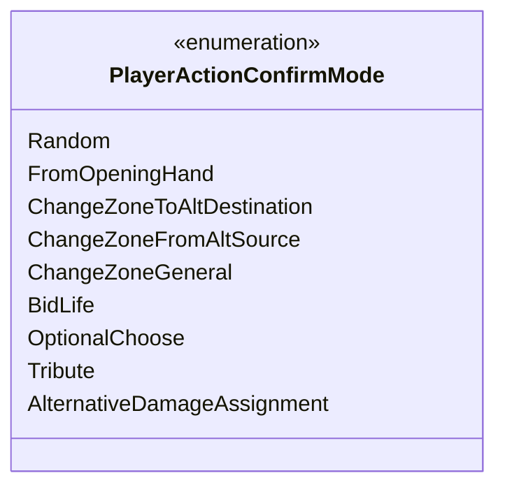

---
aliases:
  - PlayerActionConfirmMode
tags:
  - java/enum
  - module/forge-game
  - pkg/forge/game/player
fqn: forge.game.player.PlayerActionConfirmMode
package: forge.game.player
module: forge-game
kind: Enum
---

# PlayerActionConfirmMode

**Package:** `forge.game.player` &nbsp; **Module:** `forge-game` &nbsp; **Kind:** Enum



## Source
`forge-game/src/main/java/forge/game/player/PlayerActionConfirmMode.java`

```java
package forge.game.player;

/** 
 * Used by PlayerController.confirmAction - to avoid a lot of hardcoded strings for mode
 *
 */
public enum PlayerActionConfirmMode {
    Random,
    FromOpeningHand,
    ChangeZoneToAltDestination,
    ChangeZoneFromAltSource,
    ChangeZoneGeneral,
    BidLife,
    OptionalChoose,
    Tribute,
    AlternativeDamageAssignment
    // Ripple;
    ;
    
}
```
