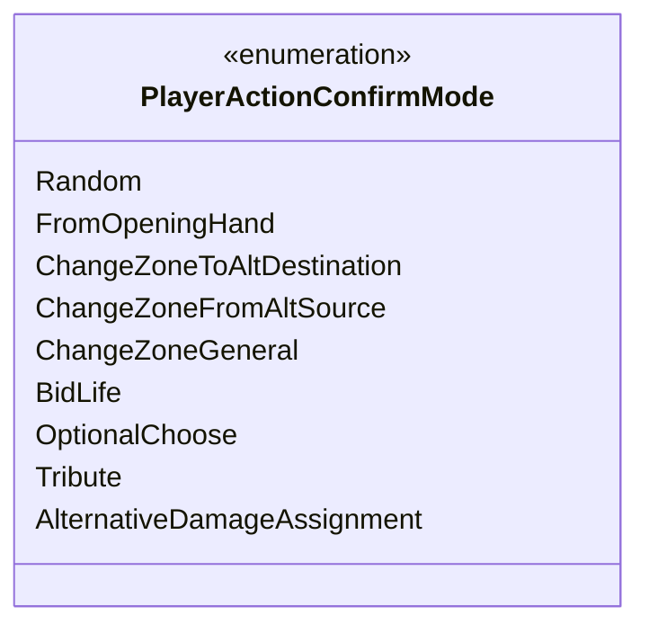

---
aliases:
  - PlayerActionConfirmMode
tags:
  - java/enum
  - module/forge-game
  - pkg/forge/game/player
fqn: forge.game.player.PlayerActionConfirmMode
package: forge.game.player
module: forge-game
kind: Enum
---

# PlayerActionConfirmMode

**Package:** `forge.game.player`   **Module:** `forge-game`   **Kind:** Enum



## Design Description

PlayerActionConfirmMode is a simple type-safe enumeration in the `forge.game.player` package that names the distinct contexts in which a player must confirm an action. As its Javadoc states, it exists to replace hardcoded mode strings passed to `PlayerController.confirmAction`, giving callers a fixed vocabulary of confirmation scenarios—such as `FromOpeningHand`, the several zone-change variants, `BidLife`, `Tribute`, and `AlternativeDamageAssignment`. By centralizing these constants, it lets `PlayerController` and its various implementations branch on a compile-checked value rather than error-prone literals, improving type safety and readability. The commented-out `Ripple` constant signals that the set is expected to grow as new card mechanics require player confirmation.

## Source
`forge-game/src/main/java/forge/game/player/PlayerActionConfirmMode.java`

```java
package forge.game.player;

/** 
 * Used by PlayerController.confirmAction - to avoid a lot of hardcoded strings for mode
 *
 */
public enum PlayerActionConfirmMode {
    Random,
    FromOpeningHand,
    ChangeZoneToAltDestination,
    ChangeZoneFromAltSource,
    ChangeZoneGeneral,
    BidLife,
    OptionalChoose,
    Tribute,
    AlternativeDamageAssignment
    // Ripple;
    ;
    
}
```

## Python
`forge/game/player/PlayerActionConfirmMode.py`

```python
from enum import Enum, auto


class PlayerActionConfirmMode(Enum):
    """Used by PlayerController.confirmAction - to avoid a lot of hardcoded strings for mode"""

    Random = auto()
    FromOpeningHand = auto()
    ChangeZoneToAltDestination = auto()
    ChangeZoneFromAltSource = auto()
    ChangeZoneGeneral = auto()
    BidLife = auto()
    OptionalChoose = auto()
    Tribute = auto()
    AlternativeDamageAssignment = auto()
    # Ripple
```
