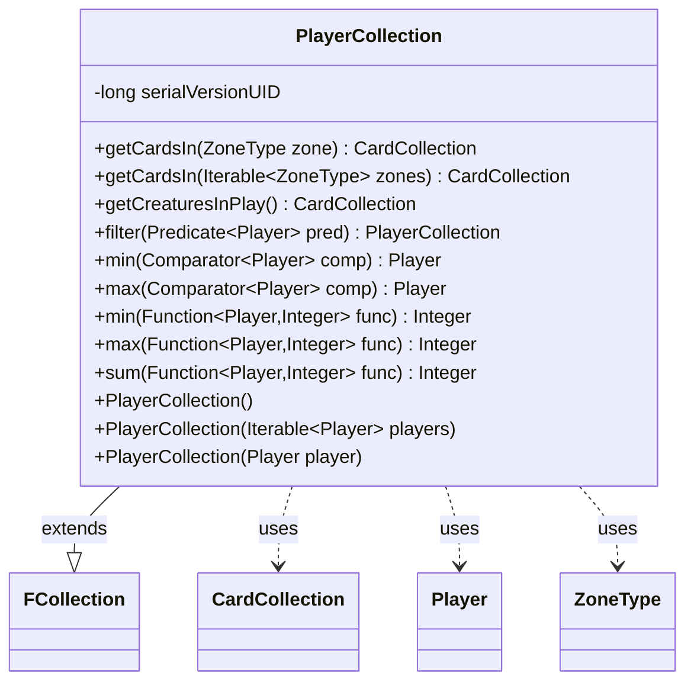

---
aliases:
  - PlayerCollection
tags:
  - java/class
  - module/forge-game
  - pkg/forge/game/player
fqn: forge.game.player.PlayerCollection
package: forge.game.player
module: forge-game
kind: Class
---

# PlayerCollection

**Package:** `forge.game.player` &nbsp; **Module:** `forge-game` &nbsp; **Kind:** Class



## Relationships
**Extends:**
- [[forge.util.collect.FCollection|FCollection]]
**Uses:**
- [[forge.game.card.CardCollection|CardCollection]]
- [[forge.game.player.Player|Player]]
- [[forge.game.zone.ZoneType|ZoneType]]

## Source
`forge-game/src/main/java/forge/game/player/PlayerCollection.java`

```java
package forge.game.player;

import java.util.Collections;
import java.util.Comparator;
import java.util.function.Function;
import java.util.function.Predicate;

import forge.game.card.CardCollection;
import forge.game.zone.ZoneType;
import forge.util.Aggregates;
import forge.util.IterableUtil;
import forge.util.collect.FCollection;

public class PlayerCollection extends FCollection<Player> {

    private static final long serialVersionUID = -4374566955977201748L;

    public PlayerCollection() {
    }
    
    public PlayerCollection(Iterable<Player> players) {
        this.addAll(players); 
    }

    public PlayerCollection(Player player) {
        this.add(player);
    }

    // card collection functions
    public final CardCollection getCardsIn(ZoneType zone) {
        CardCollection result = new CardCollection();
        for (Player p : this) {
            result.addAll(p.getCardsIn(zone));
        }
        return result;
    }

    public final CardCollection getCardsIn(Iterable<ZoneType> zones) {
        CardCollection result = new CardCollection();
        for (Player p : this) {
            result.addAll(p.getCardsIn(zones));
        }
        return result;
    }
    
    public final CardCollection getCreaturesInPlay() {
        CardCollection result = new CardCollection();
        for (Player p : this) {
            result.addAll(p.getCreaturesInPlay());
        }
        return result;
    }
    
    // filter functions with predicate
    public PlayerCollection filter(Predicate<Player> pred) {
        return new PlayerCollection(IterableUtil.filter(this, pred));
    }
    
    // sort functions with Comparator
    public Player min(Comparator<Player> comp) {
        if (this.isEmpty()) return null;
        return Collections.min(this, comp);
    }
    public Player max(Comparator<Player> comp) {
        if (this.isEmpty()) return null;
        return Collections.max(this, comp);
    }
    
    // value functions with Function
    //TODO: Could probably move these up to FCollectionView, apply them, and trim off a bunch of "Aggregates" clauses.
    public Integer min(Function<Player, Integer> func) {
        return Aggregates.min(this, func);
    }
    public Integer max(Function<Player, Integer> func) {
        return Aggregates.max(this, func);
    }
    public Integer sum(Function<Player, Integer> func) {
        return Aggregates.sum(this, func);
    }
}
```
