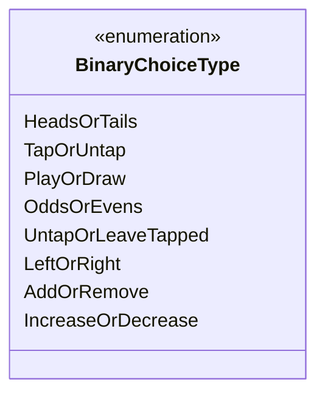

---
aliases:
  - BinaryChoiceType
tags:
  - java/enum
  - module/forge-game
  - pkg/forge/game/player
fqn: forge.game.player.PlayerController.BinaryChoiceType
package: forge.game.player
module: forge-game
kind: Enum
---

# BinaryChoiceType

**Package:** `forge.game.player` &nbsp; **Module:** `forge-game` &nbsp; **Kind:** Enum



## Source
`forge-game/src/main/java/forge/game/player/PlayerController.java` — declaration excerpt

```java
    public enum BinaryChoiceType {
        HeadsOrTails, // coin
        TapOrUntap,
        PlayOrDraw,
        OddsOrEvens,
        UntapOrLeaveTapped,
        LeftOrRight,
        AddOrRemove,
        IncreaseOrDecrease
    }
```
